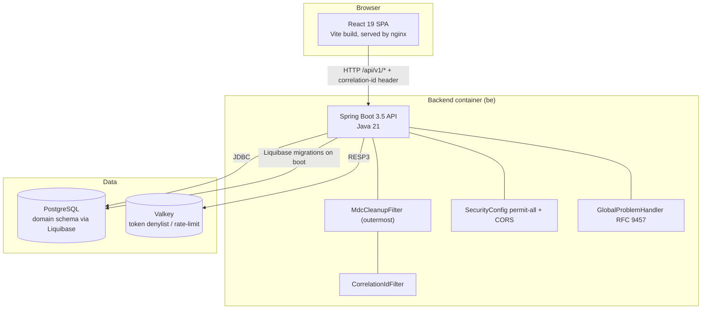
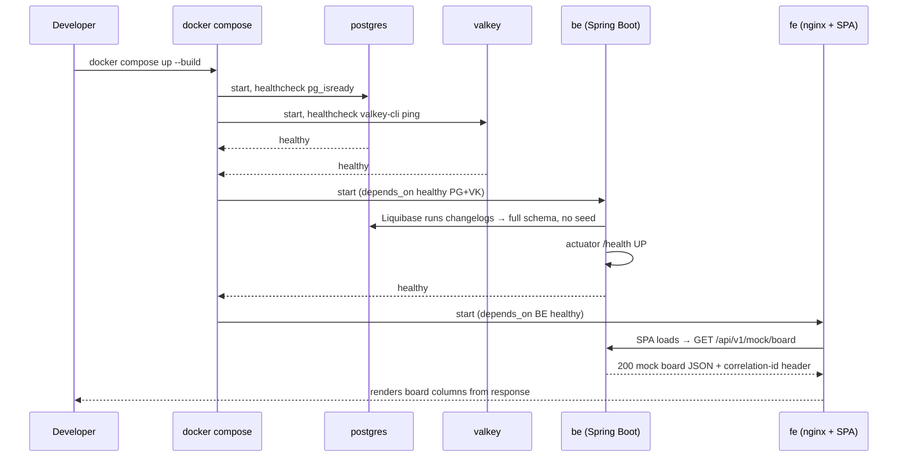
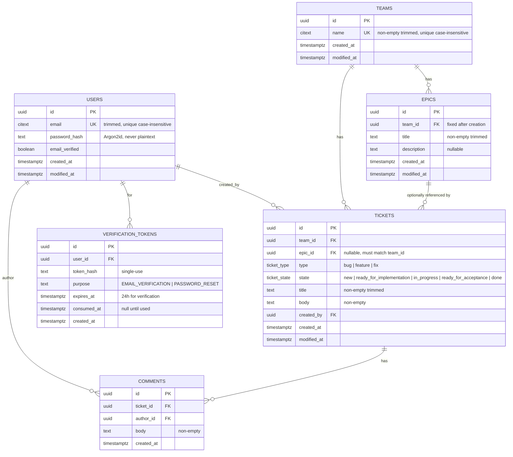
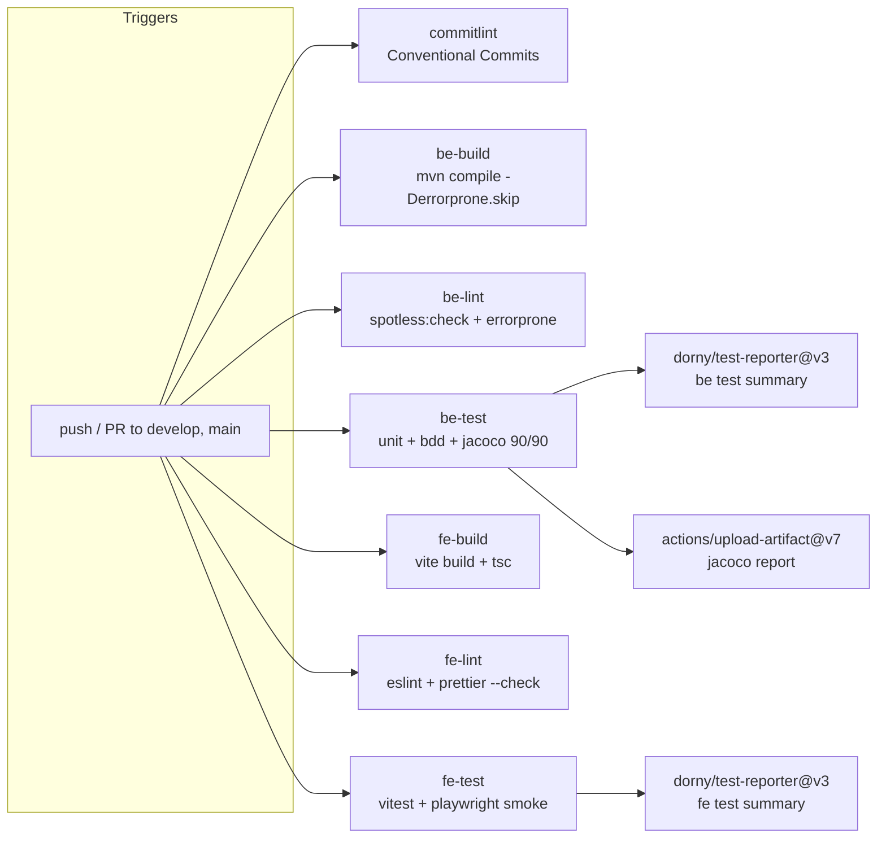

# Design Document: 001-skeleton-bootstrap (yet-another-jira Application Skeleton)

## Overview

`yet-another-jira` is a Kanban-style ticket tracker delivered as a three-tier SPA
(React frontend) + HTTP API (Spring Boot backend) + RDBMS (PostgreSQL). This
document designs an **application skeleton**: the thinnest possible scaffold that
is *runnable end-to-end* from a clean checkout with a single `docker compose up
--build`, yet contains every structural seam that future feature work
(authentication, teams, epics, tickets, comments, draggable board) will fill in.

The skeleton proves the wiring, not the features. It boots the full topology
(Postgres + Valkey + backend + frontend), establishes cross-cutting concerns
(correlation-id propagation, RFC 9457 error contract, permit-all security with
CORS configured for the SPA), runs Liquibase migrations that create the **full
domain schema with no seed data**, and exposes a mock board endpoint that the
frontend fetches and renders to demonstrate the request path end-to-end. All
quality gates (Spotless, Error Prone + NullAway, JaCoCo 90/90, Cucumber BDD,
ESLint/Prettier, Vitest) and CI/release tooling are present and green from day
one so feature work inherits a healthy pipeline.

This design intentionally describes the **full target domain schema** even though
the skeleton ships only thin behavior over it; future feature work adds columns,
indexes, services, and controllers without re-architecting.

### Decisions locked with the user

| Decision | Choice |
|----------|--------|
| Auth direction | Stateless JWT bearer tokens; **Valkey** included now for token denylist (logout) + verification-resend rate limiting |
| Skeleton migrations | **Full** domain schema (users, teams, epics, tickets, comments, verification/reset tokens), zero seed data |
| semantic-release | **Both** `be` and `fe`, independent tag namespaces; release from `main` (stable) and `develop` (prereleases on the `dev` channel) |
| FE→BE proof call | Dedicated `GET /api/v1/mock/board` returning hardcoded sample board JSON |

### Goals (skeleton)

- One-command boot of all infra + apps via root `docker compose up --build`.
- No host-installed runtime beyond Docker required.
- Full domain schema created by repeatable migrations; fresh DB has metadata only.
- Cross-cutting concerns wired: correlation-id, RFC 9457 problem details, CORS, permit-all security.
- Thin main jar: only mandatory deps; optional/dev tooling behind Maven profiles.
- Frontend renders data fetched from the backend (mock endpoint).
- Green CI: compile + unit + BDD + lint + coverage, jobs parallel and non-duplicating.

### Non-Goals (skeleton)

- No real authentication logic, password hashing, SMTP, or token issuance (scaffolded seams only).
- No business CRUD for teams/epics/tickets/comments (endpoints stubbed/mock only).
- No drag-and-drop persistence logic (board renders mock data; dnd library chosen but inert).
- No property-based tests (explicitly excluded by stack mandate).

---

## High-Level Design

### Repository Layout

```text
yet-another-jira/
├── docker-compose.yml            # postgres + valkey + be + fe, one command
├── Makefile                      # dev shortcuts (up, down, be-test, fe-test, lint, fmt)
├── README.md                     # prerequisites, config, startup
├── .gitignore
├── .dockerignore                 # root-level shared ignore (also per-module)
├── .pre-commit-config.yaml       # check-merge-conflict, mixed-line-ending(lf), trailing-whitespace, local spotless + fe eslint/prettier
├── .github/
│   ├── workflows/
│   │   ├── ci.yml                # parallel jobs: be-build, be-test, be-lint, fe-build, fe-test, fe-lint, commitlint
│   │   └── release.yml           # semantic-release for be and fe (independent)
│   └── dependabot.yml            # maven /be weekly, npm /fe weekly, github-actions / weekly (target develop)
├── be/                           # backend module (Spring Boot, Maven)
│   ├── Dockerfile
│   ├── .dockerignore
│   ├── mvnw / mvnw.cmd / .mvn/    # Maven wrapper
│   ├── pom.xml
│   ├── lombok.config
│   ├── .releaserc.json           # semantic-release (be tag namespace)
│   └── src/
│       ├── main/java/com/bovae/yaj/...          # production code
│       ├── main/resources/                      # application.yml, db/changelog/*
│       ├── test/java/com/bovae/yaj/...           # JUnit 5 + Mockito unit tests
│       ├── bdd/java/com/bovae/yaj/...             # Cucumber glue + runner (separate source set)
│       └── bdd/resources/features/*.feature      # Gherkin features
└── fe/                           # frontend module (Vite + React 19 + TS)
    ├── Dockerfile                # multi-stage build → nginx serving static SPA
    ├── .dockerignore
    ├── nginx.conf                # SPA fallback + proxy /api → backend
    ├── package.json
    ├── tsconfig.json
    ├── vite.config.ts
    ├── eslint.config.js
    ├── .prettierrc
    ├── .releaserc.json           # semantic-release (fe tag namespace)
    └── src/
        ├── main.tsx / App.tsx
        ├── api/                  # typed fetch client, calls GET /api/v1/mock/board
        ├── components/
        ├── pages/
        └── test/                 # Vitest + Testing Library, Playwright smoke
```

## Architecture



Tier separation: presentation (`fe`, nginx-served SPA), application/API (`be`,
Spring Boot), persistence (Postgres). Valkey is a supporting cache/ephemeral
store, not a system of record. The SPA never uses browser storage as the source
of truth.

Servlet filter ordering (outermost → inner): `MdcCleanupFilter`
(`HIGHEST_PRECEDENCE`, wipes MDC in `finally`) → `CorrelationIdFilter`
(`HIGHEST_PRECEDENCE + 1`, populates correlation-id + echoes header) → rest of
the chain.

### Runtime Topology & Boot Sequence (docker compose)



`depends_on` with `condition: service_healthy` enforces ordering. Backend blocks
on Postgres + Valkey health; frontend blocks on backend health. Result: a single
command yields a browser-reachable board rendered from live backend data.

---

## Backend Module Structure (be)

### Package Layout

```text
com.bovae.yaj
├── YetAnotherJiraApplication.java         # @SpringBootApplication entrypoint
├── config/
│   ├── SecurityConfig.java                # permit-all now, CORS, seam for JWT later
│   ├── WebConfig.java                     # filter registration, MDC propagation
│   ├── CorsConfig.java                    # CorsConfigurationSource from CorsProperties
│   ├── ValkeyConfig.java                  # RedisConnectionFactory → Valkey
│   └── properties/                        # @ConfigurationProperties types only
│       ├── CorsProperties.java            # @ConfigurationProperties yaj.cors.*
│       └── ValkeyProperties.java          # @ConfigurationProperties yaj.valkey.*
├── web/
│   ├── filter/MdcCleanupFilter.java       # OncePerRequestFilter @ HIGHEST_PRECEDENCE → MDC.clear() in finally
│   ├── filter/CorrelationIdFilter.java    # OncePerRequestFilter @ HIGHEST_PRECEDENCE+1: MDC put + response header
│   ├── error/GlobalProblemHandler.java    # @RestControllerAdvice → RFC 9457
│   ├── error/ProblemDetailFactory.java    # adds correlation-id + timestamp fields
│   ├── controller/MockBoardController.java # GET /api/v1/mock/board
│   └── dto/                                # board records (mock; removed by a later epic)
│       ├── BoardView.java
│       ├── BoardColumn.java
│       └── BoardCard.java
├── domain/                                # (feature work) entities live here, JaCoCo-excluded under model/
│   └── model/                             # JPA entities (excluded from coverage)
├── support/
│   └── CorrelationId.java                 # constants: header name, MDC key
└── (future) team/ epic/ ticket/ comment/ auth/   # feature slices added later
```

The skeleton ships `config/`, `web/`, `support/`, and a stub `MockBoardController`.
Feature packages (`team`, `epic`, …) are documented seams, not created yet.

## Components and Interfaces

> Low-Level Design — key skeleton classes and their contracts.

All examples are Java 21 / Spring Boot 3.5. Lombok `@Slf4j` produces a `LOG`
field (per `lombok.config`). NullAway treats the codebase as `@NonNull` by
default; nullable params are annotated explicitly.

#### MdcCleanupFilter

The outermost filter and the request-scope boundary. Its sole job is to guarantee
the request thread's MDC is wiped after every request, regardless of which
downstream producers populated it. It does **not** read or set the correlation-id
— it only clears. Sits at `HIGHEST_PRECEDENCE` so its `finally` runs after the
entire chain (including `CorrelationIdFilter` and any future MDC producers) has
returned.

```java
@Component
@Order(Ordered.HIGHEST_PRECEDENCE)
public class MdcCleanupFilter extends OncePerRequestFilter {

    @Override
    protected void doFilterInternal(
            HttpServletRequest request,
            HttpServletResponse response,
            FilterChain chain) throws ServletException, IOException {
        try {
            chain.doFilter(request, response);
        } finally {
            MDC.clear(); // wipe ALL keys at the request-scope boundary
        }
    }
}
```

**Preconditions:** request is non-null; MDC may hold any keys set by downstream
filters/handlers.
**Postconditions:** after the chain returns (success or exception), the request
thread's MDC is fully cleared — **all** keys, not just `correlationId`. Because
the filter runs at `HIGHEST_PRECEDENCE`, cleanup is owned here and decoupled from
any single producer, so no request-scoped context leaks into the pooled thread's
next request regardless of which producers ran or how the request terminated.

#### CorrelationIdFilter

Establishes the correlation-id for every request: pass through the client header
if present, else generate a UUID. Stores it in MDC for logging and echoes it on
the response. Runs at `HIGHEST_PRECEDENCE + 1` — just inside `MdcCleanupFilter` —
so all downstream logs carry it while MDC cleanup is owned by the outermost
filter.

```java
@Component
@Order(Ordered.HIGHEST_PRECEDENCE + 1)
public class CorrelationIdFilter extends OncePerRequestFilter {

    public static final String HEADER = "X-Correlation-Id";
    public static final String MDC_KEY = "correlationId";

    @Override
    protected void doFilterInternal(
            HttpServletRequest request,
            HttpServletResponse response,
            FilterChain chain) throws ServletException, IOException {
        String cid = trimToNull(request.getHeader(HEADER));
        if (cid == null) {
            cid = UUID.randomUUID().toString();
        }
        MDC.put(MDC_KEY, cid);
        response.setHeader(HEADER, cid); // present even on error paths
        chain.doFilter(request, response); // MDC.clear() is owned by MdcCleanupFilter
    }
}
```

**Preconditions:** request is non-null; header may be absent or blank.
**Postconditions:** MDC contains a non-null correlation-id for the request
thread; response carries the `X-Correlation-Id` header (echoed verbatim if the
client supplied one, else a freshly generated UUID). This filter does **not**
clear MDC — clearing is delegated to the outermost `MdcCleanupFilter`
(`HIGHEST_PRECEDENCE`), which wipes all keys in its `finally` once the chain
unwinds.

Logging pattern (`application.yml`) includes `[%X{correlationId}]` so every log
line is correlated.

> Design note: MDC cleanup is decoupled from correlation-id logic. The outermost
> `MdcCleanupFilter` (`HIGHEST_PRECEDENCE`) owns the request-scope boundary and
> clears **all** MDC keys in its `finally`; `CorrelationIdFilter`
> (`HIGHEST_PRECEDENCE + 1`) only populates the correlation-id and echoes the
> header. Any additional MDC producers introduced later are already covered by
> the cleanup filter with no rework.

#### RFC 9457 Problem Details handler

Spring 6 / Boot 3 ships `org.springframework.http.ProblemDetail`. The skeleton
extends `ResponseEntityExceptionHandler` and augments every problem with two
extra members required by the stack: `correlationId` and `timestamp` (UTC).

```java
@RestControllerAdvice
public class GlobalProblemHandler extends ResponseEntityExceptionHandler {

    @ExceptionHandler(Exception.class)
    public ProblemDetail handleUnexpected(Exception ex) {
        LOG.error("Unhandled exception", ex);
        return ProblemDetailFactory.create(
                HttpStatus.INTERNAL_SERVER_ERROR,
                "Internal Server Error",
                "An unexpected error occurred."); // no internals leaked
    }

    // Validation/404/409 handlers added per feature slice, all via the factory.
}
```

```java
public final class ProblemDetailFactory {
    public static ProblemDetail create(HttpStatus status, String title, String detail) {
        ProblemDetail pd = ProblemDetail.forStatusAndDetail(status, detail);
        pd.setTitle(title);
        pd.setProperty("correlationId", MDC.get(CorrelationIdFilter.MDC_KEY));
        pd.setProperty("timestamp", OffsetDateTime.now(ZoneOffset.UTC).toString());
        return pd;
    }
}
```

Example error body (`application/problem+json`):

```json
{
  "type": "about:blank",
  "title": "Conflict",
  "status": 409,
  "detail": "Team cannot be deleted while it contains tickets or epics.",
  "correlationId": "b7e2...",
  "timestamp": "2025-01-15T10:32:00Z"
}
```

#### SecurityConfig (permit-all now, JWT-ready seam)

```java
@Configuration
@EnableWebSecurity
public class SecurityConfig {

    @Bean
    SecurityFilterChain filterChain(HttpSecurity http, CorsConfigurationSource cors)
            throws Exception {
        http
            .cors(c -> c.configurationSource(cors))
            .csrf(AbstractHttpConfigurer::disable)      // stateless API
            .sessionManagement(s -> s.sessionCreationPolicy(SessionCreationPolicy.STATELESS))
            .authorizeHttpRequests(a -> a.anyRequest().permitAll()); // SKELETON ONLY
        // SEAM: future → .addFilterBefore(jwtAuthFilter, ...) and restrict matchers
        return http.build();
    }
}
```

CORS is driven by `CorsProperties` (allowed origins/methods/headers, exposes
`X-Correlation-Id`) so the SPA origin is configurable per environment. All
`@ConfigurationProperties` types (`CorsProperties`, `ValkeyProperties`) live in
the dedicated `com.bovae.yaj.config.properties` package; the `CorsConfigurationSource`
bean is built from `CorsProperties` in `CorsConfig`.

> Security note: `permitAll()` is intentional for the skeleton and is the single
> most important seam to replace. It is called out in README and as a `// SKELETON
> ONLY` marker so it is never shipped to a real environment unguarded.

#### Valkey wiring

Valkey speaks the Redis protocol; Spring Data Redis connects unchanged. The
skeleton configures the connection factory and a `StringRedisTemplate`; the
denylist/rate-limit logic is a documented seam.

```java
@Configuration
public class ValkeyConfig {
    @Bean
    LettuceConnectionFactory valkeyConnectionFactory(ValkeyProperties props) {
        return new LettuceConnectionFactory(
                new RedisStandaloneConfiguration(props.host(), props.port()));
    }
    @Bean
    StringRedisTemplate valkeyTemplate(LettuceConnectionFactory cf) {
        return new StringRedisTemplate(cf);
    }
}
```

A startup readiness ping confirms connectivity; if Valkey is unreachable the app
fails fast (so compose ordering surfaces misconfig early).

#### Mock board endpoint (FE↔BE proof)

```java
@RestController
@RequestMapping("/api/v1/mock")
public class MockBoardController {

    @GetMapping("/board")
    public BoardView board() {
        return BoardView.sample(); // hardcoded 5 columns + a few cards
    }
}
```

`BoardView` mirrors the eventual board contract (five state columns, cards with
title/type/epic) so the FE renders against a realistic shape that survives into
feature work. It returns hardcoded data — no DB read — and is deleted/replaced
when real board endpoints arrive.

### Health & Readiness

Health, readiness, liveness, and info are served **entirely by Spring Boot
Actuator** — there is no custom controller. Actuator exposes `/actuator/health`
(liveness/readiness groups enabled) and `/actuator/info`. Compose healthchecks
hit `/actuator/health`. These endpoints stay public per the requirements (only
health/readiness + auth endpoints are public in the future design).

---

## Data Models

### Full Target Domain Schema

The skeleton's Liquibase migrations create the entire schema below (no seed
data). Identifiers are UUIDs (`uuid` PK, server-generated). Timestamps are
`timestamptz` stored in UTC. Enums use Postgres native enum types for canonical
API values.



### Schema invariants enforced at DB level (skeleton)

- `users.email` and `teams.name`: `citext` + unique index → case-insensitive uniqueness.
- `epics.team_id` immutable by convention (enforced in service layer later); FK to `teams`.
- `tickets.epic_id` nullable FK; the **same-team** rule (`epic.team_id == ticket.team_id`)
  is enforced server-side in feature work (composite FK `(team_id, epic_id)` against a
  unique `(team_id, id)` on epics is documented as the DB-level option).
- `comments.ticket_id` FK with `ON DELETE CASCADE` → deleting a ticket deletes its comments.
- `teams`/`epics` deletion guarded server-side; attempts return 409 (referential
  integrity also backed by FK `ON DELETE RESTRICT` on tickets→team and tickets→epic).

### Liquibase Setup (YAML master changelog → external .sql files)

The master changelog stays in YAML, but each changeset references a **separate
`.sql` migration file** via Liquibase `sqlFile` rather than declarative YAML
`createTable` blocks. This keeps DDL as readable, reviewable raw SQL (the form
DBAs expect) while YAML remains the ordering/index of changesets.

```text
be/src/main/resources/db/changelog/
├── db.changelog-master.yaml          # ordered changesets, each → a sqlFile
└── sql/
    ├── 0001-extensions.sql           # create extension citext, pgcrypto
    ├── 0002-enums.sql                # ticket_type, ticket_state
    ├── 0003-users.sql
    ├── 0004-verification-tokens.sql
    ├── 0005-teams.sql
    ├── 0006-epics.sql
    ├── 0007-tickets.sql
    └── 0008-comments.sql
```

`spring.liquibase.change-log: classpath:db/changelog/db.changelog-master.yaml`.
Migrations run on boot. A fresh DB ends with all tables + `databasechangelog` /
`databasechangeloglock` metadata and **zero application rows**.

By convention every changeset declares `author: bovae`.

Each YAML changeset points at its external `.sql` file with `sqlFile`:

```yaml
# db.changelog-master.yaml (illustrative — changeset for tickets)
databaseChangeLog:
  - changeSet:
      id: 0007-tickets
      author: bovae
      changes:
        - sqlFile:
            path: db/changelog/sql/0007-tickets.sql
            relativeToChangelogFile: false
            splitStatements: true
            endDelimiter: ";"
```

```sql
-- db/changelog/sql/0007-tickets.sql (illustrative raw DDL)
CREATE TABLE tickets (
    id          uuid        PRIMARY KEY DEFAULT gen_random_uuid(),
    team_id     uuid        NOT NULL REFERENCES teams (id) ON DELETE RESTRICT,
    epic_id     uuid        REFERENCES epics (id) ON DELETE RESTRICT,
    type        ticket_type NOT NULL,
    state       ticket_state NOT NULL,
    title       text        NOT NULL,
    body        text        NOT NULL,
    created_by  uuid        NOT NULL REFERENCES users (id),
    created_at  timestamptz NOT NULL,
    modified_at timestamptz NOT NULL
);
```

---

## Maven Profiles Strategy (thin main jar)

Goal: the shipped jar carries only **mandatory** runtime deps. Everything
optional, dev-only, or build-time lives behind profiles so it never bloats the
artifact and CI can toggle behavior.

| Profile | Active | Purpose / contents |
|---------|--------|--------------------|
| (default compile) | always | Spring Boot web, data-jpa, actuator, validation, postgresql driver, spring-data-redis (Valkey), liquibase-core, MapStruct + Lombok (provided/annotation scope) |
| `errorprone` | **active by default**, off with `-Derrorprone.skip` | Error Prone + NullAway via `maven-compiler-plugin` annotation processors + JVM `--add-exports/--add-opens` |
| `dev` | opt-in | local-only conveniences (spring-boot-devtools) — never in main jar |
| `it` / `testcontainers` | activated in test/CI | Testcontainers (Postgres, Valkey) for BDD/integration; Testcontainers excluded from main jar by `test` scope |
| `bdd` | activated for BDD run | binds the `src/bdd/java` source set + Cucumber runner |

Key points:
- Lombok and MapStruct are `provided` / annotation-processor scope → compile-time
  only, not in the runtime classpath of the thin jar.
- Testcontainers and Cucumber are `test` scope → never packaged.
- Error Prone/NullAway are compiler plugins → zero runtime footprint; the profile
  exists so `-Derrorprone.skip` can disable them for fast local iteration.

### Error Prone + NullAway compiler config

`maven-compiler-plugin` runs Error Prone with NullAway as a bug-checker. Java 21
requires the standard `jdk.compiler` exports/opens for Error Prone to read the
compiler internals:

```text
--add-exports jdk.compiler/com.sun.tools.javac.api=ALL-UNNAMED
--add-exports jdk.compiler/com.sun.tools.javac.file=ALL-UNNAMED
--add-exports jdk.compiler/com.sun.tools.javac.main=ALL-UNNAMED
--add-exports jdk.compiler/com.sun.tools.javac.model=ALL-UNNAMED
--add-exports jdk.compiler/com.sun.tools.javac.parser=ALL-UNNAMED
--add-exports jdk.compiler/com.sun.tools.javac.processing=ALL-UNNAMED
--add-exports jdk.compiler/com.sun.tools.javac.tree=ALL-UNNAMED
--add-exports jdk.compiler/com.sun.tools.javac.util=ALL-UNNAMED
--add-opens jdk.compiler/com.sun.tools.javac.code=ALL-UNNAMED
--add-opens jdk.compiler/com.sun.tools.javac.comp=ALL-UNNAMED
```

NullAway configured with `-XepOpt:NullAway:AnnotatedPackages=com.bovae.yaj`,
treating the project as non-null by default; nullable values use explicit
`@Nullable`. The exact arg list is the user-provided JVM linter set; the above is
the standard Error Prone export set for JDK 17+ and should be reconciled with the
provided sample.

### Spotless

Spotless (palantir-java-format) enforces formatting on `.java`, `.feature`
(gherkin), and `pom.xml` (sortPom). Config: `importOrder`, `removeUnusedImports`,
`forbidWildcardImports`. The pre-commit hook runs `mvn spotless:apply`; CI runs
`mvn spotless:check`.

### JaCoCo Coverage Gate

- Threshold: **90% line and 90% branch**, computed over the **sum of unit + BDD**
  test execution (merged exec data).
- Excludes are a **pragmatic, adjustable choice**, not a fixed rule and not
  limited to models: exclude whatever genuinely does not need testing — wiring
  and bootstrap (`**/*Application.*`), framework config (`**/config/**`),
  generated code (e.g. MapStruct mappers), and plain data carriers
  (DTOs/records, JPA entities under `**/model/**`). Keep the gate pointed at the
  classes carrying real logic (filters, handlers, services); tune the list as
  the codebase grows rather than treating it as locked.
- The merge step combines `jacoco-unit.exec` and `jacoco-bdd.exec` before the
  `check` goal so the gate reflects total coverage, not per-suite.

---

## Testing Strategy

### Backend

Two complementary suites, **no property-based testing** (excluded by mandate).

### Unit tests — JUnit 5 + Mockito (`src/test/java`)

- One test class per production class (`{Class}Test`), Mockito for collaborators.
- Naming: `methodUnderTest_shouldExpectedBehavior_whenCondition`.
- Skeleton coverage targets: `MdcCleanupFilter` (MDC empty after the chain
  completes, even when a downstream filter/handler sets a key, and on the
  exception path), `CorrelationIdFilter` (header passthrough vs generation, MDC
  set, response header present), `ProblemDetailFactory`
  (correlationId + UTC timestamp populated), `MockBoardController` (returns five
  columns).
- `@ParameterizedTest` for same-shape/different-data cases per test conventions.

### BDD tests — Cucumber (`src/bdd/java` + `src/bdd/resources/features`)

Separate source set, run via the `bdd` profile. Backed by Testcontainers
(real Postgres + Valkey) so the full boot path — migrations, filter, problem
handler — is exercised.

```gherkin
@skeleton
Feature: Application skeleton boots and serves correlated responses

  Background:
    Given the application is running against Postgres and Valkey

  Scenario: Mock board endpoint returns a renderable board
    When the client requests GET "/api/v1/mock/board"
    Then the response status is 200
    And the response has a "X-Correlation-Id" header
    And the board contains 5 state columns

  Scenario: Correlation id passes through from the client
    When the client requests GET "/api/v1/mock/board" with header "X-Correlation-Id" "abc-123"
    Then the response "X-Correlation-Id" header equals "abc-123"

  Scenario: Errors conform to RFC 9457 problem details
    When the client requests GET "/api/v1/does-not-exist"
    Then the response content type is "application/problem+json"
    And the problem body has fields "status", "title", "correlationId", "timestamp"

  Scenario: A fresh database contains schema but no application data
    Then the "users", "teams", "epics", "tickets", "comments" tables exist
    And every application table has 0 rows
```

---

## Frontend Module Structure (fe)

Best-practice tooling chosen by the designer (user defers FE decisions):

| Concern | Choice | Rationale |
|---------|--------|-----------|
| Build/dev | **Vite** + React 19 + TypeScript | Fast, standard, first-class TS |
| Data fetching | **TanStack Query** | Cache/loading/error states the requirements demand |
| Drag & drop (future board) | **@dnd-kit** | Accessible, modern; inert in skeleton |
| Lint/format | **ESLint (flat config)** + **Prettier** | Mandated linter/auto-formatter |
| Unit/component tests | **Vitest** + **React Testing Library** | Vite-native, fast |
| Smoke/E2E | **Playwright** (one smoke test) | Proves FE↔BE call renders |
| Design system | `npx getdesign@latest add vercel` | Per user mandate |
| Serving | nginx (multi-stage Docker) | Static SPA + `/api` proxy to backend |

### FE source layout & the sample BE call

```text
fe/src/
├── api/client.ts        # fetch wrapper: injects/echoes X-Correlation-Id
├── api/board.ts         # getMockBoard() → GET /api/v1/mock/board
├── pages/BoardPage.tsx  # renders 5 columns from the response
├── components/Column.tsx, TicketCard.tsx
└── test/board.test.tsx  # Vitest: mocks fetch, asserts columns render
```

```typescript
// api/board.ts — the end-to-end proof call
export interface BoardCard { id: string; title: string; type: 'bug' | 'feature' | 'fix'; epic?: string; }
export interface BoardColumn { state: string; label: string; cards: BoardCard[]; }
export interface BoardView { columns: BoardColumn[]; }

export async function getMockBoard(): Promise<BoardView> {
  const res = await apiFetch('/api/v1/mock/board'); // apiFetch adds correlation-id header
  if (!res.ok) throw new Error(`board fetch failed: ${res.status}`);
  return res.json() as Promise<BoardView>;
}
```

```typescript
// pages/BoardPage.tsx — renders loading / error / success states
export function BoardPage() {
  const { data, isLoading, isError } = useQuery({ queryKey: ['mock-board'], queryFn: getMockBoard });
  if (isLoading) return <Spinner />;
  if (isError) return <ErrorBanner message="Could not load board" />;
  return <Board columns={data!.columns} />; // 5 columns rendered from BE
}
```

In dev, Vite proxies `/api` → `http://be:8080`; in the container, nginx proxies
`/api` → backend. Either way the SPA reaches the backend with no CORS surprises,
and CORS on the backend is configured for the SPA origin as a backup.

### FE testing strategy

- **Vitest + Testing Library**: `BoardPage` shows spinner → renders five columns
  on success → shows error banner on rejected fetch (loading/empty/success/error
  states the spec requires).
- **Playwright smoke** (CI, against composed stack): load app, assert five board
  columns visible — the real FE↔BE round trip.

---

## Error Handling

RFC 9457 (Problem Details) contract for the whole API.

| Scenario | Status | Where (skeleton vs future) |
|----------|--------|----------------------------|
| Unhandled exception | 500 | Skeleton — generic, no internals leaked |
| Validation failure | 400 | Future — Bean Validation → problem with field errors |
| Auth failure | 401 | Future — JWT filter |
| Missing record | 404 | Future + skeleton (unknown route → problem) |
| Delete team/epic still referenced | 409 | Future — conflict problem |

Every problem response is `application/problem+json` and carries `correlationId`
+ UTC `timestamp` via `ProblemDetailFactory`. Internal details (stack traces,
SQL, infra) never appear in the body; they go to correlated logs only.

---

## CI Pipeline (GitHub Actions)

Jobs are **parallel and independent**; no check runs in two jobs. A lint job does
not also build; a build job does not also lint.



Job responsibilities (no duplication):
- **be-build**: compilation only, Error Prone skipped (`-Derrorprone.skip`) — pure "does it compile".
- **be-lint**: `spotless:check` + Error Prone/NullAway (the static-analysis owner).
- **be-test**: unit + BDD with Testcontainers, JaCoCo merge + 90/90 gate; publishes test report (`dorny/test-reporter@v3`) and uploads coverage (`actions/upload-artifact@v7`).
- **fe-build**: `tsc --noEmit` + `vite build`.
- **fe-lint**: ESLint + `prettier --check` only.
- **fe-test**: Vitest + Playwright smoke; both emit JUnit XML, published as a frontend test summary via `dorny/test-reporter@v3` (Vitest configured with a junit reporter output, Playwright with its junit reporter).
- **commitlint**: validates Conventional Commits on PR commits.

Each job sets up only the toolchain it needs (Java 21 + Maven cache, or Node +
npm cache) so they run concurrently with minimal cost.

---

## Release & Dependency Tooling

### semantic-release (both modules, independent)

Two configs, two tag namespaces, so the deployables version independently.

- `be/.releaserc.json`: branches `main` (stable) and `develop` (prerelease on
  the `dev` channel); preset `conventionalcommits`; plugins:
  changelog, **exec** (`mvn versions:set -DnewVersion=${nextRelease.version}`),
  git assets `pom.xml` + `CHANGELOG.md`, github. Tag format namespaced for the
  backend (e.g. `be-v${version}`).
- `fe/.releaserc.json`: same branch model; exec runs `npm version`; git assets
  `package.json` + `CHANGELOG.md`; tag namespaced for the frontend.

> Rationale for "both": `be` and `fe` are separate Docker images with separate
> change cadences; coupling their versions would force needless releases of one
> when only the other changed. Independent tags keep changelogs meaningful.

The provided sample (`tagFormat ${version}`, `mvn versions:set`, git assets
`pom.xml`+`CHANGELOG.md`) is adopted for `be` and mirrored with npm equivalents
for `fe`, with tag formats made namespace-distinct.

### Dependabot

```yaml
version: 2
updates:
  - package-ecosystem: maven
    directory: /be
    schedule: { interval: weekly }
    target-branch: develop
    ignore:
      - dependency-name: "org.testcontainers:*"
        update-types: ["version-update:semver-major"]
  - package-ecosystem: npm
    directory: /fe
    schedule: { interval: weekly }
    target-branch: develop
  - package-ecosystem: github-actions
    directory: /
    schedule: { interval: weekly }
    target-branch: develop
```

### pre-commit

```yaml
repos:
  - repo: https://github.com/pre-commit/pre-commit-hooks
    hooks:
      - id: check-merge-conflict
      - id: mixed-line-ending
        args: [--fix=lf]
      - id: trailing-whitespace
  - repo: local
    hooks:
      - id: spotless-apply
        name: spotless apply
        entry: bash -c 'cd be && ./mvnw -q spotless:apply'
        language: system
        files: \.(java|feature)$|(^|/)pom\.xml$
      - id: fe-eslint
        name: fe eslint (fix)
        entry: bash -c 'cd fe && npm run lint -- --fix'
        language: system
        files: ^fe/.*\.(ts|tsx|js|jsx)$
      - id: fe-prettier
        name: fe prettier (write)
        entry: bash -c 'cd fe && npx prettier --write'
        language: system
        files: ^fe/.*\.(ts|tsx|js|jsx|css)$
```

Backend formatting stays with the `spotless-apply` hook; the two added local
hooks run the frontend ESLint + Prettier scoped to `fe/**` sources so JS/TS/CSS
is linted and formatted on commit alongside the pre-commit-hooks repo checks.

---

## Boot, Run, and Developer Workflow

### docker-compose (root)

```yaml
services:
  postgres:
    image: postgres:16
    environment: { POSTGRES_DB: yaj, POSTGRES_USER: yaj, POSTGRES_PASSWORD: yaj }
    healthcheck: { test: ["CMD-SHELL", "pg_isready -U yaj"], interval: 5s, retries: 10 }
  valkey:
    image: valkey/valkey:8
    healthcheck: { test: ["CMD", "valkey-cli", "ping"], interval: 5s, retries: 10 }
  be:
    build: ./be
    depends_on:
      postgres: { condition: service_healthy }
      valkey: { condition: service_healthy }
    environment:
      SPRING_DATASOURCE_URL: jdbc:postgresql://postgres:5432/yaj
      YAJ_VALKEY_HOST: valkey
      YAJ_CORS_ALLOWED_ORIGINS: http://localhost:8081
    healthcheck: { test: ["CMD", "curl", "-f", "http://localhost:8080/actuator/health"], interval: 10s, retries: 10 }
  fe:
    build: ./fe
    depends_on:
      be: { condition: service_healthy }
    ports: ["8081:80"]
  mailpit:                          # dev/test SMTP sink — opt-in, not in default boot
    image: axllent/mailpit:latest
    profiles: ["mail"]              # only starts with: docker compose --profile mail up
    ports:
      - "8025:8025"                 # web UI
      - "1025:1025"                 # SMTP listener
```

`mailpit` sits behind the `mail` compose profile, so the default
`docker compose up --build` stays lean and does **not** start it — email is a
future seam, not part of skeleton boot. QA/devs opt in with
`docker compose --profile mail up`, which provides an SMTP sink (port 1025) plus
a web UI (port 8025) to inspect captured messages. When auth /
email-verification feature work lands, the backend points its SMTP host/port at
Mailpit via env vars (`YAJ_SMTP_HOST`, `YAJ_SMTP_PORT`) — e.g.
`YAJ_SMTP_HOST=mailpit`, `YAJ_SMTP_PORT=1025` locally — while
`relay1.dataart.com` remains the real configurable target in non-local
environments.

No host runtime beyond Docker: Maven wrapper + Node build happen inside
multi-stage Dockerfiles. `docker compose up --build` from the repo root yields a
browser-reachable SPA at `http://localhost:8081` rendering the mock board.

### Makefile targets

```makefile
up:        ; docker compose up --build
down:      ; docker compose down -v
be-test:   ; cd be && ./mvnw verify
be-lint:   ; cd be && ./mvnw spotless:check
fmt:       ; cd be && ./mvnw spotless:apply
fe-test:   ; cd fe && npm test
fe-lint:   ; cd fe && npm run lint
```

### Dockerfiles

- `be/Dockerfile`: multi-stage — `amazoncorretto:21` build stage runs `./mvnw -Pdev,errorprone clean package` (thin jar), runtime stage `amazoncorretto:21` runs the jar. Linter args passed via `MAVEN_OPTS`/`.mvn/jvm.config`.
- `fe/Dockerfile`: multi-stage — `node:22` builds the SPA (`npm ci && npm run build`), `nginx:alpine` serves `dist/` with `nginx.conf` (SPA fallback + `/api` proxy).

---

## Correctness Properties

Skeleton invariants the scaffold must satisfy. They map to the BDD scenarios and
unit tests above (expressed as invariants since PBT is excluded by mandate).

### Property 1: Correlation-id always present
For every HTTP response (success or error), the `X-Correlation-Id` header is
non-empty. If the request supplied one, the response echoes it verbatim;
otherwise it is a freshly generated valid UUID.

### Property 2: MDC hygiene
After any request completes, the request thread's MDC is fully cleared by the
dedicated outermost `MdcCleanupFilter` (`MDC.clear()` in its `finally`, at
`HIGHEST_PRECEDENCE`), so neither `correlationId` nor any other request-scoped
context leaks into a pooled thread's next request — independent of the
correlation filter and of any other MDC producers.

### Property 3: RFC 9457 conformance
Every error response has content type `application/problem+json` and a body
containing at least `status`, `title`, `correlationId`, and a UTC ISO-8601
`timestamp`; it never contains stack traces or infrastructure details.

### Property 4: Fresh DB is empty of application data
After migrations run on a clean database, all application tables (`users`,
`teams`, `epics`, `tickets`, `comments`, `verification_tokens`) exist and contain
0 rows; only Liquibase metadata rows are present.

### Property 5: One-command boot
`docker compose up --build` from the repo root brings the stack to a state where
`GET /api/v1/mock/board` returns 200 and the SPA renders five columns, with no
host-installed runtime beyond Docker.

### Property 6: Thin jar
The packaged backend jar contains no Lombok, MapStruct, Testcontainers, Cucumber,
or devtools classes (all are compile/test/dev-only dependencies).

### Property 7: Mock board shape
`GET /api/v1/mock/board` returns exactly five columns, one per canonical ticket
state, in workflow order.

### Property 8: Coverage gate
Merged unit + BDD coverage is ≥ 90% line and ≥ 90% branch over non-excluded
packages, or the build fails.

---

## Dependencies

### Backend (mandatory, in thin jar)
- Spring Boot 3.5: `spring-boot-starter-web`, `-data-jpa`, `-actuator`, `-validation`
- `spring-data-redis` (Valkey via Lettuce)
- `postgresql` JDBC driver
- `liquibase-core`

### Backend (compile/test/dev only — not in jar)
- Lombok, MapStruct (annotation processors)
- JUnit 5, Mockito, Cucumber, Testcontainers (postgres, valkey/redis)
- Error Prone, NullAway (compiler plugins)
- Spotless, JaCoCo, Maven wrapper

### Frontend
- React 19, TypeScript, Vite, TanStack Query, @dnd-kit
- ESLint, Prettier
- Vitest, React Testing Library, Playwright
- getdesign/vercel design system (`npx getdesign@latest add vercel`)

### Infrastructure / tooling
- Docker + Docker Compose (Postgres 16, Valkey 8)
- GitHub Actions (`dorny/test-reporter@v3`, `actions/upload-artifact@v7`, commitlint)
- Dependabot, semantic-release (per module)
- pre-commit

---

## Open Questions / Future-Work Seams

- **Auth filter**: `SecurityConfig` currently `permitAll()`; the seam to add a
  JWT auth filter + per-route authorization is marked. Token denylist + resend
  rate-limit will use the already-wired Valkey template.
- **Same-team epic constraint**: documented as server-side validation with an
  optional composite-FK DB enforcement; chosen approach finalized in ticket
  feature work.
- **SMTP / email verification**: `relay1.dataart.com` remains the real,
  configurable SMTP target for non-local environments; not wired into skeleton
  behavior. For local QA/dev a **Mailpit** test SMTP sink ships in
  docker-compose behind the `mail` profile (`docker compose --profile mail up`),
  giving an SMTP listener + web UI to inspect messages once auth /
  email-verification work lands. SMTP host/port are an env-var seam
  (`YAJ_SMTP_HOST` / `YAJ_SMTP_PORT`) so the target swaps between Mailpit and the
  real relay per environment.
- **MDC cleanup boundary** (decided, shipped): the skeleton ships a dedicated
  `MdcCleanupFilter` at `HIGHEST_PRECEDENCE` (outermost request-scope boundary)
  that clears **all** MDC keys in its `finally`, decoupled from
  `CorrelationIdFilter` (`HIGHEST_PRECEDENCE + 1`, which only populates the
  correlation-id and echoes the header). Additional MDC producers introduced
  later are already covered with no rework.
- **Board ordering & filtering**: real board endpoint (most-recently-modified
  ordering, type/epic/title filters) replaces the mock endpoint.
