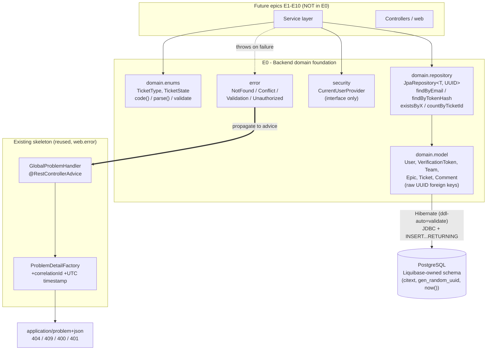

# Design Document

## Overview

Epic E0 is the persistence and shared-foundation layer of the backend. It adds, on top of the
`001-skeleton-bootstrap` runnable skeleton (correlation-id filter, RFC 9457 error handling, CORS,
Valkey, Actuator, permit-all security, mock board), the JPA entity layer, the Spring Data
repositories, the `TicketType`/`TicketState` enums, a domain exception hierarchy mapped to RFC 9457,
a current-user seam, and a reusable test-side SQL-statement-count harness. E0 ships **no HTTP
endpoints and no business CRUD** — it provides only the mappings, reference/lookup queries, and
cross-cutting building blocks that epics E1–E10 will consume.

The database schema is **locked** and owned end-to-end by Liquibase (migrations `0002`–`0008`, zero
seed data beyond the two pre-existing lookup tables). E0 maps the existing columns exactly and
**does not alter the schema**. The single configuration change E0 makes to enforce this is flipping
Hibernate's `ddl-auto` from `none` to `validate` so that entity↔table mismatches fail application
startup instead of surfacing at runtime.

This design layers onto the skeleton as follows:

- It **reuses** the existing `web.error.GlobalProblemHandler` and `web.error.ProblemDetailFactory`
  rather than introducing a parallel error path: the four domain exceptions get new
  `@ExceptionHandler` methods added to the existing advice.
- It **respects** the existing NullAway `@NonNull`-by-default policy (`AnnotatedPackages=com.bovae.yaj`):
  every nullable field is explicitly `@Nullable` (`org.springframework.lang.Nullable`, already the
  codebase convention) and every lookup returns `Optional<T>`.
- It **keeps** the existing `spring.jpa.open-in-view: false` (Requirement 19.5 is already satisfied
  by the skeleton's `application.yml`; E0 keeps it and depends on it for fail-fast lazy behavior).
- It **reuses** the existing Testcontainers wiring (`PostgreSQLContainer("postgres:16-alpine")`) for
  integration and BDD coverage.

### Package layout

| Package | Contents | Coverage status |
|---|---|---|
| `com.bovae.yaj.domain.model` | The six JPA entities (`User`, `VerificationToken`, `Team`, `Epic`, `Ticket`, `Comment`) | **Excluded** from the JaCoCo gate (`**/model/**`) |
| `com.bovae.yaj.domain.enums` | The `TicketType` and `TicketState` enums (parse/validate logic) | **Counted** — deliberately *not* under `model/**` so the parse logic is gated |
| `com.bovae.yaj.domain.repository` | The six Spring Data repository interfaces | **Counted** (interfaces have no executable lines; behavior covered by integration tests) |
| `com.bovae.yaj.error` | `NotFoundException`, `ConflictException`, `ValidationException`, `UnauthorizedException` | **Counted** |
| `com.bovae.yaj.web.error` | New `@ExceptionHandler` methods on the existing `GlobalProblemHandler` | **Counted** — unit-tested (Req 18.5) |
| `com.bovae.yaj.security` | `CurrentUserProvider` seam (interface only in E0; JWT impl deferred to E4) | **Counted** (interface → no executable lines in E0) |
| `com.bovae.yaj.support` (test scope, `src/test/java`) | `SqlStatementCount` N+1 detection harness + Testcontainers base | Not in the main JaCoCo bundle (test code) |

> Note: enums live in `com.bovae.yaj.domain.enums` (not `domain.model`) specifically because `**/model/**`
> is coverage-excluded and the enums carry real, must-cover parse/validate logic (Req 18.4). Entities,
> which are Lombok-generated boilerplate with no hand-written logic, stay under `domain.model` where
> the exclusion applies.

## Architecture



Two data flows matter in E0:

1. **Persistence path** (bottom): a future service obtains a repository, the repository maps an
   entity, Hibernate issues a single JDBC statement, validated at startup against the
   Liquibase-owned schema. Because foreign keys are raw `UUID` fields (Decision A) there are no lazy
   associations, so no read can fan out into per-row queries.
2. **Error path** (right): a future service throws one of the four domain exceptions; the existing
   `GlobalProblemHandler` advice catches it through a new `@ExceptionHandler` method, builds the body
   through the existing `ProblemDetailFactory` (which stamps `correlationId` + UTC `timestamp`), and
   returns an `application/problem+json` response with the mapped status. No stack trace, type name,
   or SQL leaks into the body.

### Configuration changes

| Setting | Location | Before | After | Reason |
|---|---|---|---|---|
| `spring.jpa.hibernate.ddl-auto` | `be/src/main/resources/application.yml` | `none` | `validate` | Hibernate validates every entity↔table mapping at startup and fails fast on mismatch (Req 1.5, 1.6). Liquibase stays the sole schema owner; Hibernate only validates, never mutates. |
| `spring.jpa.open-in-view` | `application.yml` | `false` (already set) | `false` (unchanged) | Req 19.5 already satisfied by the skeleton. Kept so any future out-of-transaction lazy access fails fast (Req 19.6). |
| `spring.jpa.properties.hibernate.generate_statistics` | **test only** (`src/test/resources/application.yml`) | absent | `true` | Powers the no-new-dependency statement-count harness (Decision C, Req 19.9). Deliberately **not** in the production `application.yml` to avoid runtime overhead. |
| `org.apache.commons:commons-lang3` dependency | `be/pom.xml` | present (transitively, via `liquibase-core`) | declared explicitly (**no** version — Spring Boot dependencies BOM-managed) | Enum `parse` uses `StringUtils.isBlank`; E0 imports `commons-lang3` directly, so it is declared explicitly rather than relied on transitively (see Decision B). |

## Components and Interfaces

### Entities (Decision A — raw UUID foreign keys)

Every entity:

- Uses a database-generated UUID primary key. The verified Hibernate pattern is
  `@Id @Generated @ColumnDefault("gen_random_uuid()")` on a `UUID` field — **no** `@GeneratedValue`
  and **no** `@UuidGenerator` (both of those generate the value client-side and would bypass the
  schema's `DEFAULT gen_random_uuid()`). With `@Generated`, Hibernate excludes the column from the
  INSERT and reads the database-generated value back via PostgreSQL `INSERT ... RETURNING`, keeping
  the insert a single statement.
- Maps `created_at` / `modified_at` (where present) as `@Generated @ColumnDefault("now()")` so the
  database default supplies the value on insert and Hibernate reads it back (Req 8.2, 8.3). A bare
  `@Generated` defaults to insert-time generation only — it is **not** regenerated on update, which
  is exactly what Req 8.6 demands for `Ticket.modified_at`.
- Maps cross-table foreign keys as raw `java.util.UUID` fields (e.g. `Ticket.teamId`,
  `Ticket.epicId`, `Ticket.createdBy`, `Comment.ticketId`, `Comment.authorId`, `Epic.teamId`,
  `VerificationToken.userId`) — **not** JPA `@ManyToOne`/`@OneToMany` associations. See Decision A.
- Uses Lombok for boilerplate: `@Getter @Setter @NoArgsConstructor @ToString`, with
  `@ToString.Exclude` on sensitive fields. We deliberately omit `@EqualsAndHashCode` (entity identity
  pitfalls with generated IDs) and `@Data`/`@Builder` (not needed; `@Builder` would also conflict
  with field-level defaults). Lombok-generated members are not unit-tested (Req 18.7).

Representative entity (the other five follow the same shape; field tables are in *Data Models*):

```java
package com.bovae.yaj.domain.model;

import jakarta.persistence.Column;
import jakarta.persistence.Entity;
import jakarta.persistence.Id;
import jakarta.persistence.Table;
import java.time.Instant;
import java.util.UUID;
import lombok.Getter;
import lombok.NoArgsConstructor;
import lombok.Setter;
import lombok.ToString;
import org.hibernate.annotations.ColumnDefault;
import org.hibernate.annotations.Generated;
import org.springframework.lang.Nullable;

@Entity
@Table(name = "users")
@Getter
@Setter
@NoArgsConstructor
@ToString
public class User {

    @Id
    @Generated
    @ColumnDefault("gen_random_uuid()")
    private UUID id;

    @Column(nullable = false) // citext at the DB; case-insensitive equality (see Req 13.1)
    private String email;

    @Column(name = "password_hash", nullable = false)
    @ToString.Exclude // Req 2.5: keep the hash out of logs
    private String passwordHash;

    @Column(name = "email_verified", nullable = false)
    private boolean emailVerified; // app-managed; Java default false aligns with DB DEFAULT false

    @Nullable
    @Column(name = "deleted_at")
    private Instant deletedAt;

    @Generated
    @ColumnDefault("now()")
    @Column(name = "created_at", nullable = false, updatable = false)
    private Instant createdAt;

    @Generated
    @ColumnDefault("now()")
    @Column(name = "modified_at", nullable = false)
    private Instant modifiedAt;
}
```

> `@DynamicInsert` is **not** required: `@Generated` already removes the id/timestamp columns from
> the generated INSERT, so there is no null-attribute-default case to handle.

### Enums (Decision B — store the raw lookup code, convert at the service boundary)

The `type`/`state` columns are stored on `Ticket` as the raw `String` lookup code (schema-faithful;
the existing `tickets.type`/`tickets.state` FKs to `ticket_types.code`/`ticket_states.code` enforce
validity at the DB). Conversion to/from the enums happens at the service boundary in later epics
using the enums' own parse helpers. We avoid `@Enumerated(EnumType.STRING)` because enum constant
names (`BUG`, `READY_FOR_IMPLEMENTATION`) do not equal the lowercase/snake_case codes (`bug`,
`ready_for_implementation`).

```java
package com.bovae.yaj.domain.enums;

import com.bovae.yaj.error.ValidationException;
import java.util.Arrays;
import java.util.Map;
import java.util.function.Function;
import java.util.stream.Collectors;
import org.apache.commons.lang3.StringUtils;
import org.springframework.lang.Nullable;

public enum TicketType {
    BUG("bug"),
    FEATURE("feature"),
    FIX("fix");

    // Built after the enum constants (which JLS initializes first), so values() is safe here.
    // O(1) lookup by code instead of scanning values() on every parse().
    private static final Map<String, TicketType> BY_CODE =
            Arrays.stream(values()).collect(Collectors.toUnmodifiableMap(TicketType::code, Function.identity()));

    private final String code;

    TicketType(String code) {
        this.code = code;
    }

    public String code() {
        return code;
    }

    public static TicketType parse(@Nullable String code) {
        if (StringUtils.isBlank(code)) {
            throw new ValidationException("A ticket type code is required.");
        }
        TicketType type = BY_CODE.get(code);
        if (type == null) {
            throw new ValidationException("Unknown ticket type code: '" + code + "'.");
        }
        return type;
    }
}
```

`TicketState` is identical in shape but additionally carries the workflow `position` and declares its
constants in ascending-position order so the natural ordinal mirrors the order (Req 10.3, 10.4):

```java
package com.bovae.yaj.domain.enums;

import com.bovae.yaj.error.ValidationException;
import java.util.Arrays;
import java.util.Map;
import java.util.function.Function;
import java.util.stream.Collectors;
import org.apache.commons.lang3.StringUtils;
import org.springframework.lang.Nullable;

public enum TicketState {
    NEW("new", 1),
    READY_FOR_IMPLEMENTATION("ready_for_implementation", 2),
    IN_PROGRESS("in_progress", 3),
    READY_FOR_ACCEPTANCE("ready_for_acceptance", 4),
    DONE("done", 5);

    // Built after the enum constants (which JLS initializes first), so values() is safe here.
    private static final Map<String, TicketState> BY_CODE =
            Arrays.stream(values()).collect(Collectors.toUnmodifiableMap(TicketState::code, Function.identity()));

    private final String code;
    private final int position;

    TicketState(String code, int position) {
        this.code = code;
        this.position = position;
    }

    public String code() {
        return code;
    }

    public int position() {
        return position;
    }

    public static TicketState parse(@Nullable String code) {
        if (StringUtils.isBlank(code)) {
            throw new ValidationException("A ticket state code is required.");
        }
        TicketState state = BY_CODE.get(code);
        if (state == null) {
            throw new ValidationException("Unknown ticket state code: '" + code + "'.");
        }
        return state;
    }
}
```

The `position` is stored explicitly (rather than derived from `ordinal()`) so it matches the
canonical `ticket_states.position` values verbatim and is robust to future constant reordering.

### Repositories

All six repositories extend `JpaRepository<T, UUID>`, which supplies CRUD (Req 11.3). Only the
reference (Req 12) and lookup (Req 13) queries are declared explicitly, as Spring Data derived
queries — each compiles to a single `EXISTS` / `COUNT` / `SELECT` statement with no per-row lazy
loading (raw-UUID FKs mean there are no associations to traverse).

```java
// com.bovae.yaj.domain.repository
public interface UserRepository extends JpaRepository<User, UUID> {
    Optional<User> findByEmail(String email); // citext column → case-insensitive equality at the DB
}

public interface VerificationTokenRepository extends JpaRepository<VerificationToken, UUID> {
    Optional<VerificationToken> findByTokenHash(String tokenHash);
}

public interface TeamRepository extends JpaRepository<Team, UUID> {
    // CRUD only in E0
}

public interface EpicRepository extends JpaRepository<Epic, UUID> {
    boolean existsByTeamId(UUID teamId); // Req 12.1
}

public interface TicketRepository extends JpaRepository<Ticket, UUID> {
    boolean existsByTeamId(UUID teamId); // Req 12.2
    boolean existsByEpicId(UUID epicId); // Req 12.3
}

public interface CommentRepository extends JpaRepository<Comment, UUID> {
    boolean existsByTicketId(UUID ticketId); // Req 12.4
    long countByTicketId(UUID ticketId);     // Req 12.5
}
```

> `findByEmail` relies on the `users.email citext` column for case-insensitive equality (Req 13.1):
> the derived query emits `WHERE email = ?`, and `citext` makes that comparison case-insensitive at
> the database, so no `LOWER(...)` or `IgnoreCase` keyword is needed (and adding one could defeat the
> `citext` index).

### Domain exceptions and their RFC 9457 mapping

Four unchecked exceptions in `com.bovae.yaj.error`, each extending `RuntimeException` and carrying a
human-readable detail message (Req 14):

```java
package com.bovae.yaj.error;

public class NotFoundException extends RuntimeException {
    public NotFoundException(String message) {
        super(message);
    }
}
// ConflictException, ValidationException, UnauthorizedException are identical in shape.
```

They are mapped to problem responses by **new `@ExceptionHandler` methods added to the existing**
`com.bovae.yaj.web.error.GlobalExceptionHandler` (these live in the non-excluded `web.error` package
and are unit-tested per Req 18.5). Each method builds the body through the existing
`ProblemDetailFactory` and routes it through the advice's single enrichment point
(`handleExceptionInternal` → `ProblemDetailFactory.applyCommonMembers`), so `correlationId` + UTC
`timestamp` are always present (Req 15.5) and the framework's content negotiation is preserved:

```java
@ExceptionHandler(NotFoundException.class)
public ResponseEntity<Object> handleNotFound(NotFoundException ex, WebRequest request) {
    return domainProblem(HttpStatus.NOT_FOUND, "Not Found", ex, request);
}

@ExceptionHandler(ConflictException.class)
public ResponseEntity<Object> handleConflict(ConflictException ex, WebRequest request) {
    return domainProblem(HttpStatus.CONFLICT, "Conflict", ex, request);
}

@ExceptionHandler(ValidationException.class)
public ResponseEntity<Object> handleValidation(ValidationException ex, WebRequest request) {
    return domainProblem(HttpStatus.BAD_REQUEST, "Validation Failed", ex, request);
}

@ExceptionHandler(UnauthorizedException.class)
public ResponseEntity<Object> handleUnauthorized(UnauthorizedException ex, WebRequest request) {
    return domainProblem(HttpStatus.UNAUTHORIZED, "Unauthorized", ex, request);
}

/** Builds the body via ProblemDetailFactory and routes through the single enrichment point. */
private ResponseEntity<Object> domainProblem(
        HttpStatus status, String title, RuntimeException ex, WebRequest request) {
    // create(...) handles the null-detail guard (forStatusAndDetail vs forStatus) and sets the title;
    // applyCommonMembers is idempotent, so re-stamping in handleExceptionInternal is harmless.
    ProblemDetail body = ProblemDetailFactory.create(status, title, ex.getMessage());
    return handleExceptionInternal(ex, body, new HttpHeaders(), status, request);
}
```

Because the body is assembled only from the status, a fixed title, and `ex.getMessage()` (the detail
the service author chose), no stack trace, exception class name, or SQL ever reaches the response
(Req 15.7). The pre-existing catch-all `handleUnexpected(Exception)` still maps anything else to a
generic 500 — the four domain handlers are strictly more specific, so they take precedence.

### Current-user seam

```java
package com.bovae.yaj.security;

import java.util.UUID;

public interface CurrentUserProvider {

    /**
     * Returns the authenticated user's id, or throws {@link com.bovae.yaj.error.UnauthorizedException}
     * when no authenticated user is present (including when authentication was never attempted).
     */
    UUID requireCurrentUserId();
}
```

**Decision: E0 ships the interface only, with no bean** (Req 16.4 defers the JWT-backed
implementation to E4). Justification: E0 has no consumer of the seam (no services, no endpoints), so
the Spring context starts with no unsatisfied dependency. Shipping a placeholder bean that always
throws `UnauthorizedException` would add no value in E0 and risks masking a genuinely missing
authentication wiring in a later epic. The interface alone satisfies Req 16.1–16.3 as a contract; E4
adds `JwtCurrentUserProvider` in the same `security` package. Context startup is verified by the
integration suite (Req 18.1) regardless.

### N+1 detection harness (Decision C — Hibernate statistics, zero new dependencies)

A test-scope utility in `com.bovae.yaj.support` (`src/test/java`) that uses Hibernate's built-in
`org.hibernate.stat.Statistics`. The verified access path is
`entityManagerFactory.unwrap(org.hibernate.SessionFactory.class).getStatistics()`, and the
statement counter is `Statistics.getPrepareStatementCount()`. It is enabled by the test-only
`hibernate.generate_statistics=true` property.

```java
package com.bovae.yaj.support;

import static org.junit.jupiter.api.Assertions.assertEquals;

import jakarta.persistence.EntityManager;
import jakarta.persistence.EntityManagerFactory;
import org.hibernate.SessionFactory;
import org.hibernate.stat.Statistics;

public final class SqlStatementCount {

    private SqlStatementCount() {}

    /**
     * Flushes and clears the persistence context so the first-level cache cannot mask reads, resets
     * the statistics, runs the action, and returns the number of prepared statements executed.
     */
    public static long around(EntityManagerFactory emf, EntityManager em, Runnable action) {
        em.flush();
        em.clear(); // critical: @DataJpaTest reuses one transaction; without clear(), a read may be
                    // served from the L1 cache and issue no SQL, hiding an N+1.
        Statistics stats = emf.unwrap(SessionFactory.class).getStatistics();
        stats.clear();
        action.run();
        return stats.getPrepareStatementCount();
    }

    public static void assertSingleStatement(EntityManagerFactory emf, EntityManager em, Runnable action) {
        assertEquals(1L, around(emf, em, action), "expected exactly one SQL statement (no per-row lazy loading)");
    }
}
```

A data-independent variant asserts the count is unchanged when more rows are seeded:

```java
public static void assertCountIndependentOfRows(
        EntityManagerFactory emf, EntityManager em, Runnable seedOneMore, Runnable read, int extraRows) {
    long withFew = around(emf, em, read);
    for (int i = 0; i < extraRows; i++) {
        seedOneMore.run();
    }
    long withMany = around(emf, em, read);
    assertEquals(withFew, withMany, "SQL statement count must not grow with the number of seeded rows");
}
```

Two caveats this design addresses explicitly:

1. **First-level cache masking (the `@DataJpaTest` transactional caveat).** Each `@DataJpaTest`
   runs in one rolled-back transaction, so an entity read right after a `persist` can be served from
   the persistence context with no SQL. The harness therefore `flush()`es then `clear()`s before
   measuring, forcing reads to hit the database. (The Req 12/13 queries are scalar `exists`/`count`/
   projection lookups that bypass the L1 entity cache anyway, but the harness enforces the boundary
   for every caller.)
2. **`Statistics` is SessionFactory-wide, not per-thread.** These tests must run sequentially
   (the default under Surefire here) and the harness `clear()`s immediately before each measurement.

## Data Models

The schema is fixed by Liquibase migrations `0002`–`0008`. The tables below map each Java field to its
column. Conventions for every entity: PK is `@Id @Generated @ColumnDefault("gen_random_uuid()") UUID`;
`created_at`/`modified_at` are `@Generated @ColumnDefault("now()") Instant`; `Instant` is used for all
`timestamptz` columns so values are stored and compared in UTC and serialize as ISO-8601 later
(Req 8.1, 17.5); nullable columns are explicitly `@Nullable` (NullAway); foreign keys are raw `UUID`
(Decision A).

### `User` → `users`

| Java field | Column | Java type | Null | Annotations |
|---|---|---|---|---|
| `id` | `id` | `UUID` | no | `@Id @Generated @ColumnDefault("gen_random_uuid()")` |
| `email` | `email` | `String` | no | `@Column(nullable=false)` — `citext` at DB |
| `passwordHash` | `password_hash` | `String` | no | `@Column(name="password_hash", nullable=false)`, `@ToString.Exclude` |
| `emailVerified` | `email_verified` | `boolean` (primitive) | no | `@Column(name="email_verified", nullable=false)` — app-managed |
| `deletedAt` | `deleted_at` | `Instant` | **yes** | `@Nullable @Column(name="deleted_at")` |
| `createdAt` | `created_at` | `Instant` | no | `@Generated @ColumnDefault("now()") @Column(updatable=false, nullable=false)` |
| `modifiedAt` | `modified_at` | `Instant` | no | `@Generated @ColumnDefault("now()") @Column(nullable=false)` |

### `VerificationToken` → `verification_tokens`

| Java field | Column | Java type | Null | Annotations |
|---|---|---|---|---|
| `id` | `id` | `UUID` | no | `@Id @Generated @ColumnDefault("gen_random_uuid()")` |
| `userId` | `user_id` | `UUID` | no | `@Column(name="user_id", nullable=false)` — raw FK → `users` |
| `tokenHash` | `token_hash` | `String` | no | `@Column(name="token_hash", nullable=false)`, `@ToString.Exclude` (Req 3.4) |
| `purpose` | `purpose` | `String` | no | `@Column(nullable=false)` |
| `expiresAt` | `expires_at` | `Instant` | no | `@Column(name="expires_at", nullable=false)` |
| `consumedAt` | `consumed_at` | `Instant` | **yes** | `@Nullable @Column(name="consumed_at")` |
| `createdAt` | `created_at` | `Instant` | no | `@Generated @ColumnDefault("now()") @Column(updatable=false, nullable=false)` |

> No `modified_at` column exists on this table, so the entity has none.

### `Team` → `teams`

| Java field | Column | Java type | Null | Annotations |
|---|---|---|---|---|
| `id` | `id` | `UUID` | no | `@Id @Generated @ColumnDefault("gen_random_uuid()")` |
| `name` | `name` | `String` | no | `@Column(nullable=false)` — `citext`, `UNIQUE` at DB |
| `createdAt` | `created_at` | `Instant` | no | `@Generated @ColumnDefault("now()") @Column(updatable=false, nullable=false)` |
| `modifiedAt` | `modified_at` | `Instant` | no | `@Generated @ColumnDefault("now()") @Column(nullable=false)` |

### `Epic` → `epics`

| Java field | Column | Java type | Null | Annotations |
|---|---|---|---|---|
| `id` | `id` | `UUID` | no | `@Id @Generated @ColumnDefault("gen_random_uuid()")` |
| `teamId` | `team_id` | `UUID` | no | `@Column(name="team_id", nullable=false)` — raw FK → `teams` |
| `title` | `title` | `String` | no | `@Column(nullable=false)` |
| `description` | `description` | `String` | **yes** | `@Nullable @Column` (Req 5.3) |
| `createdAt` | `created_at` | `Instant` | no | `@Generated @ColumnDefault("now()") @Column(updatable=false, nullable=false)` |
| `modifiedAt` | `modified_at` | `Instant` | no | `@Generated @ColumnDefault("now()") @Column(nullable=false)` |

### `Ticket` → `tickets`

| Java field | Column | Java type | Null | Annotations |
|---|---|---|---|---|
| `id` | `id` | `UUID` | no | `@Id @Generated @ColumnDefault("gen_random_uuid()")` |
| `teamId` | `team_id` | `UUID` | no | `@Column(name="team_id", nullable=false)` — raw FK → `teams` |
| `epicId` | `epic_id` | `UUID` | **yes** | `@Nullable @Column(name="epic_id")` — raw FK → `epics` (Req 6.4) |
| `type` | `type` | `String` | no | `@Column(nullable=false)` — raw `Ticket_Type_Code` (Decision B); FK → `ticket_types.code` |
| `state` | `state` | `String` | no | `@Column(nullable=false)` — raw `Ticket_State_Code` (Decision B); FK → `ticket_states.code` |
| `title` | `title` | `String` | no | `@Column(nullable=false)` |
| `body` | `body` | `String` | no | `@Column(nullable=false)` |
| `createdBy` | `created_by` | `UUID` | no | `@Column(name="created_by", nullable=false)` — raw FK → `users` |
| `createdAt` | `created_at` | `Instant` | no | `@Generated @ColumnDefault("now()") @Column(updatable=false, nullable=false)` |
| `modifiedAt` | `modified_at` | `Instant` | no | `@Generated @ColumnDefault("now()") @Column(nullable=false)` — **no `@PreUpdate`** (Req 8.6) |

### `Comment` → `comments`

| Java field | Column | Java type | Null | Annotations |
|---|---|---|---|---|
| `id` | `id` | `UUID` | no | `@Id @Generated @ColumnDefault("gen_random_uuid()")` |
| `ticketId` | `ticket_id` | `UUID` | no | `@Column(name="ticket_id", nullable=false)` — raw FK → `tickets` |
| `authorId` | `author_id` | `UUID` | no | `@Column(name="author_id", nullable=false)` — raw FK → `users` |
| `body` | `body` | `String` | no | `@Column(nullable=false)` |
| `createdAt` | `created_at` | `Instant` | no | `@Generated @ColumnDefault("now()") @Column(updatable=false, nullable=false)` |

> No `modified_at` column on `comments`, so the entity has none.

### ID generation and DB-default timestamp readback (verified mechanics)

- **PK:** `@Id @Generated @ColumnDefault("gen_random_uuid()")` is the Hibernate-documented pattern for
  a database-generated UUID. Hibernate omits `id` from the INSERT and reads the value the DB default
  produced back via `INSERT ... RETURNING` (single statement). We must **not** add `@GeneratedValue`
  or `@UuidGenerator` (client-side generation).
- **Timestamps:** `@Generated` (insert-event by default) + `@ColumnDefault("now()")` tells Hibernate
  the DB produces the value on insert and to reread it. `created_at` is additionally
  `@Column(updatable=false)` (it must never change). `modified_at` stays updatable so the E7 ticket
  service can set it explicitly; E0 adds no lifecycle callback that would advance it (Req 8.6).
- **No `@PrePersist`/`@PreUpdate` anywhere in E0.** Req 8.4's callback branch applies only to
  timestamp fields *not* backed by a DB default; in this schema every `created_at`/`modified_at` has
  `DEFAULT now()`, so that branch has no applicable field and is vacuously satisfied. Avoiding
  callbacks also directly satisfies Req 8.6.
- **`email_verified`** is app-managed (not `@Generated`): the Java primitive default `false` aligns
  with the column's `DEFAULT false`, and later epics flip it to `true` on verification.

## Error Handling

- **Domain failures** are signaled by the four `com.bovae.yaj.error` exceptions and mapped to RFC
  9457 responses by the new handlers on `GlobalProblemHandler` (see *Components and Interfaces*). The
  body is built only from status + fixed title + the author-supplied message, so internals never leak
  (Req 15.7, and the development-conventions "never leak internals" rule).
- **Schema mismatches** fail application startup: `ddl-auto=validate` makes Hibernate compare every
  mapping against the Liquibase-owned schema and abort with a descriptive error before serving
  traffic (Req 1.6).
- **Referential-integrity violations** are enforced by the existing database foreign keys
  (`ON DELETE RESTRICT`/`CASCADE` as defined in the migrations). E0 does not pre-empt them in code;
  the reference queries of Req 12 exist so later epics can convert a would-be violation into a clean
  `ConflictException`→409 *before* hitting the constraint. Inserting a row with a dangling FK in E0
  surfaces as the database's constraint violation (validated by integration tests).
- **Invalid lookup codes** raise `ValidationException` from the enum `parse` helpers, which later
  epics let propagate to the 400 mapping.
- **Missing authentication** raises `UnauthorizedException` from the current-user seam (→401).
- **`citext` validation caveat (flagged):** Hibernate `validate` checks column presence and type
  compatibility. `email`/`name` are PostgreSQL `citext` (an extension type) mapped to `String`. I
  could not fully verify that Hibernate 6.6's validator accepts `citext` against a `String` mapping
  without complaint. Mitigation: the Req 18.1 integration test starts the full context with
  `validate` against the real Testcontainers PostgreSQL, so any `citext` strictness surfaces in CI
  immediately, not in production. If it does reject, the fallback is to relax type-checking for those
  two columns (e.g. a dialect/`@Column`-level adjustment); `@Column(columnDefinition="citext")` alone
  would not help, since it only affects DDL generation, which `validate` does not perform.

## Testing Strategy

E0's tests fall into three categories: **unit tests** (no database) for pure logic, **integration
tests** (Testcontainers PostgreSQL) for persistence behavior that depends on the real schema, and
**BDD** (Cucumber) for full-context startup and the primary persistence scenario. Unit tests use
JUnit 5 with parameterized cases that exhaustively enumerate the finite domains (`@EnumSource` over
the enum constants; `@MethodSource`/`@NullAndEmptySource` plus a curated set of invalid strings for
the rejection cases; `@MethodSource` over the four exception types for the mapping cases); integration
tests use the SQL-statement-count harness against real PostgreSQL. The tables below keep each test's
"what it verifies" description and trace it to the requirement clauses it covers.

### Unit tests (no database)

| Target | Tests | Requirements |
|---|---|---|
| `TicketType` (`com.bovae.yaj.domain.enums`) | round-trip over all constants; rejection of unknown + null/blank | 9.1–9.6, 18.4 |
| `TicketState` | round-trip; rejection; position + ascending-order | 10.1–10.8, 18.4 |
| `GlobalProblemHandler` (`web.error`) | each domain exception → its status; body carries `correlationId`+`timestamp`; `detail` set from message; no stack-trace/type-name/SQL in body | 15.1–15.7, 18.5 |
| `CurrentUserProvider` contract | a test double returns the id when present; throws `UnauthorizedException` when absent / never-authenticated | 16.2, 16.3 |
| domain exceptions | each extends `RuntimeException`; carries its message (parameterized over the 4 types) | 14.3, 14.4 |

The handler tests use the standalone advice with a stubbed `WebRequest`/MDC (Mockito) — no Spring
context needed — and assert on the returned `ProblemDetail` status and members.

### Integration tests (Testcontainers PostgreSQL)

**Decision: repository and statement-count tests use `@DataJpaTest` +
`@AutoConfigureTestDatabase(replace = AutoConfigureTestDatabase.Replace.NONE)` against a shared
Testcontainers PostgreSQL container.** Justification:

- It is the narrowest slice that loads the JPA layer and repositories, so it is faster than a full
  `@SpringBootTest` and avoids the web/Redis/Valkey wiring irrelevant to persistence.
- `replace = NONE` is **mandatory** here: `@DataJpaTest` otherwise swaps in an embedded H2, which has
  no `citext`, no `gen_random_uuid()`, and different `INSERT ... RETURNING` semantics — the tests must
  run on real PostgreSQL.
- Liquibase runs before tests (Spring Boot runs detected migrations ahead of the test context), so
  the slice gets the real, migrated schema for `validate` to check against.
- The injected `EntityManagerFactory` gives the harness direct access to Hibernate `Statistics`.
- The transactional-rollback default keeps tests isolated; the harness's `flush()`/`clear()` handles
  the L1-cache caveat called out earlier.

A shared abstract base (`AbstractPostgresIntegrationTest` in `src/test`, mirroring the existing
`src/bdd` `TestcontainersConfig`) starts a singleton `PostgreSQLContainer("postgres:16-alpine")` and
wires it via Spring Boot `@ServiceConnection` (Boot-native; the existing BDD config uses the
equivalent `@DynamicPropertySource` form — either is acceptable, and the BDD path keeps its current
wiring unchanged).

Coverage:

| Test | What it verifies | Requirements |
|---|---|---|
| Entity persist/reload round trips (all six) | columns map; DB-default `id`/timestamps populate on insert; nullable fields round-trip with null and non-null | 8.2, 8.3, 8.5; mapping criteria in Req 2–8 |
| FK-violation tests | inserting a dangling `user_id`/`team_id`/`epic_id`/`ticket_id`/`created_by` raises a constraint violation | 3.3, 5.2, 6.4–6.6, 7.2, 7.3, 17.2 |
| Reference queries | `existsByX` true iff a referencing row exists; `countByTicketId` exact; absence → false/0 | 12.1–12.6 |
| Lookup queries | `findByEmail` case-insensitive hit + empty miss; `findByTokenHash` hit + empty miss | 13.1–13.4 |
| Statement-count (harness) | a chosen `exists`/`count`/lookup query executes in exactly one statement | 18.10, 19.11 |
| Data-independent count (harness) | statement count with 1 seeded row == count with N seeded rows | 18.11, 19.3, 19.10 |
| Ticket re-save | re-saving an unchanged ticket does not advance `modified_at` | 8.6 |

### BDD (Cucumber, `bdd` profile, full `@SpringBootTest` + Testcontainers)

- The **full-context startup** itself satisfies Req 18.1 (every entity loads and every repository
  bean resolves under `validate`, or the context fails). This is the glossary's
  `Integration_Test_Context`.
- One **primary-persistence scenario** (Req 18.6): persist a `User`, a `Team`, then a `Ticket`
  referencing both (with a lookup `type`/`state` code), reload it, and assert the DB-generated `id`
  and audit timestamps are present and the stored `type`/`state` round-trip. The feature is tagged
  with a domain tag and follows the existing `src/bdd` step/`TestcontainersConfig` conventions.

### Coverage gate mapping (JaCoCo 90/90, `bdd` profile)

| Package | Gate treatment | How coverage is met |
|---|---|---|
| `domain.model` (entities) | **Excluded** (`**/model/**`) | Lombok/JPA boilerplate; not counted (Req 18.3) |
| `config/**`, `*Application`, `mapper/*Impl` | **Excluded** | Pre-existing exclusions |
| `domain.enums` (enums) | Counted | Parameterized unit tests exercise every branch of `parse`/`code`/`position` |
| `domain.repository` | Counted | Interfaces have no executable lines; derived-query behavior driven by integration tests |
| `error` (exceptions) | Counted | Constructors exercised by the mapping + enum tests |
| `web.error` (new handlers) | Counted | Handler unit tests (Req 18.5) |
| `security` (seam) | Counted | Interface only in E0 → no executable lines; E4 impl will be covered then |
| `support` harness | Not in main bundle | Test-scope code |

`@DataJpaTest` slice tests run under Surefire and contribute to the same `jacoco.exec` the `bdd`
profile aggregates, alongside the Cucumber suite.

## Design Decisions and Tradeoffs

### Decision A — cross-table foreign keys as raw `UUID` fields (not `@ManyToOne`)

**Chosen:** map every cross-table FK as a raw `java.util.UUID` field.

**Rationale:** it eliminates lazy loading and the N+1 problem *by construction* — there are no
associations to traverse, so no read can fan out into per-row queries, and there is nothing that can
throw `LazyInitializationException` for E0's own code. It keeps entities simple and schema-exact, and
it matches the project-wide DTO-projection-first read strategy (later epics assemble read models via
JPQL constructor expressions / Spring Data projections / explicit joins inside the transaction, not
by navigating managed-entity graphs). This satisfies Req 19.1, 19.2, 19.7 trivially and keeps the
Req 12/13 queries single-statement (Req 19.11).

**Tradeoff:** no `ticket.getTeam()` navigation — joins are expressed in queries, and a service that
needs related rows fetches them explicitly or via a projection. If a later epic genuinely needs
entity-graph reads, the escape hatch is `@EntityGraph` / `JOIN FETCH` on a `LAZY @ManyToOne` for that
specific read; **EAGER fetching remains forbidden** project-wide (Req 19.7). This decision does not
preclude that future option; it just keeps E0's foundation association-free.

### Decision B — persist `type`/`state` as the raw lookup-code `String`

**Chosen:** store `Ticket.type`/`Ticket.state` as the raw `String` code; convert to/from
`TicketType`/`TicketState` at the service boundary via the enums' `parse`/`code` helpers.

**Rationale:** it is schema-faithful (the columns are `text` FKs to the lookup tables) and avoids
`@Enumerated(STRING)`, which would persist enum *names* (`BUG`) that do not equal the lowercase codes
(`bug`). The enums own validation and are unit-tested directly.

**Tradeoff:** the entity field is a less-typed `String`; type safety is recovered at the service edge
via `parse`, which is exactly where invalid input should be rejected with a `ValidationException`. A
JPA `AttributeConverter<TicketType,String>` was considered and rejected for E0: it would move the
conversion into the persistence layer (a non-excluded package needing its own tests) for no benefit
over converting at the service boundary, and it would obscure where validation happens.

**Dependency:** the enum `parse` helpers use `org.apache.commons.lang3.StringUtils.isBlank` for the null/blank guard. `commons-lang3` is already on the runtime classpath transitively — it ships with `liquibase-core` (a first-order dependency) — so this adds no new artifact to the build. Because E0 *imports* `commons-lang3` directly, the design still declares it explicitly in `be/pom.xml` with **no** version: relying on a transitive provider for a directly-imported library is fragile (a future `liquibase-core` upgrade could drop it), and the explicit, version-less declaration resolves to the same Spring-Boot-BOM-managed version the transitive path already provides, so it cannot drift. *Considered alternative:* `org.springframework.util.StringUtils.hasText` (a first-order Spring dependency; `!hasText(code)` is behaviorally equivalent to `isBlank`) needs no pom entry at all. Commons was chosen for the explicit `isBlank`/trim family that later epics (team name §4, epic title §5, ticket title/body §6, comment body §7, email §3) will reuse.

### Decision C — N+1 detection via Hibernate statistics (zero new dependencies)

**Chosen:** the reusable `SqlStatementCount` harness reads Hibernate's built-in
`Statistics.getPrepareStatementCount()`, enabled by `hibernate.generate_statistics=true` in the test
profile only.

**Rationale:** Hibernate is already on the classpath (`spring-boot-starter-data-jpa`), so this adds
**no** dependency (Req 19.9) — preferred over datasource-proxy or QuickPerf. Enabling statistics only
in test config keeps production free of the overhead.

**Tradeoffs / caveats addressed:** statistics are SessionFactory-wide (tests run sequentially and the
harness `clear()`s before each measurement), and the `@DataJpaTest` single-transaction L1 cache can
mask reads (the harness `flush()`/`clear()`s before measuring).

### `modified_at` semantics deferred to the owning epics (E7 for tickets)

E0 reads the DB default for `modified_at` on insert and adds **no** lifecycle callback that mutates
it. For tickets this is mandatory (Req 8.6): the E7 ticket service will own `modified_at` updates so a
no-op save does not advance it. For other entities, update-time `modified_at` semantics belong to
their respective CRUD epics; E0 deliberately leaves the field updatable but untouched.

### Current-user seam: interface only in E0

E0 ships `CurrentUserProvider` as an interface with no bean (Req 16.4). With no E0 consumer, the
context starts cleanly; a throwing placeholder bean would add risk without value. E4 supplies the
JWT-backed implementation.

### Verification notes (per the shared-libraries rule)

Confirmed against Hibernate ORM and Spring Boot documentation before pinning:

- `@Id @Generated @ColumnDefault("gen_random_uuid()")` for a DB-generated UUID PK (read back via
  `INSERT ... RETURNING`); `@Generated` defaults to insert-event generation.
- `@Generated` + `@ColumnDefault("now()")` to read DB-default timestamps back on insert (chosen over
  `@CreationTimestamp`/`@UpdateTimestamp`, which generate in-VM and would ignore the DB default that
  Req 8.2 requires).
- `EntityManagerFactory.unwrap(SessionFactory.class).getStatistics().getPrepareStatementCount()` and
  the `hibernate.generate_statistics` switch.
- `@DataJpaTest` + `@AutoConfigureTestDatabase(replace = Replace.NONE)` to run the slice against the
  real (Testcontainers) database, and that Liquibase migrations run before tests.

**Flagged as not fully verified:** (1) whether Hibernate `validate` accepts a `String` mapping against
a PostgreSQL `citext` column without complaint — guarded by the Req 18.1 full-context integration test
(see *Error Handling*); (2) if explicit insert/update event control on `@Generated` is ever needed,
the `org.hibernate.generator.EventType` enum constants should be reconfirmed at implementation time —
E0 uses only the verified bare `@Generated` form, so no unverified symbol is pinned here.
