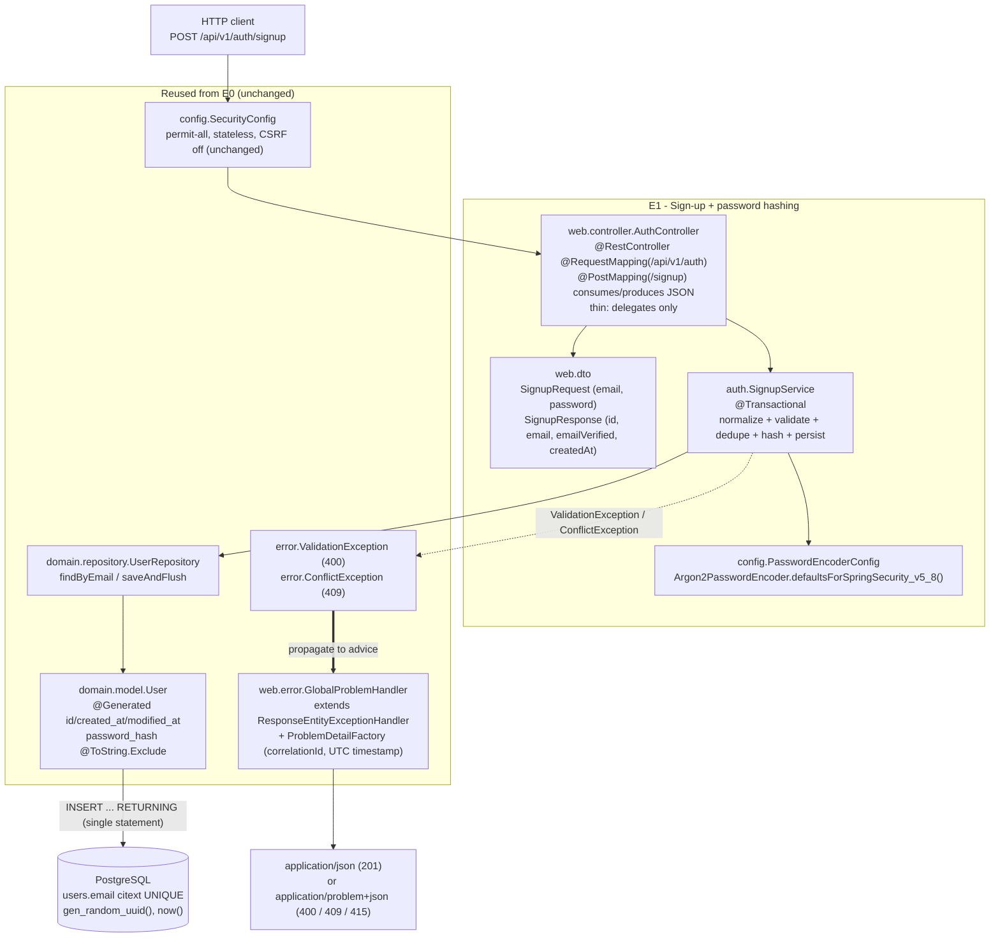
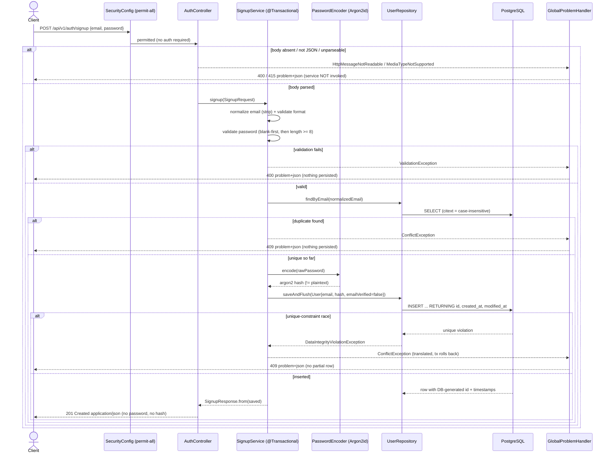

# Design Document

## Overview

Epic E1 adds the first authentication endpoint, `POST /api/v1/auth/signup`, on top of the
`002-backend-domain-foundation` persistence layer. It registers a new local account from an email
address and a password: it normalizes the email, enforces a server-authoritative email-format and
password-length policy, rejects duplicates, hashes the password with **Argon2id** so the plaintext is
never stored, persists the account in an **unverified** state, and returns `201 Created` with a body
that carries neither the password nor the hash. Validation failures return `400` and duplicates
return `409`, both through the existing RFC 9457 problem path.

E1 deliberately reuses, rather than re-implements, the foundation already shipped:

- It **reuses** the existing `com.bovae.yaj.domain.model.User` entity and
  `com.bovae.yaj.domain.repository.UserRepository` (`findByEmail`) — no schema change, no new entity.
  The `users.email` column is PostgreSQL `citext`, so case-insensitive de-duplication happens at the
  database (Req 2.2, 5.1).
- It **reuses** the typed domain exceptions `com.bovae.yaj.error.ValidationException` (→400) and
  `com.bovae.yaj.error.ConflictException` (→409) and their existing mapping in
  `com.bovae.yaj.web.error.GlobalExceptionHandler` through `ProblemDetailFactory`. E1 adds **no** new
  `@RestControllerAdvice` and **no** parallel error shape (Req 11).
- It **relies on** the fact that `GlobalProblemHandler extends ResponseEntityExceptionHandler`, so an
  absent, unparseable, or wrong-content-type body already becomes an RFC 9457 `400`/`415` without a
  new handler (Req 1.7).
- It **leaves** the permit-all `SecurityConfig` untouched: the endpoint is reachable unauthenticated
  today, and E1 issues no token, cookie, or session (Req 12).
- It **respects** the NullAway `@NonNull`-by-default policy (`AnnotatedPackages=com.bovae.yaj`): every
  nullable request field is explicitly `@Nullable`, and every repository lookup returns `Optional<T>`.
- It **honors** the JaCoCo 90/90 gate and its exclusions (`**/config/**`, `**/model/**`,
  `**/mapper/*Impl*`, `**/*Application.*`) by placing the encoder bean in the excluded `config`
  package and keeping all branch-bearing logic in the gated service.

The one new runtime dependency is **BouncyCastle** (`org.bouncycastle:bcprov-jdk18on`), which
Spring Security's `Argon2PasswordEncoder` requires on the classpath (Req 14).

### Scope boundary (what E1 does NOT do)

E1 stops at account creation. Issuing the verification token, sending the verification email over
SMTP, and the verify/resend endpoints belong to **E2** — E1 only leaves `email_verified = false`
(Req 13). Replacing the permit-all seam with JWT authentication belongs to **E4** — E1 adds no
authentication filter or authorization rule (Req 12.2).

### Package layout

| Package | Contents | Coverage status |
|---|---|---|
| `com.bovae.yaj.web.controller` | `AuthController` (real API controller) | **Counted** — controller slice test + BDD |
| `com.bovae.yaj.web.dto` | `SignupRequest`, `SignupResponse` Java records (single `dto` package for both request and response) | **Counted** — `SignupResponse.from` exercised by service/controller tests |
| `com.bovae.yaj.auth` | `SignupService` (transactional business logic) | **Counted** — `SignupServiceTest` covers every branch |
| `com.bovae.yaj.config` | `PasswordEncoderConfig` (Argon2id `PasswordEncoder` bean) | **Excluded** (`**/config/**`) — Req 7.1 places it here deliberately |
| `com.bovae.yaj.config.properties` | `SignupProperties` (externalized `yaj.signup.*` policy values) | **Excluded** (`**/config/**`) |
| `com.bovae.yaj.domain.model` | `User` (reused, unchanged) | **Excluded** (`**/model/**`) |
| `com.bovae.yaj.domain.repository` | `UserRepository` (reused, unchanged) | **Counted** (interface, no executable lines) |
| `com.bovae.yaj.error`, `com.bovae.yaj.web.error` | `ValidationException`, `ConflictException`, `GlobalProblemHandler` (reused, unchanged) | **Counted** (already covered in E0) |

> The real API controllers live under `com.bovae.yaj.web.controller` and the request/response DTOs
> under `com.bovae.yaj.web.dto` — a single `dto` package holds both the request and response records.
> All web concerns live under `web.*`, while the business logic lives in the separate `auth` package
> so E2/E4 auth concerns can cohere there later. The `com.bovae.yaj.web.controller.MockBoardController`
> is unrelated mock code, with its board records co-located under `com.bovae.yaj.web.dto` (not part of
> E1) that a later epic removes.

## Architecture



Two flows matter in E1: the **success path** (validate → dedupe → encode → persist → 201 body built
from the flushed entity) and the **failure path** (a domain exception propagates to the existing
advice, which produces the RFC 9457 body). The sequence diagram below shows both, including the
duplicate pre-check and the concurrent-insert race.



### Configuration / dependency changes

| Change | Location | Before | After | Reason |
|---|---|---|---|---|
| Add `org.bouncycastle:bcprov-jdk18on` | `be/pom.xml` `<dependencies>` | absent | declared (no `<version>` — Spring Boot dependency management supplies it) | `Argon2PasswordEncoder` requires BouncyCastle on the classpath at runtime (Req 14.1, 14.2). |
| `PasswordEncoder` bean | new `config.PasswordEncoderConfig` | none | Argon2id bean | Req 7.1 (bean lives in `com.bovae.yaj.config`). |
| `SignupProperties` record | new `config.properties.SignupProperties` | none | `@Validated @ConfigurationProperties(prefix = "yaj.signup")` | Externalize the password-length / email-length policy values instead of hardcoding them in `SignupService`; auto-registered by the existing `@ConfigurationPropertiesScan` (Req 14.3, 14.4). |
| `yaj.signup.*` block | `be/src/main/resources/application.yml` | absent | `min-password-length: 8`, `max-password-length: 128`, `min-email-length: 6`, `max-email-length: 254` | Supplies the externalized policy defaults bound by `SignupProperties`. |

New `application.yml` block:

```yaml
yaj:
  signup:
    min-password-length: 8
    max-password-length: 128
    min-email-length: 6
    max-email-length: 254
```

> **Externalized policy defaults.** The policy defaults are now **8** / **128** (minimum / maximum
> password length) and **6** / **254** (minimum / maximum email length) — so the glossary's
> `Minimum_Password_Length = 8` still holds — but they are now bound from `application.yml` into
> `SignupProperties` rather than hardcoded as constants in `SignupService`. The maximum password
> length is a hashing-cost guard (it caps the work Argon2id does per request, preventing a
> long-password hashing DoS), while the minimum email length and the interior-whitespace rejection
> tighten the email-format rule. `SignupProperties` lives in the JaCoCo-excluded `config` package
> (`**/config/**`), so the value object carries no coverage burden, and it is auto-registered by the
> `@ConfigurationPropertiesScan` already present on `YetAnotherJiraApplication` — no change to the app
> class and no `@EnableConfigurationProperties` is needed.

> **BouncyCastle version (verified handling):** Spring Boot's dependency management manages the
> BouncyCastle `*-jdk18on` artifacts, so the dependency is declared **without** an explicit
> `<version>` and inherits the BOM-managed version, consistent with how `commons-lang3` is declared
> in E0. *Fallback:* if a build shows the artifact unmanaged (no version resolved), pin a current
> `bcprov-jdk18on` version explicitly and record it in the pom; this is the only case in which E1
> hardcodes a third-party version. No `<scope>` is required (default `compile` places it on the
> runtime classpath); `runtime` scope is an acceptable tightening since only Spring Security
> references BouncyCastle, never E1 code. The thin-jar enforcement in the pom does not forbid
> BouncyCastle, so packaging it into `BOOT-INF/lib` is expected and correct.

## Components and Interfaces

### `AuthController` (thin web layer)

The controller does HTTP only: it binds the JSON body to `SignupRequest`, delegates to
`SignupService`, and returns `201`. It contains **no** validation, uniqueness, hashing, or
persistence logic, and never touches `UserRepository` (Req 1.3).

```java
package com.bovae.yaj.web.controller;

import com.bovae.yaj.auth.SignupService;
import com.bovae.yaj.web.dto.SignupRequest;
import com.bovae.yaj.web.dto.SignupResponse;
import lombok.RequiredArgsConstructor;
import org.springframework.http.HttpStatus;
import org.springframework.http.MediaType;
import org.springframework.web.bind.annotation.PostMapping;
import org.springframework.web.bind.annotation.RequestBody;
import org.springframework.web.bind.annotation.RequestMapping;
import org.springframework.web.bind.annotation.ResponseStatus;
import org.springframework.web.bind.annotation.RestController;

@RestController
@RequestMapping("/api/v1/auth")
@RequiredArgsConstructor
public class AuthController {

    private final SignupService signupService;

    @PostMapping(
            value = "/signup",
            consumes = MediaType.APPLICATION_JSON_VALUE,
            produces = MediaType.APPLICATION_JSON_VALUE)
    @ResponseStatus(HttpStatus.CREATED)
    public SignupResponse signup(@RequestBody SignupRequest request) {
        return signupService.signup(request);
    }
}
```

Notes:

- `consumes = application/json` makes a wrong/missing `Content-Type` raise
  `HttpMediaTypeNotSupportedException` (→415), and an empty/unparseable JSON body raise
  `HttpMessageNotReadableException` (→400). Both are already mapped to problem JSON by the base
  `ResponseEntityExceptionHandler` in `GlobalProblemHandler`, and the service is never invoked, so no
  row is persisted (Req 1.7). E1 adds no handler for these.
- No `@RequestBody` bean-validation (`@Valid`) is applied — see the validation decision below; the
  request fields are intentionally `@Nullable` and the **service** is the authoritative validator
  (Req 3.1, 4.1 assign the check to the `Signup_Service`).
- `@ResponseStatus(HttpStatus.CREATED)` returns `201` with the DTO as the body (Req 10.1). No
  `Location` header is set because E1 ships no account-retrieval endpoint to point at yet; a
  `Location` is deferred to the epic that adds account reads, avoiding a header that resolves to
  nothing.

### `SignupService` (transactional business logic)

All signup rules live here, inside a single `@Transactional` method so the work commits only on
success and rolls back on any thrown exception, leaving no partial row (Req 1.4, 1.5, 1.6).

```java
package com.bovae.yaj.auth;

import com.bovae.yaj.domain.model.User;
import com.bovae.yaj.domain.repository.UserRepository;
import com.bovae.yaj.error.ConflictException;
import com.bovae.yaj.error.ValidationException;
import com.bovae.yaj.web.dto.SignupRequest;
import com.bovae.yaj.web.dto.SignupResponse;
import com.bovae.yaj.config.properties.SignupProperties;
import lombok.RequiredArgsConstructor;
import lombok.extern.slf4j.Slf4j;
import org.apache.commons.lang3.StringUtils;
import org.springframework.dao.DataIntegrityViolationException;
import org.springframework.lang.Nullable;
import org.springframework.security.crypto.password.PasswordEncoder;
import org.springframework.stereotype.Service;
import org.springframework.transaction.annotation.Transactional;

@Slf4j
@Service
@RequiredArgsConstructor
public class SignupService {

    private final UserRepository userRepository;
    private final PasswordEncoder passwordEncoder;
    private final SignupProperties signupProperties;

    @Transactional
    public SignupResponse signup(SignupRequest request) {
        String email = normalizeAndValidateEmail(request.email());
        String password = validatePassword(request.password());

        // Req 5: case-insensitive pre-check (citext column) before attempting an insert.
        if (userRepository.findByEmail(email).isPresent()) {
            LOG.info("Signup rejected: email already registered");
            throw new ConflictException("Email address is already registered.");
        }

        String passwordHash = passwordEncoder.encode(password);
        // Req 7.5: defensive invariant — Argon2id never returns the plaintext; if it did, fail
        // before persisting anything (maps to a generic 500, never leaks the hash/plaintext).
        if (passwordHash.equals(password)) {
            throw new IllegalStateException("Password encoder returned plaintext; refusing to persist.");
        }

        User user = new User();
        user.setEmail(email); // Req 9: id/created_at/modified_at are @Generated — never set here.
        user.setPasswordHash(passwordHash);
        user.setEmailVerified(false);

        try {
            User saved = userRepository.saveAndFlush(user); // flush now so a race surfaces here, not at commit.
            LOG.info("Account created: userId={}", saved.getId());
            return SignupResponse.from(saved);
        } catch (DataIntegrityViolationException ex) {
            // Req 6: a concurrent signup won the unique race after our pre-check. Translate to a
            // clean 409. The exception propagates, so the transaction rolls back: no partial row,
            // and the driver/SQL/constraint text never reaches the response.
            LOG.warn("Signup race: email unique-constraint rejected the insert; translating to conflict");
            throw new ConflictException("Email address is already registered.");
        }
    }

    private String normalizeAndValidateEmail(@Nullable String submittedEmail) {
        // Req 3.1: required check first (covers absent, empty, and whitespace-only).
        if (StringUtils.isBlank(submittedEmail)) {
            throw new ValidationException("An email address is required.");
        }
        // Req 2.1 / 2.3: strip surrounding whitespace; interior characters and letter case preserved.
        String email = submittedEmail.strip();

        // Req 3.2 / 3.5: deliberate format rule (jakarta @Email is too lenient — it accepts a dot-less
        // domain such as "user@localhost"), bounded below by the minimum and above by the maximum.
        if (email.length() < signupProperties.minEmailLength()
                || email.length() > signupProperties.maxEmailLength()
                || !isWellFormedEmail(email)) {
            throw new ValidationException("The email address is malformed.");
        }
        return email;
    }

    private static boolean isWellFormedEmail(String email) {
        // Req 3.4: after strip(), any remaining whitespace is interior — reject it.
        if (email.chars().anyMatch(Character::isWhitespace)) {
            return false;
        }
        int at = email.indexOf('@');
        // exactly one '@': first '@' exists and there is no second one
        if (at < 0 || email.indexOf('@', at + 1) >= 0) {
            return false;
        }
        String local = email.substring(0, at);
        String domain = email.substring(at + 1);
        if (local.isEmpty() || domain.isEmpty()) {
            return false; // non-empty local part and non-empty domain
        }
        String[] labels = domain.split("\\.", -1); // -1 keeps trailing empty labels
        if (labels.length < 2) {
            return false; // domain must hold at least one dot
        }
        for (String label : labels) {
            if (label.isEmpty()) {
                return false; // no leading dot, trailing dot, or consecutive dots
            }
        }
        return true;
    }

    private String validatePassword(@Nullable String submittedPassword) {
        // Req 4.1: blank-first (absent, empty, or whitespace-only) regardless of length.
        if (StringUtils.isBlank(submittedPassword)) {
            throw new ValidationException("A password is required.");
        }
        // Req 4.2 / 4.3 / 4.7: count every character, including whitespace; no trimming.
        if (submittedPassword.length() < signupProperties.minPasswordLength()) {
            throw new ValidationException("The password is too short.");
        }
        if (submittedPassword.length() > signupProperties.maxPasswordLength()) {
            throw new ValidationException("The password is too long.");
        }
        return submittedPassword;
    }
}
```

Key points:

- **Validation precedence is exact.** Email: required (blank) → format/length (Req 3.1 before 3.2).
  Password: required (blank) → length (Req 4.1 before 4.2). The password length is measured on the
  **raw** value, never the trimmed value, so `"   a    "` (length 8, non-blank) is accepted while
  `"   "` is rejected as *required* (not *too short*).
- **Normalization preserves interior + case** (`strip()` removes only leading/trailing whitespace).
  The stored value therefore has no surrounding whitespace and keeps the original case (Req 2.1, 2.3),
  while the `citext` column makes the uniqueness comparison case-insensitive (Req 2.2).
- **`saveAndFlush` (not `save`)** forces the `INSERT` to execute inside the `try`, so a unique-key
  race throws `DataIntegrityViolationException` where we can catch it and translate it to a
  `ConflictException` (Req 6.1). The translated exception propagates out of the `@Transactional`
  method, so Spring rolls the transaction back — no partial row (Req 6.4) — and the response carries
  only our message, never driver/SQL/constraint text (Req 6.3).
- **The service sets only `email`, `passwordHash`, `emailVerified=false`.** `id`, `created_at`, and
  `modified_at` are `@Generated @ColumnDefault(...)` on the entity, so Hibernate omits them from the
  `INSERT` and reads the DB-generated values back via `INSERT ... RETURNING`; `saveAndFlush` returns
  the entity populated with them (Req 9.2, 9.3, 9.4). The DTO has no id/timestamp fields, so a
  client cannot supply them (Req 9.5).

### `PasswordEncoderConfig` (Argon2id bean)

```java
package com.bovae.yaj.config;

import org.springframework.context.annotation.Bean;
import org.springframework.context.annotation.Configuration;
import org.springframework.security.crypto.argon2.Argon2PasswordEncoder;
import org.springframework.security.crypto.password.PasswordEncoder;

@Configuration
public class PasswordEncoderConfig {

    @Bean
    public PasswordEncoder passwordEncoder() {
        // Argon2id with Spring Security's current defaults (random per-encode salt).
        return Argon2PasswordEncoder.defaultsForSpringSecurity_v5_8();
    }
}
```

Verified external API (authoritative, not re-derived):
`org.springframework.security.crypto.argon2.Argon2PasswordEncoder.defaultsForSpringSecurity_v5_8()`
returns a `PasswordEncoder` that uses **Argon2id** with current defaults. The `PasswordEncoder`
contract is `String encode(CharSequence rawPassword)` and
`boolean matches(CharSequence rawPassword, String encodedPassword)`. Each `encode` of the same input
yields a **different** hash because a fresh random salt is generated per call — this directly
satisfies Req 7.6. `Argon2PasswordEncoder` requires **BouncyCastle** on the classpath, supplied by
the `bcprov-jdk18on` dependency (Req 14.1).

- The bean lives in `com.bovae.yaj.config` (Req 7.1), which is JaCoCo-excluded — so the encoder
  wiring carries no coverage burden, while the branch-bearing logic stays in the gated `auth`
  package.
- Declaring only a `PasswordEncoder` bean does **not** trigger Spring Security's auto-configured
  default user/password (that is triggered by a `UserDetailsService`/`AuthenticationManager`
  auto-config, none of which E1 adds), so the permit-all seam is unchanged (Req 12.2).

### `SignupProperties` (externalized policy values)

The numeric policy values (minimum password length, maximum email length) are externalized as a
validated `@ConfigurationProperties` record, mirroring the existing `ValkeyProperties` pattern. It is
auto-registered by the `@ConfigurationPropertiesScan` already present on `YetAnotherJiraApplication`,
so no `@EnableConfigurationProperties` and no change to the application class is required.

```java
package com.bovae.yaj.config.properties;

import jakarta.validation.constraints.Max;
import jakarta.validation.constraints.Min;
import org.springframework.boot.context.properties.ConfigurationProperties;
import org.springframework.validation.annotation.Validated;

@Validated
@ConfigurationProperties(prefix = "yaj.signup")
public record SignupProperties(
        @Min(value = 1, message = "yaj.signup.min-password-length must be at least 1") int minPasswordLength,
        @Min(value = 1, message = "yaj.signup.max-password-length must be at least 1") int maxPasswordLength,
        @Min(value = 1, message = "yaj.signup.min-email-length must be at least 1") int minEmailLength,
        @Min(value = 1, message = "yaj.signup.max-email-length must be at least 1")
                @Max(value = 254, message = "yaj.signup.max-email-length must not exceed the RFC 5321 limit of 254")
                int maxEmailLength) {}
```

- The defaults (`8` / `128` / `6` / `254`) come from `application.yml` (`yaj.signup.min-password-length`,
  `yaj.signup.max-password-length`, `yaj.signup.min-email-length`, `yaj.signup.max-email-length`),
  keeping the glossary's `Minimum_Password_Length = 8` intact while removing the hardcoded constants
  from `SignupService`.
- `maxEmailLength` is bounded by `@Max(254)` so the externalized config can never be set above the
  RFC 5321 maximum email-address length (local part ≤ 64, domain ≤ 255, full address ≤ 254 octets);
  the other three bounds carry `@Min(1)` to stay positive integers. `maxPasswordLength` deliberately
  carries **no** `@Max` — there is no RFC ceiling for a password length, and the 128 default is a
  hashing-cost (Argon2id DoS) guard rather than a hard protocol limit, so an arbitrary upper cap on
  the config value would add no value. `minEmailLength` complements the structural
  `isWellFormedEmail` check by rejecting addresses too short to be plausible.
- `SignupService` injects `SignupProperties` through its `@RequiredArgsConstructor` and reads
  `signupProperties.minPasswordLength()` / `signupProperties.maxPasswordLength()` /
  `signupProperties.minEmailLength()` / `signupProperties.maxEmailLength()` in its validation methods.
- The record sits in `com.bovae.yaj.config.properties`, which is JaCoCo-excluded (`**/config/**`), so
  it carries no coverage burden.

### DTOs (`web.dto`)

```java
package com.bovae.yaj.web.dto;

import org.springframework.lang.Nullable;

// Fields are nullable on purpose: the SERVICE is the authoritative validator (Req 3.1, 4.1),
// so no @NotNull / @Valid bean-validation is applied here.
public record SignupRequest(@Nullable String email, @Nullable String password) {}
```

```java
package com.bovae.yaj.web.dto;

import com.bovae.yaj.domain.model.User;
import java.time.Instant;
import java.util.UUID;

public record SignupResponse(UUID id, String email, boolean emailVerified, Instant createdAt) {

    public static SignupResponse from(User user) {
        return new SignupResponse(user.getId(), user.getEmail(), user.isEmailVerified(), user.getCreatedAt());
    }
}
```

- `SignupResponse` **physically cannot** carry the password or the hash — it has no such component
  (Req 8.3, 8.4, 10.2). It exposes the DB-generated `id`, the stored normalized `email`, the
  `emailVerified=false` flag, and the DB-generated `createdAt`.
- `createdAt` is an `Instant`; Jackson (Boot disables `WRITE_DATES_AS_TIMESTAMPS`) serializes it as
  an ISO-8601 instant in UTC (e.g. `2025-01-02T03:04:05.123Z`), satisfying Req 10.4.

### Mapping decision — static factory over MapStruct

`User → SignupResponse` is a flat three/four-field projection. A static factory `SignupResponse.from`
is chosen over a MapStruct `UserMapper`:

- **Chosen:** `SignupResponse.from(User)`. Simplest possible mapping for a trivial scalar projection,
  with no annotation-processor indirection and the mapping visible next to the type it produces. It
  is exercised by the service success-path test and the controller test, so it is covered.
- **Rejected:** a MapStruct mapper in a `mapper` package. MapStruct earns its keep on large/nested
  mappings; for four scalar fields it adds a generated `*Impl`, a bean, and ceremony with no benefit.
  (The `mapper/*Impl` JaCoCo exclusion would cover the generated impl, but that is not a reason to
  introduce indirection.) MapStruct remains available for the richer read-model mappings later epics
  will need.

### Validation-placement decision — service-authoritative, no bean validation

- **Chosen:** validate in `SignupService` (throwing `ValidationException`/`ConflictException`).
  Requirements 3.1/3.2/4.1/4.2 explicitly assign the check to the *Signup_Service*, the messages are
  defined in one place, and every failure flows through the single existing problem path with
  consistent wording.
- **Rejected (as the authoritative check):** `@NotNull`/`@Size`/`@Email` on `SignupRequest` plus
  `@Valid` on the controller parameter. That would move the check to the framework (raising
  `MethodArgumentNotValidException` from the controller, not the service), contradicting the
  requirement's actor and producing a different error body shape and message. *Note:* such
  annotations could be added later as a **defensive complement** (a fast first-line `400`); they
  would still map to `400` via the existing handler, but they would not be the canonical check and
  must not replace the service rules. E1 omits them to keep exactly one authoritative validation path.

## Data Models

E1 introduces **no** persistent schema change. It reuses the `users` table and the `User` entity
exactly as shipped in E0; the only new "models" are the two request/response DTOs.

### Reused entity `User` → `users` (unchanged)

The fields E1 reads or writes (full mapping is owned by E0):

| Java field | Column | E1 interaction |
|---|---|---|
| `id` (`UUID`, `@Generated @ColumnDefault("gen_random_uuid()")`) | `id` | **Read back** after insert; returned in `SignupResponse`. Never set by the service. |
| `email` (`String`, `citext NOT NULL UNIQUE`) | `email` | **Set** to the normalized email. Uniqueness enforced case-insensitively at the DB. |
| `passwordHash` (`String`, `NOT NULL`, `@ToString.Exclude`) | `password_hash` | **Set** to the Argon2id hash. `@ToString.Exclude` keeps it out of any `toString()` log line (Req 8.2). |
| `emailVerified` (`boolean`, `NOT NULL`) | `email_verified` | **Set** to `false` (Req 9.1, 13.1). |
| `createdAt` / `modifiedAt` (`Instant`, `@Generated @ColumnDefault("now()")`) | `created_at` / `modified_at` | **Read back** after insert (UTC). `createdAt` returned in `SignupResponse`. Never set. |
| `deletedAt` (`@Nullable Instant`) | `deleted_at` | Untouched by E1 (remains null). |

### New DTO `SignupRequest`

| Component | Type | Notes |
|---|---|---|
| `email` | `@Nullable String` | Raw submitted email; may be null/blank — the service validates. |
| `password` | `@Nullable String` | Raw submitted password; may be null/blank — the service validates. Never logged, never returned. |

### New DTO `SignupResponse`

| Component | Type | Source | Notes |
|---|---|---|---|
| `id` | `UUID` | DB-generated | Req 10.2. |
| `email` | `String` | normalized stored email | Req 10.2 (no surrounding whitespace, original case). |
| `emailVerified` | `boolean` | always `false` at creation | Req 10.2, 13.1. |
| `createdAt` | `Instant` | DB-generated, UTC | Serialized ISO-8601 UTC by Jackson (Req 10.4). |

> The response model deliberately enumerates only non-sensitive fields. Because it is a `record`,
> adding a password/hash member would be a visible, reviewable code change — the confidentiality
> guarantee is structural, not merely conventional (Req 8.3, 8.4).

## Error Handling

E1 introduces no new error path; it feeds the existing one. Every failure becomes a typed domain
exception that the existing `GlobalProblemHandler` maps to an RFC 9457 `application/problem+json` body
enriched with `correlationId` and a UTC `timestamp` by `ProblemDetailFactory`.

| Failure | Where detected | Exception | HTTP | Body / leakage |
|---|---|---|---|---|
| Blank/missing email | `SignupService` | `ValidationException("An email address is required.")` | 400 | Fixed message only (Req 3.1, 3.3, 11.1). |
| Malformed/oversize email | `SignupService` | `ValidationException("The email address is malformed.")` | 400 | Fixed message only (Req 3.2, 3.3). |
| Blank/missing password | `SignupService` | `ValidationException("A password is required.")` | 400 | No password value in message (Req 4.1, 4.4, 8.5). |
| Too-short password | `SignupService` | `ValidationException("The password is too short.")` | 400 | No password value/length echoed (Req 4.2, 4.4, 8.5). |
| Duplicate (pre-check) | `SignupService` | `ConflictException("Email address is already registered.")` | 409 | Fixed message (Req 5.1, 5.2). |
| Duplicate (insert race) | `SignupService` catch of `DataIntegrityViolationException` | `ConflictException("Email address is already registered.")` | 409 | No driver/SQL/constraint/index/type names (Req 6.1–6.3). |
| Absent/unparseable JSON body | framework (before service) | `HttpMessageNotReadableException` | 400 | Mapped by base `ResponseEntityExceptionHandler`; service not invoked (Req 1.7). |
| Wrong/missing `Content-Type` | framework (before service) | `HttpMediaTypeNotSupportedException` | 415 | Mapped by base handler; service not invoked (Req 1.7). |
| Encoder returns plaintext (must-never-happen) | `SignupService` guard | `IllegalStateException` | 500 (generic) | Caught by `handleUnexpected`; message never includes hash/plaintext; nothing persisted (Req 7.5, 8.2). |

Transaction and confidentiality guarantees:

- **Atomicity / no partial row.** The `@Transactional` method commits only on the success return; any
  thrown exception (validation, conflict, race translation, or the guard) propagates through the
  proxy and rolls the transaction back. The duplicate race is caught *inside* the method only to
  re-throw a `ConflictException`, which still rolls the transaction back — so no partial or orphaned
  row survives (Req 1.4, 1.6, 4.5, 5.3, 6.4).
- **No internals leak.** All domain-exception messages are fixed strings authored by E1; the existing
  handler builds the body from status + title + message only, never a stack trace, type name, or SQL
  (Req 6.3, 11.4). The `DataIntegrityViolationException` is logged at `WARN` *without* its SQL/cause
  detail and never forwarded to the client.
- **Sensitive data stays out.** `password_hash` is `@ToString.Exclude` on the entity, so no
  `toString()` log line can leak it; the service logs only the created `userId` on success and
  outcome-only messages on failure (no email, no password, no hash) — and the log pattern already
  carries the `correlationId` for traceability (Req 8.1, 8.2).

## Testing Strategy

E1 is verified with three test types only: **unit tests** (JUnit 5 + Mockito) for the service logic,
the encoder behavior, the web slice, and confidentiality; **integration tests** (the `src/it` source
set, Testcontainers PostgreSQL — the same setup as `EntityPersistenceIntegrationTest` /
`AbstractPostgresIntegrationTest`) for the behaviors that need a real database; and **BDD** (Cucumber,
`src/bdd`) for the end-to-end signup scenario. There is **no** property-based testing and **no**
property-based testing library: the input-space coverage that a property would give is expressed as
`@ParameterizedTest` tables over carefully chosen inputs plus example-based methods. Unit tests use
JUnit 5 + Mockito; per the test conventions, the email-format and password-length tables are
`@ParameterizedTest`s, while tests with distinct mock setups or distinct interaction verification stay
as separate methods.

### Unit tests — `SignupServiceTest` (`src/test/java`, no database)

`@ExtendWith(MockitoExtension.class)` with `@Mock UserRepository`, `@Mock PasswordEncoder`, and
`@Captor ArgumentCaptor<User>`. The service is built in a `@BeforeEach` rather than via
`@InjectMocks`, because `SignupProperties` is a record value object that should not be mocked — the
test constructs it directly with the real policy values: `new SignupService(userRepository,
passwordEncoder, new SignupProperties(8, 254))`. The `@Captor` is still used to verify the persisted
`User`.

| Test | What it verifies | Requirements |
|---|---|---|
| `signup_shouldEncodeOnceWithRawPassword_whenValid` | `verify(passwordEncoder, times(1)).encode(rawPassword)`; no other encode interactions | 15.1, 7.2 |
| `signup_shouldPersistUnverifiedUserWithHashedPassword_whenValid` | `@Captor` on `saveAndFlush`: captured `User` has `emailVerified=false`, `email` normalized, `passwordHash` equals the stubbed hash and `!= plaintext`; exactly one `saveAndFlush`; response mirrors id/email/false | 1.5, 7.2, 7.3, 9.1, 10.2, 13.1 |
| `normalize_shouldStripPreserveInteriorAndCase` (`@ParameterizedTest` / `@CsvSource`) | `"  Foo@Bar.com  "` etc. persist as `"Foo@Bar.com"` (captor); interior + case preserved, surround stripped | 2.1, 2.3 |
| `signup_shouldRejectEmail_whenBlankOrMalformed` (`@ParameterizedTest` / `@MethodSource`) | blank (null, `""`, `"   "`), `>254`, no `@`, two `@`, empty local, `a@b` (no dot), `a@.b`, `a@b.`, `a@b..c` → `ValidationException`; `verifyNoInteractions(passwordEncoder)` and no `saveAndFlush` (nothing persisted) | 3.1, 3.2, 1.6 |
| `signup_shouldRejectPassword_whenBlankOrTooShort` (`@ParameterizedTest` / `@MethodSource`) | null, `""`, `"   "`, `"1234567"` (7) → `ValidationException`; `"        "` (8 spaces) → *required* not *too short*; nothing persisted | 4.1, 4.2, 4.5, 1.6 |
| `signup_shouldAcceptPassword_whenAtLeastEightChars` (`@ParameterizedTest` / `@ValueSource`) | `"12345678"`, `"   a    "` (len 8, non-blank) pass the length policy | 4.3 |
| `signup_shouldRaiseConflict_whenEmailAlreadyRegistered` (`@ParameterizedTest` / `@CsvSource` over case/whitespace variants) | `findByEmail` stubbed present for a case/whitespace variant of a registered email → `ConflictException`; `saveAndFlush` never called (nothing persisted) | 2.2, 5.1, 5.3, 1.6, 15.2 |
| `signup_shouldTranslateToConflict_whenUniqueRace` | `saveAndFlush` stubbed to throw `DataIntegrityViolationException` → `ConflictException`; message is the fixed text (no internals) | 6.1, 6.2, 6.3 |
| `signup_shouldFailAndNotPersist_whenEncoderReturnsPlaintext` (edge case) | `encode` mock returns the plaintext → signup throws, `saveAndFlush` never called | 7.5 |

Mockito strict-stub note: validation-failure tests stub neither `findByEmail` nor `encode` (those
collaborators are never reached), so no `UnnecessaryStubbingException` arises; only the tests that
reach persistence stub them.

> The case-insensitive duplicate rejection (former Req 2.2/5.1 coverage) is verified here at the unit
> level with a mocked `findByEmail` returning a present account for each case/whitespace variant, and
> again at the database level in the integration test below (`SignupPersistenceIntegrationTest`),
> which proves the real `citext` column actually de-duplicates case-insensitively rather than relying
> on the mock.

### Unit tests — encoder behavior (`Argon2PasswordEncoderBehaviorTest`, no database)

Plain JUnit 5 example-based tests (no generators, no iteration loops) against
`Argon2PasswordEncoder.defaultsForSpringSecurity_v5_8()` — the same factory the bean uses. Each test
uses a small fixed set of example passwords (e.g. `"password1"`, `"correct horse"`, `"   spaced   "`),
keeping Argon2's CPU/memory cost low:

| Test | What it verifies | Requirements |
|---|---|---|
| `encode_shouldProduceNonEmptyHashUnequalToPlaintext` | for each example password, `encode` returns a non-empty hash string `!=` the plaintext | 7.2, 7.3 |
| `matches_shouldReturnTrueForCorrectAndFalseForWrongPassword` | for each example, `matches(rawPassword, encode(rawPassword))` is `true`; `matches(differentPassword, encode(rawPassword))` is `false` | 7.4, 7.7 |
| `encode_shouldProduceDifferentHashEachTime_andBothVerify` | for an example password, two `encode` calls yield two different hash strings (random salt), yet `matches` verifies the original against both | 7.6 |

### Integration tests — `SignupPersistenceIntegrationTest` (`src/it`, Testcontainers PostgreSQL)

`SignupPersistenceIntegrationTest extends AbstractPostgresIntegrationTest` (the `@DataJpaTest` +
Testcontainers PostgreSQL base used by `EntityPersistenceIntegrationTest`), autowiring
`UserRepository` (and `TestEntityManager` for reload). These cases need a real database — mocks cannot
prove the DB-generated values or the `citext` uniqueness behavior:

| Test | What it verifies | Requirements |
|---|---|---|
| `signup_shouldReadBackDbGeneratedIdAndTimestamps` | persist a `User` via `saveAndFlush`, clear, reload: non-null `UUID` id, non-null UTC `created_at` and `modified_at` — all server-side defaults, none client-supplied | 9.2, 9.3, 9.4 |
| `email_shouldRejectCaseInsensitiveDuplicate_atCitextColumn` | persist `"User@Example.com"`, then `findByEmail("user@example.com")` returns the same row (case-insensitive lookup); inserting `"USER@EXAMPLE.COM"` is rejected by the `email` `UNIQUE` constraint (`DataIntegrityViolationException`) | 2.2, 5.1, 6.1 |

> These integration tests live in `src/it` alongside the existing domain-foundation persistence
> tests and run under the same Testcontainers PostgreSQL profile, so the `citext` semantics and the
> `@Generated` id/timestamp defaults are exercised against an actual PostgreSQL instance.

### Unit tests — `AuthControllerTest` (web slice)

`@WebMvcTest(AuthController.class)` with `@AutoConfigureMockMvc(addFilters = false)` and
`@MockitoBean SignupService` (Spring Boot 3.5 replaces the deprecated `@MockBean` with
`@MockitoBean`). Disabling the filters sidesteps the auto-configured security filter chain in the
slice — appropriate because the permit-all policy makes security irrelevant to the controller's
behavior, and the reachability-without-auth requirement is proven end-to-end in BDD instead.

| Test | What it verifies | Requirements |
|---|---|---|
| `signup_shouldReturn201AndBody_whenServiceSucceeds` | 201; JSON has `id`, `email`, `emailVerified=false`, `createdAt`; content type `application/json` | 10.1, 10.2, 10.3 |
| `signup_shouldSerializeCreatedAtAsIsoUtc` | `createdAt` rendered as ISO-8601 `...Z` instant | 10.4 |
| `signup_responseShouldNotContainPasswordOrHash` | response JSON has no `password`/`passwordHash`/`hash` member; no `Set-Cookie`/token | 8.3, 8.4, 12.3 |
| `signup_shouldReturn400_whenBodyUnparseable` | empty/garbage body → 400 problem+json; `verifyNoInteractions(signupService)` | 1.7 |
| `signup_shouldReturn415_whenContentTypeNotJson` | `text/plain` body → 415; service not invoked | 1.7 |

### Unit test — confidentiality (logs + response)

`SignupConfidentialityTest` using Spring Boot's `OutputCaptureExtension` (or a Logback `ListAppender`
attached to the `SignupService` logger):

- Run a successful signup and a failing signup; assert the captured log output contains **neither**
  the submitted password **nor** the produced hash at any level (Req 8.1, 8.2, 15.5).
- Serialize `SignupResponse` with the application `ObjectMapper`; assert no member exposes the
  password or hash (Req 8.3, 8.4, 15.5).

### BDD (Cucumber, `bdd` profile, full context + Testcontainers PostgreSQL)

New `src/bdd/resources/features/signup.feature`, tagged `@auth`, with a `SignupSteps` glue class
following the existing BDD conventions (`CucumberSpringConfig` provides `RANDOM_PORT` +
Testcontainers; cleanup in an `@After("@auth")` hook). The steps use `TestRestTemplate` with
`@LocalServerPort` (it does not throw on 4xx, so status is directly assertable) and autowire
`UserRepository` to assert persisted state. (`RestClient`, as used by `SkeletonSteps`, is the
equivalent existing alternative.)

```gherkin
@auth
Feature: Account sign-up

  Scenario: Valid signup creates an unverified account
    Given no account exists with email "new-user@example.com"
    When a signup is submitted with email "new-user@example.com" and password "correct horse"
    Then the signup response status is 201
    And a users row exists for "new-user@example.com" with email_verified false
```

`SignupSteps` responsibilities: POST the JSON body to `/api/v1/auth/signup` unauthenticated (proving
Req 12.1 reachability), assert `201`, then `userRepository.findByEmail(...)` to assert the row exists
with `email_verified=false` and no verification token was created (Req 13.2). The `@After("@auth")`
hook calls `userRepository.deleteAll()` (mirroring `DomainFoundationSteps`). This single scenario
satisfies Req 15.6 and provides the end-to-end persistence proof for a valid signup (Req 1.5, 9.1).

### Smoke / build-gate checks

- **Context loads** with the `PasswordEncoder` bean present and BouncyCastle resolved — proves Req
  7.1, 14.1, 14.2 (the BDD full-context startup already exercises this).
- **`SecurityConfig` unchanged** and no new security beans — proves Req 12.2 (review-level + absence).
- **JaCoCo `bdd`-profile check** enforces ≥90% line and ≥90% branch over non-excluded packages and
  fails the build otherwise (Req 15.7, 15.9). **Spotless** (`palantirJavaFormat`, no wildcard
  imports) and **Error Prone + NullAway** at `ERROR` fail the build on any violation (Req 15.8,
  15.10).

### Coverage-gate mapping (JaCoCo 90/90, `bdd` profile)

| Package / type | Gate treatment | How coverage is met |
|---|---|---|
| `config.PasswordEncoderConfig` | **Excluded** (`**/config/**`) | Encoder wiring; bean instantiation proven by context startup |
| `config.properties.SignupProperties` | **Excluded** (`**/config/**`) | Externalized policy value object; binding proven by context startup |
| `domain.model.User`, `*Application` | **Excluded** | Reused entity / app class |
| `auth.SignupService` | **Counted** | `SignupServiceTest` exercises every branch: email blank/format/oversize, password blank/short/ok, duplicate pre-check, race catch, plaintext guard, success |
| `web.controller.AuthController` | **Counted** | Controller slice + BDD |
| `web.dto.SignupRequest` / `SignupResponse` | **Counted** | `SignupResponse.from` covered by service success + controller tests; records carry no other executable lines |
| `error.*`, `web.error.*` | **Counted** | Already covered in E0; E1 adds no new lines there |

Branch-coverage care: the email-format helper has several `return false` branches (no `@`, second
`@`, empty local, empty domain, `<2` labels, empty label) — the `@MethodSource` table in
`signup_shouldRejectEmail_whenBlankOrMalformed` names one input per branch so all are hit; the race
`catch` and the plaintext-guard `if` are hit by their dedicated tests.

## Design Decisions and Tradeoffs

### Decision A — `saveAndFlush` + catch `DataIntegrityViolationException` for the race

**Chosen:** pre-check with `findByEmail`, then `saveAndFlush`, catching
`DataIntegrityViolationException` and translating it to `ConflictException`.

**Rationale:** the pre-check gives the common-case `409` without hitting the constraint, and
`saveAndFlush` forces the `INSERT` to run *inside* the `try` so a lost race surfaces as a catchable
exception here rather than as an opaque failure at commit. Translating to `ConflictException` keeps
the race indistinguishable from the ordinary duplicate to the client (same `409`, same message) and
guarantees no `5xx` (Req 6.2). On the `users` insert every other column is non-null and set, so the
only integrity constraint that can fire is the `email` `UNIQUE` — making the translation unambiguous.

**Tradeoff:** the catch is on the broad `DataIntegrityViolationException`. Acceptable here because of
the single-constraint argument above; if `users` later grows additional constraints, the catch should
be narrowed (e.g. inspect the constraint name) before assuming "duplicate email".

### Decision B — static factory `SignupResponse.from` over MapStruct

**Chosen:** a static factory on the response record. **Rejected:** a MapStruct `UserMapper`.
**Rationale/Tradeoff:** see *Mapping decision* above — four scalar fields do not justify an
annotation-processor mapper; MapStruct stays available for richer mappings later.

### Decision C — service-authoritative validation, no bean validation

**Chosen:** validate in `SignupService`. **Rejected (as authoritative):** `@Valid` + jakarta
constraints on the DTO. **Rationale/Tradeoff:** see *Validation-placement decision* above —
requirements assign the check to the service, and one validation path keeps messages and the error
actor consistent. `spring-boot-starter-validation` remains on the classpath and may add a defensive
first-line `@NotNull` later without becoming the canonical check.

### Decision D — deliberate email-format rule instead of jakarta `@Email`

**Chosen:** the explicit `isWellFormedEmail` check (exactly one `@`, non-empty local, domain with ≥1
dot between non-empty labels, ≤254).

**Rejected — Hibernate Validator's `@Email`:** `@Email` is intentionally lenient and accepts a
dot-less domain such as `user@localhost`, which Req 3.2 forbids.

**Rejected — a regex-based check:** a single email regex is brittle and hard to read, and it is
difficult to make a regex match the *exact* Req 3.2 semantics (exactly one `@`, a non-empty local
part, a domain with ≥1 dot between non-empty labels, and a ≤254 length bound). The result would be an
opaque pattern that future readers cannot easily map back to the four precise rules, so the small
explicit helper is preferred.

**Rejected — Apache Commons Validator (`org.apache.commons.validator.routines.EmailValidator`):** this
is a **new dependency** (`commons-validator`) that is **not** currently on the classpath, so adopting
it would add a maintenance/security burden purely for this one check. Beyond that, its semantics
differ from the Req 3.2 contract: its `DomainValidator` validates against real, registered TLDs
(accepting or rejecting based on the IANA TLD list) rather than the simple "≥1 dot between non-empty
labels" rule, so it would both reject some inputs Req 3.2 accepts and accept some it should not — a
mismatch with the precise, fully-specified contract.

**Conclusion:** keep the small, fully-specified, unit-tested `isWellFormedEmail` helper and add no new
dependency.

**Tradeoff:** a hand-written rule is stricter and fully specified/testable, but it is deliberately
*not* a full RFC 5322 parser (which would accept quoted local parts and address literals); Req 3.2
defines the contract, and the rule implements exactly that. The
`signup_shouldRejectEmail_whenBlankOrMalformed` parameterized table pins the behavior.

### Decision E — `201` with body, no `Location` header

**Chosen:** `@ResponseStatus(CREATED)` returning the DTO. **Rationale:** Req 10.1 wants `201` + a body;
E1 has no account-retrieval endpoint, so a `Location` URL would point at nothing. **Tradeoff:** a
strict REST reading prefers `Location` on creation; deferring it until a `GET /accounts/{id}` (or
similar) exists avoids shipping a broken header now.

### Decision F — single `web.dto` package, DTOs required

**Chosen:** the request and response records (`SignupRequest`, `SignupResponse`) live in one
`com.bovae.yaj.web.dto` package, and the wire contract is carried by DTOs rather than the `User`
entity.

**Rationale — DTOs are required:** dedicated DTOs decouple the wire contract from the `User` entity,
so the API shape evolves independently of the persistence model, and — critically — the
password/hash exclusion becomes **structural** rather than conventional: `SignupResponse` simply has
no password/hash component, so the confidentiality guarantee cannot be broken by accident (it would
take a visible, reviewable code change). Returning the entity directly would risk leaking
`passwordHash` and couple the response to schema changes.

**Rejected — split `web.request` / `web.response` packages:** two small records do not justify the
fragmentation of two extra packages; a single `web.dto` package keeps the closely-related request and
response types together and is easier to navigate. Splitting can be revisited if the DTO surface
grows substantially in later epics.

### Verification notes (per the shared-libraries rule)

- **Argon2id encoder API — confirmed authoritative:**
  `org.springframework.security.crypto.argon2.Argon2PasswordEncoder.defaultsForSpringSecurity_v5_8()`
  returns a `PasswordEncoder` (Argon2id, current defaults), with `String encode(CharSequence)` and
  `boolean matches(CharSequence, String)`; each `encode` of the same input yields a different hash
  (random salt). Spring Boot parent `3.5.16` ⇒ Spring Security `6.5.x`, Java 21.
- **BouncyCastle requirement — confirmed:** `Argon2PasswordEncoder` requires BouncyCastle on the
  classpath; E1 adds `org.bouncycastle:bcprov-jdk18on` to `be/pom.xml`, version supplied by Spring
  Boot's dependency management (no explicit `<version>`), with the pinned-version fallback documented
  above.
- **`@MockitoBean`** (Spring Framework 6.2 / Spring Boot 3.4+) replaces the deprecated `@MockBean`;
  used in the controller slice.
- **`@ConfigurationProperties` pattern — confirmed in-repo:** `SignupProperties` mirrors the existing
  `com.bovae.yaj.config.properties.ValkeyProperties` (a `@Validated @ConfigurationProperties` record
  with jakarta `@Min` constraints). `YetAnotherJiraApplication` already carries
  `@ConfigurationPropertiesScan`, so the new record is auto-registered with no app-class change and no
  `@EnableConfigurationProperties`. The bound values come from `application.yml` under `yaj.signup.*`.
- **Lombok `LOG` field — confirmed in-repo:** `be/lombok.config` sets `lombok.log.fieldName = LOG`, so
  `@Slf4j` generates a field named `LOG` (as used in `GlobalProblemHandler`); the `SignupService`
  sample logs through `LOG.info` / `LOG.warn` accordingly.
- **Reused workspace symbols** (`User`, `UserRepository.findByEmail`, `ValidationException`,
  `ConflictException`, `GlobalProblemHandler`, `ProblemDetailFactory`, `SecurityConfig`, the
  Jackson/Instant defaults, and the BDD/Testcontainers wiring) were read directly from this repo and
  are used exactly as defined.

## Requirements Traceability

Every requirement (1–15) maps to a design element and its verifying test(s).

| Req | Design element | Verification |
|---|---|---|
| 1.1–1.3 | `AuthController` (`@PostMapping /signup`, JSON, delegates to `SignupService`, no repo) | Controller slice (201, delegation); BDD |
| 1.4 | `@Transactional signup(...)` | Service rollback behavior; BDD no-partial-row |
| 1.5 | Success path persists one `User` | `signup_shouldPersistUnverifiedUserWithHashedPassword_whenValid`; BDD |
| 1.6 | Exceptions roll back; rejection persists nothing | `signup_shouldRejectEmail_whenBlankOrMalformed`, `signup_shouldRejectPassword_whenBlankOrTooShort`, `signup_shouldRaiseConflict_whenEmailAlreadyRegistered` (each asserts nothing persisted) |
| 1.7 | `consumes=json` + base `ResponseEntityExceptionHandler` | Controller slice 400/415, service not invoked |
| 2.1, 2.3 | `normalizeAndValidateEmail` (`strip`) | `normalize_shouldStripPreserveInteriorAndCase` (parameterized) |
| 2.2 | `citext` column + `findByEmail` pre-check | `signup_shouldRaiseConflict_whenEmailAlreadyRegistered` (unit, mocked); `email_shouldRejectCaseInsensitiveDuplicate_atCitextColumn` (integration); BDD |
| 3.1, 3.2 | `normalizeAndValidateEmail` + `isWellFormedEmail` | `signup_shouldRejectEmail_whenBlankOrMalformed` (`@MethodSource` table, one input per branch) |
| 3.3 | `ValidationException` → existing handler | Controller/BDD 400 |
| 4.1, 4.2, 4.3, 4.5, 4.6 | `validatePassword` (blank-first, raw length ≥8) | `signup_shouldRejectPassword_whenBlankOrTooShort`, `signup_shouldAcceptPassword_whenAtLeastEightChars` (parameterized) |
| 4.4 | `ValidationException` → handler | Controller/BDD 400, no internals |
| 5.1, 5.3 | `findByEmail` pre-check → `ConflictException` | `signup_shouldRaiseConflict_whenEmailAlreadyRegistered`; `email_shouldRejectCaseInsensitiveDuplicate_atCitextColumn` (integration) |
| 5.2 | `ConflictException` → handler | Controller/BDD 409 |
| 6.1, 6.4 | catch `DataIntegrityViolationException` → `ConflictException`; rollback | `signup_shouldTranslateToConflict_whenUniqueRace`; `email_shouldRejectCaseInsensitiveDuplicate_atCitextColumn` (integration) |
| 6.2, 6.3 | translated `409`, fixed message | `signup_shouldTranslateToConflict_whenUniqueRace` (message); handler emits no internals |
| 7.1 | `PasswordEncoderConfig` Argon2id bean in `config` | Context startup (smoke) |
| 7.2, 7.3 | `encoder.encode(...)` + stored hash | `signup_shouldPersistUnverifiedUserWithHashedPassword_whenValid` (service), `encode_shouldProduceNonEmptyHashUnequalToPlaintext` (encoder) |
| 7.4, 7.7 | `PasswordEncoder.matches` | `matches_shouldReturnTrueForCorrectAndFalseForWrongPassword` |
| 7.5 | plaintext-equality guard before persist | `signup_shouldFailAndNotPersist_whenEncoderReturnsPlaintext` |
| 7.6 | Argon2id random salt | `encode_shouldProduceDifferentHashEachTime_andBothVerify` |
| 8.1, 8.2 | `@ToString.Exclude` hash; outcome-only logging | `SignupConfidentialityTest` (log capture) |
| 8.3, 8.4, 8.5 | `SignupResponse` record (no password/hash member); fixed error messages | `signup_responseShouldNotContainPasswordOrHash`; `SignupConfidentialityTest` |
| 9.1 | `setEmailVerified(false)` | `signup_shouldPersistUnverifiedUserWithHashedPassword_whenValid`; BDD |
| 9.2, 9.3, 9.4 | `@Generated` id/timestamps read back via `saveAndFlush` | `signup_shouldReadBackDbGeneratedIdAndTimestamps` (integration, non-null DB values) |
| 9.5 | DTO has no id/timestamp fields | Structural (compile-enforced); documented |
| 10.1, 10.2, 10.3 | `@ResponseStatus(CREATED)` + `SignupResponse` | Controller slice; BDD |
| 10.4 | `Instant` + Jackson UTC ISO-8601 | `signup_shouldSerializeCreatedAtAsIsoUtc` (controller slice) |
| 11.1–11.4 | reuse `GlobalProblemHandler` + `ProblemDetailFactory` | Controller/BDD problem body; E0 handler tests |
| 12.1 | permit-all `SecurityConfig` unchanged | BDD unauthenticated 201 |
| 12.2, 12.4 | no security beans added; scope note | Smoke (config unchanged); documented |
| 12.3 | no token/cookie issued | `signup_responseShouldNotContainPasswordOrHash` (asserts no token/`Set-Cookie`) |
| 13.1 | `emailVerified=false` | `signup_shouldPersistUnverifiedUserWithHashedPassword_whenValid`; BDD |
| 13.2, 13.3 | no verification-token / SMTP collaborator wired | BDD (no token row); absence documented |
| 14.1, 14.2 | `bcprov-jdk18on` in `be/pom.xml` | Build resolves; context starts (encoder instantiable) |
| 14.3, 14.4 | no hardcoded secrets; policy values externalized to `application.yml` via `SignupProperties` (`@ConfigurationProperties`) | Review (smoke); context starts with `yaj.signup.*` bound |
| 15.1 | `verify(encoder, times(1)).encode(raw)` | `signup_shouldEncodeOnceWithRawPassword_whenValid` |
| 15.2 | duplicate → 409 | `signup_shouldRaiseConflict_whenEmailAlreadyRegistered` |
| 15.3 | too-short password → 400 | `signup_shouldRejectPassword_whenBlankOrTooShort` (parameterized table) |
| 15.4 | malformed email → 400 | `signup_shouldRejectEmail_whenBlankOrMalformed` (parameterized table) |
| 15.5 | no password/hash in response or logs | `SignupConfidentialityTest` |
| 15.6 | `signup.feature` `@auth` scenario | BDD (201 + `email_verified=false` row) |
| 15.7, 15.9 | JaCoCo 90/90 `bdd` gate | Build gate |
| 15.8, 15.10 | Spotless + Error Prone/NullAway | Build gate |
