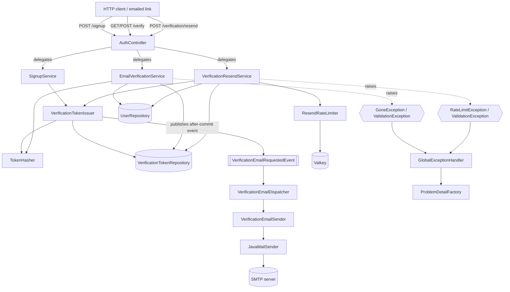
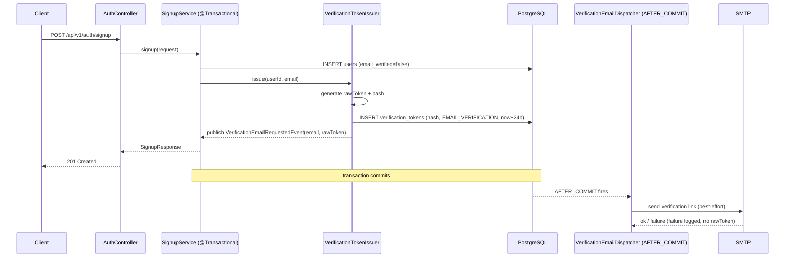
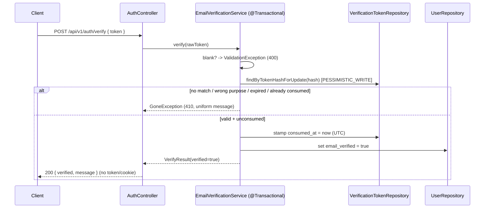

# Design Document

## Overview

Epic E2 (`004-email-verification-resend`) closes the gap left by E1: a freshly signed-up account
exists with `email_verified = false`, but no verification token is issued and no email is sent. E2
adds three behaviors on top of the existing E1/E2-foundation code, **reusing** rather than rewriting
the shipped infrastructure:

1. **Token issuance on sign-up** — when `SignupService` persists a `User`, a single-use verification
   token is issued in the *same* transaction (only its one-way hash is stored), and the raw token is
   mailed as a link **after** the sign-up transaction commits.
2. **Verification** at `GET` and `POST /api/v1/auth/verify` — a raw token that hashes to a stored,
   unexpired, unconsumed `EMAIL_VERIFICATION` token flips the account to `email_verified = true` and
   stamps `consumed_at`. `GET` issues a 303 redirect to the login screen on success and to a configured
   error screen on failure (a browser following an emailed link never sees a JSON problem body);
   `POST` returns JSON and surfaces 400/410 problem responses for API clients. No automatic login is
   performed.
3. **Resend** at `POST /api/v1/auth/verification/resend` — for an unverified account, a fresh token is
   issued, every earlier unconsumed token is invalidated, and a new email is sent. The endpoint is
   rate-limited per email through Valkey and returns a uniform success response that reveals nothing
   about account existence.

E2 introduces exactly one new runtime dependency (`spring-boot-starter-mail`) and two new typed domain
exceptions (`GoneException` → 410, `RateLimitException` → 429) with their RFC 9457 mappings. It changes
no database schema and does not touch the permit-all `SecurityConfig` seam.

### Scope boundaries (carried from requirements)

- **In scope:** issuing, consuming, and re-issuing verification tokens; SMTP delivery; resend rate
  limiting; the new 410/429 error mappings; configuration externalization.
- **Out of scope:** login and rejection of unverified accounts at login (E3); JWT authentication and
  authorization replacing the permit-all seam (E4); the verification-result and resend frontend
  screens (E12).

### Research notes

- **Spring Boot mail auto-configuration (Spring Boot 3.5).** Spring Boot auto-configures a
  `JavaMailSender` from the `spring.mail.*` namespace when `spring.mail.host` is set and
  `spring-boot-starter-mail` is on the classpath, and `MailSenderAutoConfiguration` backs off when a
  `MailSender`/`JavaMailSender` bean is already defined.
  ([Spring Boot 3.5 reference — Sending Email](https://docs.spring.io/spring-boot/3.5/reference/io/email.html);
  [`MailSenderAutoConfiguration`](https://docs.spring.io/spring-boot/3.5/api/java/org/springframework/boot/autoconfigure/mail/MailSenderAutoConfiguration.html)).
  Because Requirement 4.2/4.3 demand an explicit 1–65535 SMTP-port range check that fails startup with
  a clear message — which the framework's `Integer`-typed `spring.mail.port` does not enforce — E2
  defines its own validated `SmtpProperties` record and builds a `JavaMailSenderImpl` from it in a
  `MailConfig` bean, mirroring the existing `ValkeyProperties` + `ValkeyConfig` pattern. Content was
  rephrased for compliance with licensing restrictions.
- **Reused foundation (read directly from this repo):** `VerificationToken` /
  `VerificationTokenRepository`, `User` / `UserRepository` (case-insensitive `citext` `findByEmail`),
  `GlobalExceptionHandler` + `ProblemDetailFactory` (RFC 9457 with `correlationId`/`timestamp`),
  `ValkeyConfig` + `StringRedisTemplate` + `ValkeyProperties`, the `@ConfigurationPropertiesScan`
  pattern on `YetAnotherJiraApplication`, and the permit-all `SecurityConfig`.

## Architecture

E2 keeps the established three-layer split: thin HTTP controllers, transactional services that own the
business rules, and Spring Data repositories for persistence. Two cross-cutting collaborators are
added: a Valkey-backed rate limiter (ephemeral counter only) and an SMTP sender driven by an
after-commit transactional event so email dispatch never participates in the database transaction.



### Why an after-commit event for email

The verification email must be sent **only after** the database work durably commits (Requirement 3.4)
and an SMTP failure must not roll the account back (Requirement 3.5). Issuing the token publishes a
`VerificationEmailRequestedEvent` inside the active transaction; a
`@TransactionalEventListener(phase = AFTER_COMMIT)` listener (`VerificationEmailDispatcher`) sends the
email after commit. If the transaction rolls back, the event never fires and no email is sent. The same
mechanism serves both sign-up and resend, giving one consistent "issue → mail" path.

> `ponytail:` the dispatcher runs **synchronously** in the commit thread, so SMTP latency is added to
> the request latency. The `JavaMailSenderImpl` is configured with finite connection/read/write
> timeouts (see `MailConfig`/`SmtpProperties`) so a hung relay cannot pin the request thread
> indefinitely and exhaust the servlet pool. Ceiling: a slow relay still slows the response up to the
> timeout (the account is already durable, so there is no correctness risk). Upgrade path: annotate the
> listener `@Async` with a bounded executor and `@EnableAsync` if request latency becomes a concern.

### Sign-up issuance sequence



### Verify sequence (POST)



## Components and Interfaces

All new types live under `com.bovae.yaj`. Package placement follows the existing layout
(`auth`, `web.controller`, `web.dto`, `web.error`, `error`, `config`, `config.properties`,
`domain.repository`).

### HTTP layer — `AuthController` (extended), `com.bovae.yaj.web.controller`

The existing `AuthController` (`@RequestMapping("/api/v1/auth")`) gains three handler methods. It stays
HTTP-only and delegates all rules/persistence to services (Requirements 5.3, 9.3).

| Route | Method | Request | Success response |
|-------|--------|---------|------------------|
| `/verify` | `GET` | `token` query param | `303 See Other`, `Location: <resultRedirectUrl>`, empty body; on a failed token `303` to `<resultErrorRedirectUrl>` instead (Req 6.4, 6.7) |
| `/verify` | `POST` | JSON `VerifyRequest{ token }` | `200 OK`, JSON `VerifyResponse` (Req 6.3) |
| `/verification/resend` | `POST` | JSON `ResendRequest{ email }` | `202 Accepted`, JSON `ResendResponse` (Req 12.1) |

```java
@GetMapping("/verify")
public ResponseEntity<Void> verifyViaLink(@RequestParam(name = "token", required = false) @Nullable String token) {
    URI redirect;
    try {
        emailVerificationService.verify(token);
        redirect = URI.create(verificationProperties.resultRedirectUrl()); // success -> login screen
    } catch (ValidationException | GoneException ex) {
        // a browser must land on a human-readable page, not a JSON problem body (Req 6.7)
        redirect = URI.create(verificationProperties.resultErrorRedirectUrl()); // failure -> error screen
    }
    return ResponseEntity.status(HttpStatus.SEE_OTHER).location(redirect).build(); // no auth token, no cookie (Req 6.5)
}

@PostMapping(value = "/verify", consumes = MediaType.APPLICATION_JSON_VALUE, produces = MediaType.APPLICATION_JSON_VALUE)
public VerifyResponse verify(@RequestBody VerifyRequest request) {
    emailVerificationService.verify(request.token());
    return VerifyResponse.success(); // { verified:true, message:"...login..." }
}

@PostMapping(value = "/verification/resend", consumes = MediaType.APPLICATION_JSON_VALUE, produces = MediaType.APPLICATION_JSON_VALUE)
@ResponseStatus(HttpStatus.ACCEPTED)
public ResendResponse resend(@RequestBody ResendRequest request) {
    verificationResendService.resend(request.email());
    return ResendResponse.uniform(); // identical for all account states (Req 12.2)
}
```

Notes:
- `required = false` on the `GET` `token` param ensures a missing token reaches the service as `null`
  and surfaces as a `ValidationException` (400) rather than a framework `MissingServletRequestParameter`
  error, keeping the missing/blank-token contract uniform across `GET` and `POST` (Req 8.1/8.2).
- The `GET` route is browser-facing (it is the emailed link), so it translates the verify exceptions
  into a 303 redirect: success to `resultRedirectUrl`, and `ValidationException`/`GoneException` to
  `resultErrorRedirectUrl`. Only these two typed exceptions are caught; any other failure propagates to
  the 500 handler. The transaction has already rolled back by the time the exception reaches the
  controller, so the catch is purely an HTTP-presentation concern. The `POST` route does **not** catch:
  it lets the exceptions flow to `GlobalExceptionHandler` as 400/410 problem responses for API clients
  (Req 6.7, 8.2, 8.5).
- A `Retry-After` header on the 429 path is added centrally in the exception handler, not the
  controller (see Error Handling).

### DTOs — `com.bovae.yaj.web.dto`

```java
public record VerifyRequest(@Nullable String token) {}

public record VerifyResponse(boolean verified, String message, String next) {
    public static VerifyResponse success() {
        return new VerifyResponse(true, "Your email is verified. Please log in.", "login");
    }
}

public record ResendRequest(@Nullable String email) {}

public record ResendResponse(String message) {
    public static ResendResponse uniform() {
        return new ResendResponse("If an unverified account exists for that address, a new verification email has been sent.");
    }
}
```

`VerifyResponse`/`ResendResponse` carry no JWT, session token, or cookie field (Req 6.5). The uniform
`ResendResponse` is the single body returned for unknown, unverified, and already-verified emails
(Req 12.2).

### Service layer — `com.bovae.yaj.auth`

#### `EmailVerificationService` (`@Service`, `@Transactional`)

Owns the verify business rules; runs in one transaction that commits only on success and rolls back on
any raised exception (Req 5.4, 8.6).

```java
public void verify(@Nullable String rawToken) // raises ValidationException | GoneException
```

Algorithm:
1. If `rawToken` is null/blank → `ValidationException("A verification token is required.")` (Req 8.1).
2. `hash = tokenHasher.hash(rawToken)`.
3. `token = verificationTokenRepository.findByTokenHashForUpdate(hash)` (pessimistic write lock) or
   `GoneException(UNIFORM_GONE_MESSAGE)` if absent (Req 8.3).
4. If `token.purpose != EMAIL_VERIFICATION` → `GoneException` (uniform).
5. If `now >= token.expiresAt` → `GoneException` (expired; Req 8.4).
6. If `token.consumedAt != null` → `GoneException` (already consumed; Req 7.2).
7. Stamp `token.consumedAt = clock.instant()` (UTC) (Req 6.2, 7.1).
8. Load the associated `User`, set `emailVerified = true` (Req 6.1); if already `true`, it remains
   `true` (Req 6.6).

The single uniform 410 message (e.g., *"This verification link is invalid or has expired. Please
request a new verification email."*) is used for the unknown, expired, and consumed cases so the
response never reveals which condition occurred (Req 8.5). The user record is touched only at step 8,
so any earlier exception leaves `email_verified` unchanged (Req 8.6); a later failure rolls the
transaction back.

**Concurrency (Req 7.3):** the row is read with `LockModeType.PESSIMISTIC_WRITE`. Two concurrent verify
requests for the same token serialize on the row lock; the first commits with `consumed_at` set, the
second — released after the first commits — reads a non-null `consumed_at` at step 6 and raises
`GoneException`. Exactly one request consumes the token.

#### `VerificationResendService` (`@Service`, `@Transactional`)

Owns the resend rules; one transaction, commit-on-success (Req 9.5).

```java
public void resend(@Nullable String submittedEmail) // raises ValidationException | RateLimitException
```

Algorithm:
1. Normalize: if null/blank after `strip()` → `ValidationException` (Req 12.4); else `normalizedEmail =
   submittedEmail.strip()`.
2. `resendRateLimiter.checkAndIncrement(normalizedEmail)` → raises `RateLimitException` when the limit
   for the window is exceeded (Req 13.2). The limiter is consulted **before** any account lookup so the
   throttle is identical regardless of whether the email exists (anti-enumeration; Req 12).
3. `user = userRepository.findByEmail(normalizedEmail)` (case-insensitive `citext`; Req 9.4).
4. Branch:
   - **No account** → issue nothing, send nothing; return (uniform 202) (Req 12.3).
   - **Account, `emailVerified == true`** → issue nothing, send nothing; return (uniform 202)
     (Req 11.1, 11.2, 11.3).
   - **Account, unverified** → `verificationTokenRepository.invalidateUnconsumed(userId,
     EMAIL_VERIFICATION, now)` (Req 10.2), then `verificationTokenIssuer.issue(userId,
     normalizedEmail)` which persists a fresh token and publishes the after-commit email event
     (Req 10.1, 10.3).

Invalidation runs before issuance so the freshly issued token is never invalidated. Because a verify
request matching an invalidated (now `consumed_at`-stamped) token hits step 6 of the verify algorithm,
it correctly yields `GoneException` (Req 10.4).

#### `VerificationTokenIssuer` (`@Component`)

Single source of truth for issuing tokens; invoked by `SignupService` and `VerificationResendService`,
participating in the caller's transaction (no `@Transactional` of its own).

```java
public void issue(UUID userId, String recipientEmail)
```

1. `rawToken = rawTokenGenerator.generate()` — 32 random bytes from `SecureRandom`, Base64URL-encoded
   (256 bits, ≥128 required; Req 2.1).
2. `hash = tokenHasher.hash(rawToken)` (Req 2.2).
3. Build and `save` a `VerificationToken`: `userId`, `tokenHash = hash`, `purpose =
   EMAIL_VERIFICATION` (Req 1.2), `expiresAt = clock.instant() + verificationProperties.tokenTtl()`
   (24h; Req 1.3), `consumedAt = null` (Req 1.4).
4. `applicationEventPublisher.publishEvent(new VerificationEmailRequestedEvent(recipientEmail,
   rawToken))` — dispatched after commit.

The raw token is held only in memory and on the event; it is never persisted (only the hash is) and
never logged (Req 2.3, 2.4). When called from `SignupService`'s transaction, a persistence failure here
propagates and rolls back the user insert (Req 1.5, 1.6).

#### `TokenHasher` (`@Component`)

```java
public String hash(String rawToken) // SHA-256(rawToken) -> lowercase hex
```

A fast one-way hash is appropriate because the input is a high-entropy random secret, not a low-entropy
password (Req 2 rationale; Argon2id unnecessary). Sharing this single component between issuer and
verify guarantees the issue-then-verify round trip: the same raw token always hashes to the stored
value (Req 2.6).

#### `RawTokenGenerator` (`@Component`)

Wraps a `SecureRandom` and returns a URL-safe, unpadded Base64 string of 32 random bytes. Isolated
behind an interface-free component so the value is generated in exactly one place (Req 2.1).

#### `ResendRateLimiter` (`@Component`)

Valkey-backed fixed-window counter using the existing `StringRedisTemplate` (Req 13.5).

```java
public void checkAndIncrement(String normalizedEmail) // raises RateLimitException when over limit
```

1. `key = "verif:resend:rl:" + sha256(lowercase(normalizedEmail))` — the email is lowercased with
   `Locale.ROOT` (deterministic, locale-independent case folding) and hashed into the key so raw
   addresses are not stored in Valkey.
2. `count = redis.opsForValue().increment(key)`.
3. If `count == 1`, set the key's TTL to `resendRateWindow` (Req 13.6).
4. If `count > resendRateLimit`, read the remaining TTL and raise
   `RateLimitException(retryAfterSeconds)` (Req 13.2). If that read shows the key carries **no** TTL
   (a prior `EXPIRE` was lost), re-arm the expiry with the full window and report the window as the
   retry delay, so a counter can never live forever and lock an email out permanently (Req 13.6).
5. Otherwise return (request accepted).

Valkey holds only the ephemeral counter; verification state of record stays in PostgreSQL (Req 13.5).
When the limiter rejects, the service raises before any lookup, so no token is issued and no email is
sent (Req 13.4).

> `ponytail:` fixed-window counter (one `INCR` + one `EXPIRE`, plus a `getExpire` re-arm guard on the
> over-limit path). Ceiling: a client can send up to ~2× the limit across a window boundary. Upgrade
> path: switch the key to a sorted-set sliding window if strict smoothing is required. The simpler
> counter is sufficient for inbox/relay abuse protection.

#### `VerificationEmailSender` (`@Component`) and `VerificationEmailDispatcher` (`@Component`)

`VerificationEmailDispatcher` listens for the issuance event after commit and delegates to the sender:

```java
@TransactionalEventListener(phase = TransactionPhase.AFTER_COMMIT)
public void onVerificationEmailRequested(VerificationEmailRequestedEvent event) {
    try {
        verificationEmailSender.send(event.recipientEmail(), event.rawToken());
    } catch (MailException ex) {
        LOG.warn("Verification email dispatch failed for a recipient; user can recover via resend", ex);
        // swallow: the account+token are durable; sign-up already returned 201 (Req 3.5)
    }
}
```

`VerificationEmailSender.send(String email, String rawToken)`:
1. Build the link: `verificationProperties.linkBaseUrl()` + the raw token as the `token` query
   parameter (Req 3.2).
2. Compose a `SimpleMailMessage` — `setFrom(smtpProperties.from())`, `setTo(email)`, a fixed subject,
   and a body containing the link (Req 3.1).
3. `javaMailSender.send(message)` over the configured SMTP server (Req 3.3).

The log statement on failure never includes the raw token, the hash, or any SMTP credential
(Req 2.4, 3.5, 3.6).

### Configuration — `com.bovae.yaj.config` / `com.bovae.yaj.config.properties`

#### `VerificationProperties` (`@ConfigurationProperties(prefix = "yaj.verification")`, `@Validated`)

```java
@Validated
@ConfigurationProperties(prefix = "yaj.verification")
public record VerificationProperties(
        @NotNull Duration tokenTtl,
        @NotBlank String linkBaseUrl,
        @NotBlank String resultRedirectUrl,
        @NotBlank String resultErrorRedirectUrl,
        @Min(1) int resendRateLimit,
        @NotNull Duration resendRateWindow) {}
```

Bound to `yaj.verification.*`, auto-registered by the existing `@ConfigurationPropertiesScan`
(Req 4.4). Holds the 24h token TTL, the link base URL, the login-screen redirect URL (success), the
error-screen redirect URL (failed `GET` verify), and the rate-limit limit/window.

#### `SmtpProperties` (`@ConfigurationProperties(prefix = "yaj.mail")`, `@Validated`)

```java
@Validated
@ConfigurationProperties(prefix = "yaj.mail")
public record SmtpProperties(
        @NotBlank String host,
        @Min(1) @Max(65535) int port,
        @NotBlank String from,
        @NotNull Duration timeout,
        @Nullable String username,
        @Nullable String password) {}
```

`host`/`port` bind to the `YAJ_SMTP_HOST` / `YAJ_SMTP_PORT` environment variables via `application.yml`
(Req 4.1). `@Min(1) @Max(65535)` enforces the valid port range (Req 4.2); a non-numeric or out-of-range
value fails bean validation at startup with a message identifying the SMTP port (Req 4.3), mirroring
`ValkeyProperties`. `timeout` (a `@NotNull Duration`, defaulted to `5s` via `application.yml`) bounds
every SMTP phase (Req 4.7). `username`/`password` are optional and, when present, supplied only from
environment variables — never hardcoded in source (Req 4.5, 4.6) and never logged (Req 3.6).

#### `MailConfig` (`@Configuration`)

Builds the `JavaMailSenderImpl` from `SmtpProperties` (host, port, and credentials when present),
parallel to `ValkeyConfig`. It also sets `mail.smtp.connectiontimeout`, `mail.smtp.timeout` (read), and
`mail.smtp.writetimeout` on the sender from `SmtpProperties.timeout()` so a slow or hung relay cannot
pin the after-commit dispatch thread (Req 3.7). Defining this bean makes Spring Boot's
`MailSenderAutoConfiguration` back off, so the validated record is the single source of SMTP
configuration.

#### `Clock` bean

A `Clock.systemUTC()` `@Bean` is injected into `EmailVerificationService`,
`VerificationResendService`, and `VerificationTokenIssuer` so "now" is controllable in unit tests
(expiry-boundary and TTL assertions). All instants are produced via the injected clock in UTC
(Req 6.2).

#### `application.yml` additions

```yaml
yaj:
  verification:
    token-ttl: 24h
    link-base-url: ${YAJ_VERIFICATION_LINK_BASE_URL}
    result-redirect-url: ${YAJ_VERIFICATION_REDIRECT_URL}
    result-error-redirect-url: ${YAJ_VERIFICATION_ERROR_REDIRECT_URL}
    resend-rate-limit: 5
    resend-rate-window: 15m
  mail:
    host: ${YAJ_SMTP_HOST}
    port: ${YAJ_SMTP_PORT}
    from: ${YAJ_SMTP_FROM:no-reply@yet-another-jira.local}
    timeout: ${YAJ_SMTP_TIMEOUT:5s}
    username: ${YAJ_SMTP_USERNAME:}
    password: ${YAJ_SMTP_PASSWORD:}
```

No plaintext SMTP credential appears in any source-controlled file; every secret is an environment-variable
reference or a non-production placeholder resolved at runtime (Req 4.5).

### Security seam

`SecurityConfig` is **not modified** (Req 14.2). The verify and resend routes are reachable under the
existing permit-all policy with no credentials (Req 14.1). E2 adds no JWT issuance, authentication
filter, or authorization rule, deferring those to E4 (Req 14.2, 14.3).

### Dependency

`be/pom.xml` adds one runtime dependency (Req 16.1):

```xml
<dependency>
  <groupId>org.springframework.boot</groupId>
  <artifactId>spring-boot-starter-mail</artifactId>
</dependency>
```

## Data Models

E2 introduces **no schema change**. It uses the existing `users` and `verification_tokens` tables and
their JPA entities (`User`, `VerificationToken`) exactly as shipped.

`verification_tokens` (from migration `0004-verification-tokens.sql`):

| Column | Type | E2 usage |
|--------|------|----------|
| `id` | `uuid` PK, `gen_random_uuid()` | token identity |
| `user_id` | `uuid` NOT NULL → `users(id)` ON DELETE CASCADE | owning account (Req 1.4) |
| `token_hash` | `text` NOT NULL (indexed) | stored one-way SHA-256 hash; lookup key (Req 2.2) |
| `purpose` | `text` NOT NULL | literal `EMAIL_VERIFICATION` (Req 1.2) |
| `expires_at` | `timestamptz` NOT NULL | creation instant + 24h (Req 1.3, 8.4) |
| `consumed_at` | `timestamptz` NULL | null until consumed/invalidated; set on verify and on resend invalidation (Req 6.2, 7.1, 10.2) |
| `created_at` | `timestamptz` NOT NULL, `now()` | DB-generated |

`users` (relevant columns): `email` (`citext`, unique), `email_verified` (`boolean`) flipped to `true`
on successful verify (Req 6.1).

### `VerificationPurpose` constant

A small holder `com.bovae.yaj.auth.VerificationPurpose` exposes
`public static final String EMAIL_VERIFICATION = "EMAIL_VERIFICATION";`, shared by the issuer, verify
service, and resend service to avoid a duplicated magic string.

### `VerificationTokenRepository` additions — `com.bovae.yaj.domain.repository`

The existing `findByTokenHash` stays. E2 adds:

```java
// Pessimistic lock for single-use enforcement under concurrency (Req 7.3)
@Lock(LockModeType.PESSIMISTIC_WRITE)
@Query("select t from VerificationToken t where t.tokenHash = :hash")
Optional<VerificationToken> findByTokenHashForUpdate(@Param("hash") String hash);

// Bulk-invalidate every earlier unconsumed token of a purpose for an account (Req 10.2)
@Modifying(clearAutomatically = true, flushAutomatically = true)
@Query("""
       update VerificationToken t
          set t.consumedAt = :now
        where t.userId = :userId
          and t.purpose = :purpose
          and t.consumedAt is null
       """)
int invalidateUnconsumed(@Param("userId") UUID userId, @Param("purpose") String purpose, @Param("now") Instant now);
```

`flushAutomatically`/`clearAutomatically` keep the persistence context consistent after the bulk
update; the subsequently issued token is a new, unaffected row.

### `VerificationEmailRequestedEvent` — `com.bovae.yaj.auth`

```java
public record VerificationEmailRequestedEvent(String recipientEmail, String rawToken) {}
```

An in-process application event. The raw token lives only here and in the sender; it is never persisted
or logged (Req 2.3, 2.4).

### Exceptions — `com.bovae.yaj.error`

```java
public class GoneException extends RuntimeException {
    public GoneException(String message) { super(message); }
}

public class RateLimitException extends RuntimeException {
    private final long retryAfterSeconds;
    public RateLimitException(String message, long retryAfterSeconds) {
        super(message);
        this.retryAfterSeconds = retryAfterSeconds;
    }
    public long getRetryAfterSeconds() { return retryAfterSeconds; }
}
```

These mirror the existing typed exceptions (`ValidationException`, `ConflictException`, …) that the
handler maps to status codes.

## Error Handling

`GlobalExceptionHandler` (existing `@RestControllerAdvice` extending `ResponseEntityExceptionHandler`)
gains two mappings; all responses flow through `ProblemDetailFactory`, so each body carries a non-empty
`correlationId` and a UTC ISO-8601 `timestamp`, and never leaks stack traces, internal type names, SQL,
the raw token, or the hash (Req 15.4, 15.5).

```java
@ExceptionHandler(GoneException.class)
public ResponseEntity<Object> handleGone(GoneException ex, WebRequest request) {
    return domainProblem(HttpStatus.GONE, "Gone", ex, request); // 410 (Req 15.2)
}

@ExceptionHandler(RateLimitException.class)
public ResponseEntity<Object> handleRateLimit(RateLimitException ex, WebRequest request) {
    ProblemDetail body = ProblemDetailFactory.create(HttpStatus.TOO_MANY_REQUESTS, "Too Many Requests", ex.getMessage());
    HttpHeaders headers = new HttpHeaders();
    headers.add(HttpHeaders.RETRY_AFTER, Long.toString(ex.getRetryAfterSeconds())); // Req 13.3
    return handleExceptionInternal(ex, body, headers, HttpStatus.TOO_MANY_REQUESTS, request); // 429 (Req 15.3)
}
```

`HttpStatus.GONE` (410) and `HttpStatus.TOO_MANY_REQUESTS` (429) resolve to standard reason phrases, so
the handler's existing `reasonPhrase` fallback and common-member enrichment apply unchanged.
`ValidationException` already maps to 400 (Req 8.2, 12.4, 15.1).

The 400/410/429 problem responses above are what `POST` callers and other API clients receive. The
browser-facing `GET /verify` route is the one exception: its handler catches `ValidationException` and
`GoneException` and converts them into a `303` redirect to `resultErrorRedirectUrl` (Req 6.7), so a user
clicking a stale link lands on a friendly page rather than a raw problem body. The mapping table still
governs the underlying exceptions; only the `GET` presentation differs.

| Condition | Exception | Status | Notes |
|-----------|-----------|--------|-------|
| Missing/blank token; missing/blank email | `ValidationException` | 400 | uniform "required" message (Req 8.1, 12.4) |
| Unknown / expired / already-consumed / invalidated token | `GoneException` | 410 | single uniform message, no condition disclosure (Req 8.5, 10.4) |
| Resend rate limit exceeded | `RateLimitException` | 429 | `Retry-After` header (Req 13.3) |
| SMTP dispatch failure (sign-up) | none (swallowed in dispatcher) | n/a | 201 still returned; failure logged without secrets (Req 3.5) |
| Unexpected | `Exception` (existing handler) | 500 | internals logged only, not in body |

Transactionality: verify and resend run in a single `@Transactional` each; any raised exception rolls
the transaction back so a failed verify leaves `email_verified` and `consumed_at` unchanged
(Req 8.6) and a failed resend issues no token.

## Testing Strategy

This feature is dominated by I/O and side effects — SMTP dispatch, JPA persistence, a Valkey counter,
transactional event timing, and HTTP wiring — rather than pure functions with universal input/output
properties. Accordingly, **property-based testing is not used**; the strategy is the three layers the
project already standardizes on: JUnit 5 + Mockito unit tests, Cucumber BDD against a real
PostgreSQL + SMTP-capture context, and Testcontainers PostgreSQL integration tests. This satisfies the
explicit E2 Definition-of-Done test cases (Req 16.2–16.6).

Test conventions: one `{ProductionClass}Test` per class, methods named
`methodUnderTest_shouldExpectedBehavior_whenCondition`, `@ParameterizedTest` for same-shape/different-data
cases, specific assertions with failure messages, `@ExtendWith(MockitoExtension.class)` with
`@Mock`/`@InjectMocks`/`@Captor`, and stubbing only what each test needs.

### Unit tests (JUnit 5 + Mockito) — `src/test/java`

- **`EmailVerificationServiceTest`**
  - Expiry boundary: a token with `expires_at <= now` → `GoneException` (maps to 410), and a token with
    `expires_at` in the future and `consumed_at == null` verifies successfully, asserting
    `email_verified` set `true` and `consumed_at` stamped. Drive "now" through the injected `Clock`.
    (Req 16.2)
  - Single-use: a token already carrying a non-null `consumed_at` → `GoneException`, with
    `email_verified` left unchanged and the user never saved as verified. (Req 16.3, 7.2)
  - Missing/blank token → `ValidationException`, repositories never touched. (Req 8.1)
  - Unknown hash (`findByTokenHashForUpdate` empty) → `GoneException`. (Req 8.3)
  - Wrong purpose → `GoneException`. Already-verified user + still-valid token → remains `true`
    (Req 6.6).
  - Parameterize the unknown / expired / consumed cases to assert the **same** uniform message
    (Req 8.5).
- **`VerificationResendServiceTest`**
  - Issuing a new token invalidates every earlier unconsumed `EMAIL_VERIFICATION` token
    (`invalidateUnconsumed` invoked with the right args, then issuer invoked). (Req 16.4, 10.2)
  - Exceeding the limit → `RateLimitException` (429), with issuer and sender never invoked. (Req 16.5,
    13.4)
  - Unknown email and already-verified email each return normally with **no** token issued and **no**
    email event published, asserting the identical uniform outcome. (Req 16.5, 11, 12.3)
  - Blank email → `ValidationException`; rate limiter never consulted. (Req 12.4)
  - Rate limiter consulted before account lookup (verify ordering with `InOrder`).
- **`VerificationTokenIssuerTest`** — sets `purpose = EMAIL_VERIFICATION`, `expires_at = now + 24h`
  (clock-driven), `consumed_at == null`, persists the hash (captured `VerificationToken` via `@Captor`),
  and publishes a `VerificationEmailRequestedEvent`; the stored hash differs from the raw token.
  (Req 1.2–1.4, 2.2)
- **`TokenHasherTest`** — deterministic, one-way (output ≠ input), stable across calls; issue-then-verify
  hashes match. (Req 2.2, 2.6)
- **`ResendRateLimiterTest`** — with a mocked `StringRedisTemplate`: first request sets TTL = window
  (Req 13.6); request count beyond the limit raises `RateLimitException` carrying a `retryAfterSeconds`
  from the key TTL; an over-limit request whose key has lost its TTL re-arms the expiry and reports the
  full window; the key derives from a `Locale.ROOT`-lowercased hash of the email, not the raw address.
- **`VerificationEmailSenderTest` / `VerificationEmailDispatcherTest`** — sender builds the link from
  `linkBaseUrl` + raw token and calls `JavaMailSender.send` with the right `to`/`from`; a thrown
  `MailException` in the dispatcher is swallowed (logged) so sign-up is unaffected, and a log-capture
  assertion confirms the raw token never appears in any log line. (Req 3.1–3.3, 3.5, 2.4)
- **`SignupServiceTest` (updated)** — the existing test's constructor gains the issuer mock; add cases
  asserting the issuer is invoked after a successful save and that an issuer failure prevents the user
  from being persisted (rolled back). (Req 1.5, 1.6)
- **`AuthControllerTest` (extended, `@WebMvcTest`)** — `GET /verify` returns `303` with the configured
  `Location` and no `Set-Cookie`/token; a `GET /verify` whose service raises `GoneException` returns
  `303` to the configured **error** `Location` (and still no token/cookie); `POST /verify` returns `200`
  with the JSON body and no token; `POST /verification/resend` returns `202` with the uniform body;
  controller delegates and never touches repositories. (Req 5, 6.3, 6.4, 6.5, 6.7, 9, 12.1)
- **`GlobalExceptionHandlerTest` (extended)** — `GoneException` → 410 problem+json with `status: 410`;
  `RateLimitException` → 429 problem+json with `status: 429` and a `Retry-After` header; both bodies
  carry `correlationId`/`timestamp` and leak no internals/token/hash/SQL. (Req 15.2–15.5)
- **`VerificationPropertiesTest`, `SmtpPropertiesTest`** — Jakarta-Validator unit tests mirroring
  `ValkeyPropertiesTest`: valid values pass; blank host/URLs (including `resultErrorRedirectUrl`),
  out-of-range/zero ports/limits, and a null SMTP `timeout` produce violations. (Req 4.2, 4.3, 4.7)

### Integration tests (Testcontainers PostgreSQL) — `src/it/java`, `-Pit`

Extend `AbstractPostgresIntegrationTest` (`@DataJpaTest` + Testcontainers Postgres) for repository-level
behavior against real SQL/`citext`:

- **`VerificationTokenRepositoryIntegrationTest`** — `findByTokenHashForUpdate` returns a saved token;
  `invalidateUnconsumed` stamps `consumed_at` on exactly the unconsumed `EMAIL_VERIFICATION` rows of one
  user and leaves consumed rows and other users/purposes untouched (returns the affected count).
  (Req 10.2)
- **Single-use / concurrency** — a verify that stamps `consumed_at` makes a second lookup see it
  consumed; the pessimistic-lock path is exercised through the real DB. (Req 7.1, 7.3)

### BDD (Cucumber) — `src/bdd`, `-Pbdd`, tagged `@auth`

Run under the `Integration_Test_Context` (`CucumberSpringConfig` + `TestcontainersConfig`, random-port
Spring Boot, Testcontainers Postgres + Valkey), extended with an **SMTP capture server** (GreenMail as
an in-JVM SMTP server is the simplest fit; Mailpit via a container is the alternative). `TestcontainersConfig`
registers `yaj.mail.host`/`yaj.mail.port` (and `yaj.verification.*`) to point at the capture server, and
the `@After("@auth")` hook clears persisted users and captured messages.

New `verification.feature` (tagged `@auth`), with a `Background` for the shared SMTP-capture setup and a
`Scenario Outline` where step structure repeats over data:

- **End-to-end verify (Req 16.6):** sign up an account → capture the verification email → extract the
  raw token from the link → `POST /api/v1/auth/verify` → assert success and that the `users` row has
  `email_verified = true`.
- **GET-link verify:** the same extracted token via `GET /api/v1/auth/verify?token=...` returns `303`
  to the configured redirect URL.
- **GET-link verify failure:** an expired token via `GET /api/v1/auth/verify?token=...` returns `303`
  to the configured **error** redirect URL (Req 6.7).
- **Expired/consumed link:** a consumed token returns `410`.
- **Resend issues a fresh email and invalidates the prior token:** resend for an unverified account
  captures a second email; the first (now invalidated) token verifies to `410` while the second
  succeeds. (Req 10)
- **Resend privacy:** resend for an unknown email and for an already-verified email both return `202`
  with the identical body and capture no email. (Req 11, 12)
- **Resend rate limit:** exceeding the configured limit returns `429` with a `Retry-After` header and
  captures no further email. (Req 13)

Scenarios describe observable behavior (status codes, captured emails, `email_verified` state), not
implementation. The DataTable/Scenario-Outline `Examples` drive the privacy and status-code variants.

### Quality gates (Req 16.7–16.9)

- **JaCoCo** ≥ 90% line and ≥ 90% branch over non-excluded packages. `config/**`, `model/**`,
  `mapper/*Impl*`, and `*Application.*` are excluded, so `MailConfig`, `SmtpProperties`,
  `VerificationProperties`, the entities, and the `Clock` bean fall outside the gate; the services,
  controller, issuer, hasher, sender, dispatcher, rate limiter, exceptions, and handler are inside it
  and are exercised by the unit + IT + BDD suites above. Coverage accumulates across unit and BDD runs
  into a single `jacoco.exec`, as the build is configured today.
- **Spotless** (Palantir Java format, import order, no wildcard imports) and **Error Prone + NullAway**
  must pass with no violations; new code is `@Nullable`-annotated where Spring binds optional values
  (e.g., `VerifyRequest.token`, `ResendRequest.email`, `SmtpProperties.username`/`password`).
- Any coverage/format/static-analysis violation fails the build (Req 16.9).

## Requirements Traceability

| Requirement | Addressed by |
|-------------|--------------|
| 1 Token issuance on sign-up | `SignupService` (updated) + `VerificationTokenIssuer`, same transaction |
| 2 Token secrecy and storage | `RawTokenGenerator` (SecureRandom ≥128-bit), `TokenHasher` (SHA-256), hash-only persistence, no-log policy |
| 3 SMTP delivery | `VerificationEmailSender` + after-commit `VerificationEmailDispatcher`, best-effort on failure, bounded by SMTP connect/read/write timeouts (`MailConfig`) |
| 4 Config externalization | `SmtpProperties` (`yaj.mail`, port range, `timeout`), `VerificationProperties` (`yaj.verification`, incl. `resultErrorRedirectUrl`), `application.yml` env refs |
| 5 Verify endpoint & layering | `AuthController` GET/POST `/verify` → `EmailVerificationService` (`@Transactional`) |
| 6 Successful verification | `EmailVerificationService` sets `email_verified`, stamps `consumed_at`; GET 303 to login (success) / error URL (failure), POST 200, no auth token |
| 7 Single-use & idempotency | pessimistic-lock consume; consumed → `GoneException` |
| 8 Verify validation & errors | blank → 400; unknown/expired/consumed → uniform 410 |
| 9 Resend endpoint & layering | `AuthController` POST `/verification/resend` → `VerificationResendService` (normalize, `@Transactional`) |
| 10 Resend re-issue & invalidate | `invalidateUnconsumed` then `issue`; invalidated token verifies to 410 |
| 11 Resend already-verified no-op | branch issues nothing, sends nothing, returns uniform 202 |
| 12 Resend enumeration privacy | rate-limit before lookup; uniform 202 body; blank → 400 |
| 13 Resend rate limiting | `ResendRateLimiter` (Valkey fixed window, TTL=window); 429 + `Retry-After` |
| 14 Security seam | `SecurityConfig` unchanged; permit-all reachable |
| 15 RFC 9457 mapping | `GlobalExceptionHandler` + new `GoneException`/`RateLimitException` via `ProblemDetailFactory` |
| 16 Dependency, hygiene, gates | `spring-boot-starter-mail`; unit/IT/BDD suites; JaCoCo/Spotless/Error Prone+NullAway |
