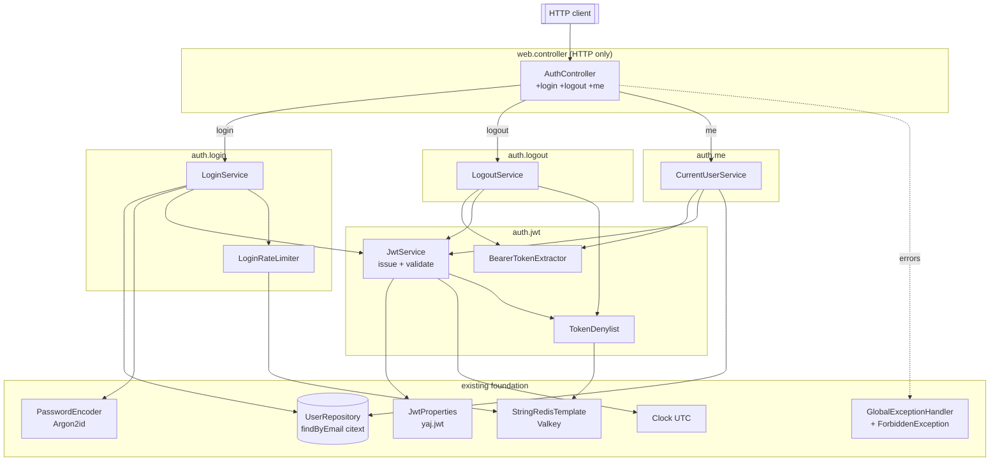

# Design Document — Epic E3: Login / logout (JWT + denylist)

Spec: `005-login-logout-jwt-denylist` · Module: `be` (Spring Boot 3.5.x, Java 21)

## Overview

E3 adds authentication on top of the E1 sign-up and E2 verification work. It extends the existing
`AuthController` (`@RequestMapping("/api/v1/auth")`) with three handlers and a transactional service
layer behind them:

- `POST /api/v1/auth/login` — verify Argon2id credentials, reject unverified (403) and soft-deleted
  (uniform 401) accounts, and on success issue a signed JWT access token returned in the response body.
- `POST /api/v1/auth/logout` — read the bearer token, verify it enough to learn its `jti`/`exp`, and
  record that `jti` in a Valkey-backed denylist with a self-expiring TTL. Idempotent `204`.
- `GET /api/v1/auth/me` — read and validate the bearer token (signature, expiry, denylist), resolve the
  `sub` to a live account, and return `{ id, email, emailVerified }`.

The design reuses the foundation already shipped rather than re-implementing it: the `User` entity and
`UserRepository.findByEmail` (citext, case-insensitive), the Argon2id `PasswordEncoder` bean
(`PasswordEncoderConfig`, used through `matches`), the `StringRedisTemplate` (`ValkeyConfig`) following
the same ephemeral SET/EXPIRE discipline `ResendRateLimiter` uses, the UTC `Clock` bean (`ClockConfig`),
the typed-exception + RFC 9457 mapping (`GlobalExceptionHandler` + `ProblemDetailFactory`), and the
`@ConfigurationPropertiesScan` validated-record pattern (`VerificationProperties`, `SmtpProperties`).

E3 introduces exactly one new HTTP mapping: `ForbiddenException` → `403`. It reads and validates the
bearer token **directly in the logout and me flows**; it leaves `SecurityConfig` permit-all unchanged,
adds **no** authentication filter, **no** authorization enforcement, and **no** `CurrentUserProvider`
implementation — all deferred to E4.

### Research summary — JWT library selection

The one genuinely new runtime dependency is a JSON Web Token library. Per the shared-library rule its
coordinates and API were confirmed against authoritative sources, not recalled from memory.

- **Chosen library: JJWT (`io.jsonwebtoken`)**, the most widely used JVM JWT library, with a clean
  separation of API/impl/JSON artifacts and first-class HS256 support. Confirmed via Context7
  (`/jwtk/jjwt`) and Maven Central. Rejected alternative: Nimbus JOSE+JWT — more surface area than this
  single-service symmetric use case needs.
- **Pinned version: `0.12.6`** (the current `0.12.x` line; `0.12.7` is the latest patch and is
  API-identical — either is acceptable, pin one). The `0.12.x` fluent API (`Jwts.SIG.HS256`,
  `verifyWith`, `parseSignedClaims`) is the modern surface; do not use the deprecated `0.11.x`
  `setSubject`/`parseClaimsJws` API.
- **Algorithm: HS256** (symmetric), per the confirmed decision. The same service signs and verifies, so a
  shared secret is sufficient; the secret is externalized and never committed.

Maven coordinates to be added to `be/pom.xml` (a `<jjwt.version>0.12.6</jjwt.version>` property; `impl`
and `jackson` are runtime-scoped so only the `api` artifact is compile-visible):

```xml
<dependency>
  <groupId>io.jsonwebtoken</groupId>
  <artifactId>jjwt-api</artifactId>
  <version>${jjwt.version}</version>
</dependency>
<dependency>
  <groupId>io.jsonwebtoken</groupId>
  <artifactId>jjwt-impl</artifactId>
  <version>${jjwt.version}</version>
  <scope>runtime</scope>
</dependency>
<dependency>
  <groupId>io.jsonwebtoken</groupId>
  <artifactId>jjwt-jackson</artifactId>
  <version>${jjwt.version}</version>
  <scope>runtime</scope>
</dependency>
```

Confirmed API surface used by `JwtService` (JJWT `0.12.x`):

```java
import io.jsonwebtoken.Jwts;
import io.jsonwebtoken.Jws;
import io.jsonwebtoken.Claims;
import io.jsonwebtoken.JwtException;            // base parse/verify failure
import io.jsonwebtoken.security.Keys;
import javax.crypto.SecretKey;

// key (HS256 requires >= 256-bit / 32-byte secret; Keys.hmacShaKeyFor enforces this and
// throws io.jsonwebtoken.security.WeakKeyException otherwise)
SecretKey key = Keys.hmacShaKeyFor(secret.getBytes(StandardCharsets.UTF_8));

// issue
String jws = Jwts.builder()
        .subject(userId.toString())   // sub
        .id(jti)                       // jti
        .issuedAt(Date.from(now))      // iat
        .expiration(Date.from(exp))    // exp
        .signWith(key, Jwts.SIG.HS256)
        .compact();

// parse + verify signature; throws JwtException family (ExpiredJwtException,
// io.jsonwebtoken.security.SignatureException, MalformedJwtException, ...) on failure
Jws<Claims> parsed = Jwts.parser().verifyWith(key).build().parseSignedClaims(jws);
Claims claims = parsed.getPayload();
claims.getSubject();   // String
claims.getId();        // jti
claims.getExpiration();// Date
claims.getIssuedAt();  // Date
```

Source: [JJWT README (jwtk/jjwt)](https://github.com/jwtk/jjwt) via Context7; coordinates verified on
[Maven Central — jjwt-api](https://central.sonatype.com/artifact/io.jsonwebtoken/jjwt-api).
Content was rephrased for compliance with licensing restrictions.

## Architecture

E3 keeps the established three-layer flow: **controller (HTTP only) → service (rules) → repository /
infrastructure**. JWT components live in a **new `auth/jwt` package**, deliberately separate from the
existing `auth/token` package (which holds `RawTokenGenerator` and `TokenHasher` for *email-verification*
tokens) so the two token mechanisms never collide. Login and logout get their own service packages.



Package layout (new types in **bold**):

| Package | Type | Responsibility |
|---|---|---|
| `web.controller` | `AuthController` (extended) | Three new handlers; HTTP concerns only; delegates to services. |
| `web.dto` | **`LoginRequest`**, **`LoginResponse`**, **`MeResponse`** | Request/response records. |
| `auth.login` | **`LoginService`** | Login rules: normalize, branch, timing defense, request issuance. `@Transactional(readOnly = true)`. |
| `auth.login` | **`LoginRateLimiter`** | Per-email fixed-window rate limiter for login attempts. Mirrors `ResendRateLimiter`. |
| `auth.logout` | **`LogoutService`** | Verify token enough for `jti`/`exp`; record revocation. |
| `auth.me` | **`CurrentUserService`** | Validate token (incl. denylist), resolve `sub` to a live user, build `MeResponse`. |
| `auth.jwt` | **`JwtService`** | Issue + validate tokens (signature, expiry, claims, denylist). |
| `auth.jwt` | **`TokenDenylist`** | Valkey revocation cache (`auth:jwt:denylist:<jti>`). |
| `auth.jwt` | **`BearerTokenExtractor`** | Pull raw token from `Authorization: Bearer …`; 401 when absent/malformed. |
| `auth.jwt` | **`TokenClaims`** (record) | Validated claim carrier (`subject`, `jti`, `issuedAt`, `expiresAt`). |
| `config.properties` | **`JwtProperties`** | `@ConfigurationProperties("yaj.jwt")` validated record. |
| `error` | **`ForbiddenException`** | New typed domain exception (→ 403). |
| `web.error` | `GlobalExceptionHandler` (extended) | New `ForbiddenException` → 403 mapping. |

### Why identity is resolved in-handler (E3 boundary)

`SecurityConfig` is still the permit-all seam, so no Spring Security filter populates the
`SecurityContext` and `CurrentUserProvider` has no implementation. E3 therefore resolves the caller by
reading the `Authorization` header and calling `JwtService` directly from `LogoutService` /
`CurrentUserService`. The same validation logic is what E4 will later wrap in a real authentication
filter. E3 changes nothing in `SecurityConfig`.

## Components and Interfaces

All services use constructor injection (`@RequiredArgsConstructor`), matching `SignupService` /
`VerificationResendService`. Method signatures below are the contract; types reference real workspace
symbols.

### AuthController (extended)

```java
@PostMapping(value = "/login", consumes = APPLICATION_JSON_VALUE, produces = APPLICATION_JSON_VALUE)
public LoginResponse login(@RequestBody LoginRequest request);            // 200 on success

@PostMapping("/logout")
@ResponseStatus(HttpStatus.NO_CONTENT)
public void logout(@RequestHeader(value = AUTHORIZATION, required = false) @Nullable String authorization);

@GetMapping(value = "/me", produces = APPLICATION_JSON_VALUE)
public MeResponse me(@RequestHeader(value = AUTHORIZATION, required = false) @Nullable String authorization);
```

The controller carries no rules: it passes the raw `Authorization` header value straight to the service
(extraction + 401 decisions live in `BearerTokenExtractor`/services), mirroring how the existing handlers
delegate entirely to `signupService` / `emailVerificationService`.

### LoginService (`auth.login`)

```java
LoginResponse login(LoginRequest request);
```

Algorithm (single pass; constant-work on the failure path):

1. **Validate input.** Reuse the existing pattern (`StringUtils.isBlank`): blank/missing email or
   blank/empty password → `ValidationException` (→ 400). No repository or encoder call yet.
2. **Normalize.** `email = submittedEmail.strip()` (citext makes the DB comparison case-insensitive — no
   `toLowerCase` needed for the lookup, matching `SignupService`).
3. **Look up.** `Optional<User> user = userRepository.findByEmail(email)`.
4. **Determine active account** = present AND `deletedAt == null`.
5. **No active account** (empty *or* soft-deleted): call `passwordEncoder.matches(password, DUMMY_HASH)`
   (discard the result) so elapsed time matches a real verify, then throw `UnauthorizedException` with
   the **uniform** message. Soft-deleted is handled here, so it is byte-for-byte indistinguishable from
   an unknown email (no `email_verified`/password branch is ever reached for it).
6. **Active account:**
   - `passwordEncoder.matches(password, user.getPasswordHash())` is `false` → `UnauthorizedException`
     (same uniform message).
   - password matches but `!user.isEmailVerified()` → `ForbiddenException` (→ 403, "verify your email").
   - password matches and verified → `jwtService.issue(user.getId())`; build `LoginResponse`.

The dummy hash is computed **once at bean construction** as `passwordEncoder.encode(<random UUID>)`, so a
valid Argon2id hash exists for the timing defense without any hash being committed to source (satisfies
Req 11.3). `ponytail:` a precomputed constant would also work, but deriving it at startup keeps zero
credential-shaped strings in the repo.

### LoginRateLimiter (`auth.login`)

```java
void checkAndIncrement(String normalizedEmail);
```

Mirrors `ResendRateLimiter` exactly. Keyed by `auth:login:rl:` + SHA-256 hash of the lowercase email
(via `TokenHasher`). Increments a Valkey counter; on the first increment sets `EXPIRE` to
`jwtProperties.loginRateWindow()`. If count exceeds `jwtProperties.loginRateLimit()`, throws
`RateLimitException` with `retryAfterSeconds` derived from the key's remaining TTL.

Called by `LoginService` after input validation but before any repository lookup or password verification,
so rate-limited requests are rejected fast without DB or encoder work.

### JwtService (`auth.jwt`)

```java
String issue(UUID userId);                 // signs HS256, sets sub/jti/iat/exp
TokenClaims validateAccessToken(String token); // signature + expiry + required claims + DENYLIST
TokenClaims parseForRevocation(String token);   // signature + expiry + required claims, NO denylist
```

- `issue`: `jti = UUID.randomUUID().toString()`; `now = clock.instant()`; `exp = now.plus(tokenTtl)`;
  builds via the confirmed JJWT builder; returns the compact JWS.
- Shared private `parse(token)`: `Jwts.parser().verifyWith(key).build().parseSignedClaims(token)`,
  wrapped so **every** `io.jsonwebtoken.JwtException` (expired, bad signature, malformed) and any missing
  `sub`/`jti`/`exp` becomes `UnauthorizedException`. Expiry is enforced by JJWT against its own clock; the
  injected `Clock` is also used so tests can pin time (`Jwts.parser().clock(() -> Date.from(clock.instant()))`).
- `validateAccessToken` = `parse` + `if (tokenDenylist.contains(jti)) throw UnauthorizedException` — used
  by `me`.
- `parseForRevocation` = `parse` only (no denylist) — used by `logout`, so an already-denylisted token is
  still parseable and logout stays idempotent (Req 8.5).
- The `SecretKey` is built once (`Keys.hmacShaKeyFor(secret.getBytes(UTF_8))`) from `JwtProperties`.

### TokenDenylist (`auth.jwt`)

```java
void revoke(String jti, Duration ttl);  // SET auth:jwt:denylist:<jti> = "1" EX <ttl>
boolean contains(String jti);            // EXISTS
```

Follows the `ResendRateLimiter` ephemeral discipline on the same `StringRedisTemplate`:

- `revoke`: `stringRedisTemplate.opsForValue().set(KEY_PREFIX + jti, MARKER, ttl)` where
  `KEY_PREFIX = "auth:jwt:denylist:"` and `MARKER = "1"` (minimal; no user id, email, or token material).
  `set` with a TTL is itself idempotent (a repeat overwrites with the same marker and refreshes the TTL
  toward the unchanged `exp`), so repeated logout stays a no-op success.
- `contains`: `Boolean.TRUE.equals(stringRedisTemplate.hasKey(KEY_PREFIX + jti))`.

Valkey is never the system of record: the token's own `exp` is authoritative; the key only records a
revocation within that window and self-expires (Req 9.4).

### LogoutService (`auth.logout`)

```java
void logout(@Nullable String authorizationHeader);
```

`token = bearerTokenExtractor.extract(authorizationHeader)` (401 if header missing/not `Bearer`) →
`claims = jwtService.parseForRevocation(token)` (401 if malformed/bad-sig/expired) →
`ttl = Duration.between(clock.instant(), claims.expiresAt())` → guard `ttl > 0` (parse already rejected
expired tokens; treat a non-positive remainder defensively as nothing-to-revoke) →
`tokenDenylist.revoke(claims.jti(), ttl)`. Returns void → controller maps to `204`.

### CurrentUserService (`auth.me`)

```java
MeResponse me(@Nullable String authorizationHeader);
```

`token = bearerTokenExtractor.extract(authorizationHeader)` →
`claims = jwtService.validateAccessToken(token)` (signature + expiry + denylist) →
`UUID id = UUID.fromString(claims.subject())` (any parse failure → `UnauthorizedException`) →
`User u = userRepository.findById(id)` ; if empty **or** `u.deletedAt != null` → `UnauthorizedException`
(Req 10.6) → `MeResponse.from(u)`. The body never contains the password hash and never a token.

### BearerTokenExtractor (`auth.jwt`)

```java
String extract(@Nullable String authorizationHeader); // throws UnauthorizedException when absent/malformed
```

Accepts only the `Bearer <token>` scheme (case-insensitive scheme, non-blank token); anything else →
`UnauthorizedException`. Centralizes the "missing/garbled header" → 401 decision for both logout and me.

## Data Models

### DTOs (`web.dto`, records — mirror `SignupRequest`/`SignupResponse`)

```java
public record LoginRequest(@Nullable String email, @Nullable String password) {}

// token only in the body (Req 2.4); expiresInSeconds is a client convenience derived from tokenTtl
public record LoginResponse(String accessToken, String tokenType, long expiresInSeconds) {
    public static LoginResponse bearer(String accessToken, long expiresInSeconds) {
        return new LoginResponse(accessToken, "Bearer", expiresInSeconds);
    }
}

public record MeResponse(UUID id, String email, boolean emailVerified) {
    public static MeResponse from(User user) {
        return new MeResponse(user.getId(), user.getEmail(), user.isEmailVerified());
    }
}
```

### TokenClaims (`auth.jwt`, internal record)

```java
public record TokenClaims(UUID subject, String jti, Instant issuedAt, Instant expiresAt) {}
```

### JwtProperties (`config.properties`, validated record — mirrors `VerificationProperties`)

```java
@Validated
@ConfigurationProperties(prefix = "yaj.jwt")
public record JwtProperties(
        @NotBlank @Size(min = 32) String secret,   // HS256 needs >= 256-bit secret
        @NotNull Duration tokenTtl,
        @Min(1) int loginRateLimit,
        @NotNull Duration loginRateWindow) {
    public JwtProperties {
        // ponytail: positive-duration guard (Req 12.4); fails fast at binding time, no custom annotation needed
        if (tokenTtl != null && (tokenTtl.isZero() || tokenTtl.isNegative())) {
            throw new IllegalArgumentException("yaj.jwt.token-ttl must be a positive duration");
        }
    }
}
```

Auto-registered by the existing `@ConfigurationPropertiesScan`. `@NotBlank` + `@Size(min = 32)` make a
blank or too-short secret a **startup failure** (Req 12.3) with a message naming `yaj.jwt.secret`; the
`@Size(min = 32)` also pre-empts JJWT's `WeakKeyException`. Living in `config.properties` keeps it inside
the JaCoCo `**/config/**` exclusion, consistent with `VerificationProperties`/`SmtpProperties`.

### Configuration wiring (`application.yml`)

```yaml
yaj:
  jwt:
    secret: ${YAJ_JWT_SECRET}     # externalized; never committed (Req 12.2)
    token-ttl: 1h                 # confirmed value (Req 2 / Decision 2)
    login-rate-limit: 5
    login-rate-window: 15m
```

No default secret is provided, so a missing `YAJ_JWT_SECRET` fails startup. The `User` entity, the Valkey
key namespace, and the Argon2id encoder are unchanged; `UserRepository.findByEmail` is reused as-is
(soft-deleted filtering is done in `LoginService`, per Decision 4's recommended approach — no new query).

## Key Behaviors and Invariants

The statements below capture what E3 must guarantee, in plain English, each traced to the requirement
clauses it satisfies. They are **not** property-based-testing artifacts: there is no randomized or
generated input. Each is verified by the example-based unit tests, the Cucumber BDD scenario, and the
Testcontainers integration tests described in the Testing Strategy, which exercise concrete, hand-chosen
inputs (using `@ParameterizedTest` tables where cases share structure). This is the same three-layer
approach the sibling E1/E2 specs adopt.

### Behavior 1: Issue/validate round trip preserves subject and claims

A token produced by `issue` validates successfully, and validation recovers the same `sub` (the user
id), an `iat` equal to the issuing instant, an `exp` equal to that instant plus the configured
`tokenTtl`, and a valid signature.

**Validates: Requirements 3.1, 3.3, 3.4, 3.6, 12.4**

### Behavior 2: Token ids are unique per issuance

Every issued token carries a distinct `jti`; issuing repeatedly for the same user never repeats a token
id.

**Validates: Requirements 3.2**

### Behavior 3: Correct credentials for a verified, active account issue a resolvable token

When a verified, non-soft-deleted account presents its correct password, `LoginService` requests exactly
one token from `JwtService`, and validating that token resolves back to the same user id.

**Validates: Requirements 2.1, 2.2, 2.3**

### Behavior 4: Correct password for an unverified account is forbidden, no token issued

When a non-soft-deleted account whose `email_verified` is false presents its correct password,
`LoginService` raises `ForbiddenException` (→ 403) and requests no token.

**Validates: Requirements 4.1, 4.2, 4.3**

### Behavior 5: Every failed login is uniform and issues no token

A login whose email matches no active account (unknown email or a soft-deleted account), or whose
password does not verify for an active account, raises `UnauthorizedException` with the same uniform
message and requests no token — the three causes are indistinguishable to the caller.

**Validates: Requirements 5.1, 5.2, 5.3, 6.1, 6.2, 6.3**

### Behavior 6: No-active-account logins perform constant work

When the email matches no active account, `LoginService` invokes `PasswordEncoder.matches` exactly once
(against the dummy hash) before raising `UnauthorizedException`, so elapsed processing does not reveal
whether the email is registered.

**Validates: Requirements 6.4**

### Behavior 7: Invalid tokens are rejected on validation

A token that is structurally malformed, signature-tampered, expired, missing a required claim
(`sub`/`jti`/`exp`), or present in the denylist is rejected by `JwtService.validateAccessToken` with
`UnauthorizedException`.

**Validates: Requirements 7.1, 7.2, 7.3, 7.4, 7.5, 8.6, 9.5, 10.5**

### Behavior 8: Logout revokes idempotently with a self-expiring entry

A valid, unexpired token's `jti` is recorded in the denylist with a TTL in the half-open interval
`(0, exp − now]`, after which `validateAccessToken` rejects that token; logging the same token out again
still succeeds and leaves it denylisted.

**Validates: Requirements 8.3, 8.5, 9.1, 9.3**

### Behavior 9: `me` returns exactly the live caller's identity

For a freshly issued token of an active (non-soft-deleted) account, `me` returns that account's `id`,
`email`, and `emailVerified`, and the response never contains the password hash or any token.

**Validates: Requirements 10.3, 10.4, 2.5**

### Behavior 10: `me` rejects tokens whose subject is not a live account

A validly signed, unexpired, non-denylisted token whose `sub` resolves to no user or to a soft-deleted
user causes `me` to raise `UnauthorizedException` (→ 401).

**Validates: Requirements 10.6**

### Behavior 11: Email lookup is whitespace- and case-insensitive

`LoginService` issues its repository lookup against the trimmed submitted email; surrounding whitespace
and letter-case differences resolve to the same account (the citext column matches case-insensitively).

**Validates: Requirements 1.4**

### Behavior 12: Blank credentials are rejected before any lookup

A request whose email is null/blank-after-trim or whose password is null/empty raises
`ValidationException` (→ 400) without consulting the repository or the password encoder.

**Validates: Requirements 1.5**

### Behavior 13: Login rate limiting rejects excessive attempts

When the number of login attempts for an email within the configured window exceeds the limit,
subsequent attempts are rejected with `RateLimitException` (→ 429) without performing credential
verification or token issuance. The counter self-expires after the window elapses.

**Validates: Requirements 16.1, 16.2, 16.3, 16.4, 16.5, 16.6**

## Error Handling

E3 adds one typed exception and one mapping; everything else reuses `GlobalExceptionHandler` +
`ProblemDetailFactory`, so all bodies are RFC 9457 problem details carrying `correlationId` and an
ISO-8601 UTC `timestamp` and excluding stack traces, internal type names, SQL, passwords, hashes,
secrets, and tokens (Req 14.4, 14.5).

`ForbiddenException` mirrors the existing exceptions exactly:

```java
package com.bovae.yaj.error;
public class ForbiddenException extends RuntimeException {
    public ForbiddenException(String message) { super(message); }
}
```

New handler method in `GlobalExceptionHandler` (same shape as `handleUnauthorized`):

```java
@ExceptionHandler(ForbiddenException.class)
public ResponseEntity<Object> handleForbidden(ForbiddenException ex, WebRequest request) {
    return domainProblem(HttpStatus.FORBIDDEN, "Forbidden", ex, request);
}
```

### Error mapping table

| Condition | Exception | Status | Body `status` |
|---|---|---|---|
| Login: missing/blank email, or missing/empty password | `ValidationException` | 400 | 400 |
| Login: unknown email | `UnauthorizedException` (uniform msg) | 401 | 401 |
| Login: wrong password (active account) | `UnauthorizedException` (uniform msg) | 401 | 401 |
| Login: soft-deleted account | `UnauthorizedException` (uniform msg) | 401 | 401 |
| Login: correct password, account not verified | `ForbiddenException` (**new**) | 403 | 403 |
| Logout / me: missing, malformed, bad-signature, or expired token | `UnauthorizedException` | 401 | 401 |
| me: token valid but `sub` → no user / soft-deleted | `UnauthorizedException` | 401 | 401 |
| me: token in denylist | `UnauthorizedException` | 401 | 401 |
| Login success | — | 200 | — |
| Login: rate limit exceeded for email | `RateLimitException` | 429 | 429 |
| Logout success (incl. repeat) | — | 204 | — |

Uniformity note: the unknown-email, wrong-password, and soft-deleted branches all throw with the exact
same message string (a single shared constant) so the 401 body is identical across causes (Req 6.3).
Logging never emits the submitted password, the stored hash, the signing secret, or a full token
(Req 11.2); login logs only outcome + (on success) the issued `userId`, matching `SignupService`.

## Testing Strategy

Three layers, matching the project standard (and the E1/E2 specs): **unit** (JUnit 5 + Mockito),
**integration** (`src/it`, Testcontainers), and **BDD** (Cucumber, `src/bdd`). There is **no**
property-based testing and **no** property-testing library. The input-space coverage a property would
give is expressed as example-based methods plus `@ParameterizedTest` tables over carefully chosen
inputs. Test method names follow `methodUnderTest_shouldExpectedBehavior_whenCondition` and prefer
specific assertions (`assertEquals`, `assertNull`, `assertThrows`). Together the three layers verify
every statement in **Key Behaviors and Invariants**.

### Unit tests (JUnit 5 + Mockito) — one `{Class}Test` per production class

Each class is tested through its public API with mocked collaborators; slow or external collaborators
(`PasswordEncoder` Argon2id, `StringRedisTemplate`, `UserRepository`) are mocked. Where failure cases
share structure and differ only in fixture state and expected outcome, use `@ParameterizedTest` with
`@MethodSource`/`@CsvSource` (per test conventions); keep cases standalone when their mock setup or
verified interactions differ.

- **`JwtServiceTest`** — real `SecretKey` from an in-test secret (≥ 32 chars) + a fixed `Clock`; mock
  `TokenDenylist`. Cases: issue/validate round trip recovers `sub`, `iat`, `exp`, and a valid signature
  (Behavior 1); two issuances yield distinct `jti` (Behavior 2); validation rejects each invalid-token
  kind — malformed, signature-tampered, expired, missing `sub`/`jti`/`exp`, and denylisted — with
  `UnauthorizedException` (Behavior 7). Parametrize the rejection cases via `@MethodSource` (shared
  structure, all expect `UnauthorizedException`; the crafted token and stub differ). Covers Req 15.6 and
  the observable parts of Requirements 3 and 7.
- **`LoginServiceTest`** — mock `UserRepository`, `PasswordEncoder`, `JwtService`. Cases: verified active
  account + correct password issues exactly one resolvable token (Behavior 3, Req 15.2 good path); wrong
  password for an active account → uniform `UnauthorizedException` (Req 15.2 bad path); correct password
  for an unverified account → `ForbiddenException` (Behavior 4, Req 15.3); soft-deleted email → the same
  uniform `UnauthorizedException` as an unknown email (Behavior 5, Req 15.4); no-active-account path calls
  `PasswordEncoder.matches` exactly once against the dummy hash, asserted with `verify(..., times(1))`
  (Behavior 6); trimmed/case-insensitive lookup (Behavior 11); blank email/empty password → 400 with
  `verifyNoInteractions(userRepository, passwordEncoder)` (Behavior 12). Parametrize the three uniform
  401 branches (unknown email, wrong password, soft-deleted) with `@MethodSource` — they differ only in
  fixture state and assert the same exception and message; keep the 403 and the success case standalone
  because their stubbing and verified interactions differ.
- **`LogoutServiceTest`** — mock `JwtService`, `TokenDenylist`; fixed `Clock`. Cases: a valid, unexpired
  token records its `jti` with a TTL derived from `exp` (capture key + TTL with `@Captor`); an
  already-denylisted token still returns success and re-records (Behavior 8 idempotency, Req 15.5);
  missing / malformed / bad-signature / expired token → `UnauthorizedException`.
- **`CurrentUserServiceTest`** — mock `JwtService`, `UserRepository`. Cases: a valid token resolving to a
  live user returns a `MeResponse` with `id`/`email`/`emailVerified` and no hash or token (Behavior 9); a
  token whose `sub` resolves to no user or to a soft-deleted user → `UnauthorizedException` (Behavior 10);
  extractor / validation failures propagate as 401.
- **`TokenDenylistTest`** — mock `StringRedisTemplate` (+ `ValueOperations`). Cases: `revoke(jti, ttl)`
  calls `opsForValue().set("auth:jwt:denylist:" + jti, "1", ttl)` (verify args with `@Captor`);
  `contains(jti)` mirrors `hasKey`. Pure interaction test — real-Valkey behavior is proven in the
  integration layer.
- **`BearerTokenExtractorTest`** — example/parametrized over header values: a well-formed
  `Bearer <token>` returns the raw token; `null`, blank, wrong scheme, and missing-token values raise
  `UnauthorizedException`. Use `@MethodSource`/`@CsvSource` over the malformed-header variants (shared
  structure, same expected exception).
- **`GlobalExceptionHandler` mapping** — alongside the existing handler tests (or a thin MVC slice):
  `ForbiddenException` → 403 with body `status = 403`, a non-empty `correlationId`, and a UTC ISO-8601
  `timestamp`; assert the body carries no stack trace, internal type name, SQL, password, hash, secret,
  or token. Covers Req 14.2.

### Integration tests (`src/it`, Testcontainers) — what only real infrastructure proves

New tests under `src/it` follow the existing pattern (`SignupPersistenceIntegrationTest` extends
`AbstractPostgresIntegrationTest`; the harness provisions real PostgreSQL and Valkey via Testcontainers).
They cover the things mocks cannot:

- **`TokenDenylist` against a real Valkey container** — `revoke(jti, ttl)` writes
  `auth:jwt:denylist:<jti>` with the correct TTL (assert the key exists and its remaining TTL is within
  expected bounds), `contains(jti)` returns `true` while present, and the key **self-expires** once the
  TTL elapses so `contains(jti)` returns `false` afterward (Behaviors 7 and 8; Requirements 9.1, 9.3, 9.5;
  backs Req 15.5's storage claim against real infrastructure). Mirrors the existing Valkey-/DB-backed
  integration tests.
- **End-to-end `login → me → logout → rejected`** over real Postgres + Valkey, exercised through an
  MVC/HTTP slice **if that fits the existing it harness**: a seeded verified user logs in (200, token in
  the body), `GET /me` with the token returns the right identity, `POST /logout` returns 204, and a
  subsequent `GET /me` with the same token returns 401 (Requirements 2.x, 8.x, 10.x against real infra).
  Where the it harness wires only persistence (no MVC), keep this as the Valkey-backed denylist slice
  above and let the BDD layer own the full HTTP flow (Req 15.7).

Requirement-15 mapping: the Valkey integration test backs **15.5** (denylist add + self-expiry against
real infra); the end-to-end slice — or, if the harness lacks MVC, its BDD equivalent below — backs
**15.7**.

### BDD (`src/bdd`, Cucumber, `@auth`) — single end-to-end scenario (Req 15.7)

Add `auth-session.feature` (tag `@auth`) and matching steps under `src/bdd`, run under the existing
Testcontainers Postgres + Valkey harness. `TestcontainersConfig` already starts a `valkey/valkey:8-alpine`
container and registers `yaj.valkey.*`; add `yaj.jwt.secret` (≥ 32 chars) and `yaj.jwt.token-ttl` to
`TestcontainersConfig.registerProperties`, and extend the `@After("@auth")` cleanup to also delete
`auth:jwt:denylist:*` keys.

Scenario (single flow): sign up → verify → `POST /login` to obtain a token → `GET /me` with the token
asserts the returned `id`/`email`/`emailVerified` → `POST /logout` → a subsequent `GET /me` with the same
token returns **401**. Step definitions reuse `TestRestTemplate`, `SharedScenarioState`, `UserRepository`,
and `StringRedisTemplate` exactly as `SignupSteps` does.

### Quality gates (Requirement 15.8–15.10)

- **JaCoCo 90/90:** `LoginService`, `LogoutService`, `CurrentUserService`, `JwtService`,
  `TokenDenylist`, `BearerTokenExtractor` are in non-excluded packages and must hit 90% line + branch.
  The example-based unit tests above drive **every branch** in these classes (each conditional has at
  least one case on each side), while the BDD scenario and the integration tests exercise the wired
  end-to-end paths — so the threshold is met by unit + BDD + integration coverage alone, with no
  property/generated tests. `JwtProperties` is JaCoCo-excluded (`**/config/**`); the `web.dto` records,
  `TokenClaims`, and `ForbiddenException` carry no meaningful branches and need no dedicated tests beyond
  being exercised by the service/handler tests.
- **Spotless** (palantir-java-format, import order, no wildcard imports) and **Error Prone + NullAway**
  (`@Nullable` on the optional header params and nullable returns) must pass; new code annotates
  nullability exactly as the existing controller/services do.
- The `bdd` profile's combined unit + BDD `jacoco.exec` feeds the 90/90 `check`; the `src/it`
  integration tests run under their own (`it`) execution. All unit and BDD tests must run under the
  `bdd` profile to count toward the coverage gate.

## E4 boundary (explicitly out of scope)

`SecurityConfig` permit-all is left unchanged; no authentication filter, no authorization enforcement,
and no `CurrentUserProvider` implementation are added. `JwtService.validateAccessToken` is written so E4
can wrap it in a Spring Security filter and back a `CurrentUserProvider` without changing E3 behavior.
