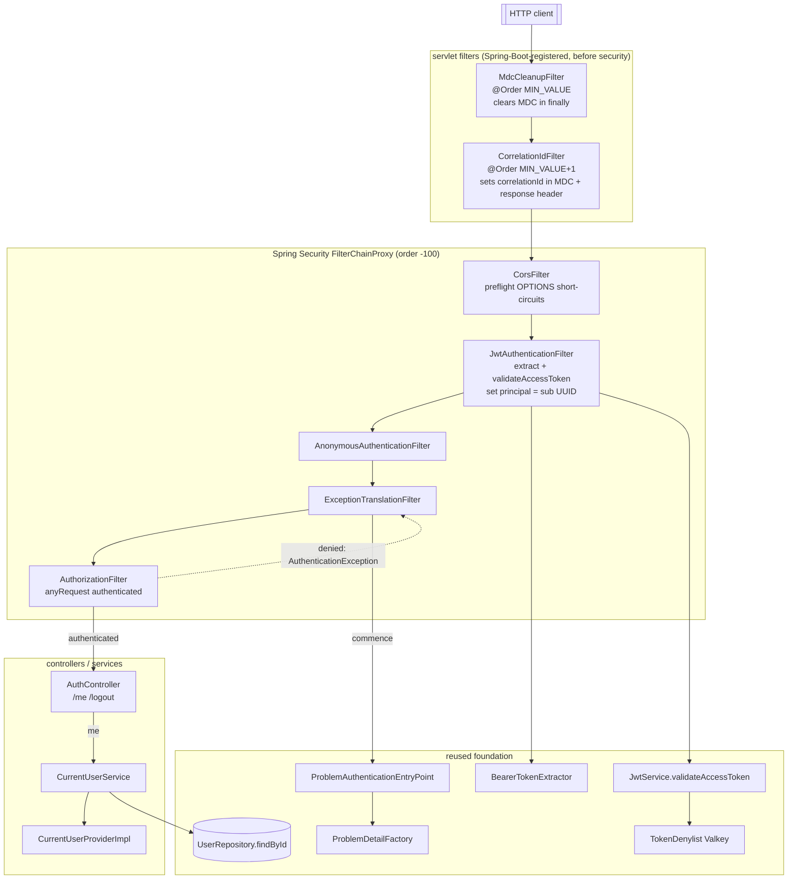

# Design Document — Epic E4: AuthN/AuthZ enforcement + current-user

Spec: `006-authn-authz-enforcement` · Module: `be` (Spring Boot 3.5.16, Spring Security 6.5.x, Java 21)

## Overview

E4 turns authentication from optional into mandatory. E3 shipped the full token machinery
(`JwtService`, `BearerTokenExtractor`, `TokenClaims`, `TokenDenylist`) and validated the bearer token
**directly inside** the `logout` and `me` handlers, while `SecurityConfig` was still the permit-all
seam (`anyRequest().permitAll()` + a `SKELETON ONLY` startup warning) and `CurrentUserProvider` had no
implementation. E4 closes that gap with four changes, each reusing the E3 foundation rather than
re-implementing it:

1. **A JWT authentication filter** (`JwtAuthenticationFilter extends OncePerRequestFilter`) that reads
   the `Authorization` header through the existing `BearerTokenExtractor`, validates the token through
   the existing `JwtService.validateAccessToken` (signature + expiry + denylist), and on success places
   an `Authentication` whose principal is the token `sub` (a `UUID`) into the `SecurityContext`. It adds
   no token parsing, signature, expiry, or denylist logic of its own (Req 1, Req 2).
2. **An enforcing authorization policy.** `SecurityConfig` is rewritten from permit-all to
   **default-deny**: the four `Auth_Public_Endpoints`, the `Logout_Endpoint`, and the
   `/actuator/health/**` probes stay public; everything else — every other `/api/v1/**` route,
   `/api/v1/auth/me`, `/api/v1/mock/board`, and `/actuator/info` — requires authentication. The
   permit-all rule and the `SKELETON ONLY` warning are deleted (Req 3, Req 4, Req 5).
3. **A uniform RFC 9457 rejection.** A custom `AuthenticationEntryPoint` writes a single uniform `401`
   problem response through the existing `ProblemDetailFactory` (carrying `correlationId` and a UTC
   `timestamp`), never a `403` and never a login redirect (Req 6, Req 7, Req 14).
4. **A current-user accessor.** `CurrentUserProvider` gains its first implementation
   (`CurrentUserProviderImpl`), which reads the authenticated `UUID` from the `SecurityContext`. The
   `GET /api/v1/auth/me` handler is refactored to resolve the caller through this enforced context
   instead of re-parsing the header (Req 8, Req 9, Req 13).

E4 reuses, and does not duplicate: `JwtService.validateAccessToken` (the single source of truth for
"valid token"), `BearerTokenExtractor` (`bearer ` scheme parsing, 401 on absent/garbled header),
`TokenDenylist` (Valkey `auth:jwt:denylist:<jti>`), `UnauthorizedException` → `401` in
`GlobalExceptionHandler`, `ProblemDetailFactory` enrichment, the `CorrelationIdFilter` /
`MdcCleanupFilter` pair that establish and clear the per-request correlation id around the whole chain,
the `CorsConfigurationSource` already wired into `HttpSecurity`, and the stateless / CSRF-disabled
posture E3 left in place. With E4 landed the security seam is gone and `CurrentUserProvider` is
implemented, which **supersedes** the deferred seam boundaries of E2 (Requirement 14) and E3
(Requirement 13). E4 introduces **no roles and no per-resource authorization** — every authenticated
request may reach every protected endpoint (Req 13.4).

### Research summary — Spring Security 6 filter integration

The one genuinely new mechanism is the Spring Security wiring; there is **no new runtime dependency**
(`spring-boot-starter-security` and `io.jsonwebtoken:jjwt-*:0.12.6` are already in `be/pom.xml` from
the skeleton and E3 — Req 2.5, Req 15). Per the shared-library rule the Spring Security symbols were
confirmed against the authoritative reference rather than recalled:

- **Custom filter placement.** `HttpSecurity.addFilterBefore(Filter, Class<? extends Filter>)` inserts
  a servlet `Filter` ahead of an existing chain filter; the conventional anchor for a
  pre-authentication token filter is `UsernamePasswordAuthenticationFilter.class`, which runs before
  the `AnonymousAuthenticationFilter` and the `AuthorizationFilter`.
- **Unauthenticated handling.** When authorization denies an unauthenticated request, the
  `ExceptionTranslationFilter` invokes the configured `AuthenticationEntryPoint`. The servlet interface
  method is `void commence(HttpServletRequest request, HttpServletResponse response,
  AuthenticationException authException)`, wired via `http.exceptionHandling(e ->
  e.authenticationEntryPoint(entryPoint))`.
- **Base filter.** `org.springframework.web.filter.OncePerRequestFilter.doFilterInternal(
  HttpServletRequest, HttpServletResponse, FilterChain)` guarantees one invocation per request — the
  same base class the existing `CorrelationIdFilter` / `MdcCleanupFilter` extend (Req 1.6).

Sources: [Spring Security 6.5 reference — HttpSecurity filter management](https://docs.spring.io/spring-security/reference/6.5/api/java/org/springframework/security/config/annotation/web/builders/HttpSecurity.html),
[AuthenticationEntryPoint.commence](https://docs.spring.io/spring-security/reference/6.5/servlet/authentication/architecture.html),
[exceptionHandling DSL](https://docs.spring.io/spring-security/reference/6.5/servlet/exceptions.html).
Content was rephrased for compliance with licensing restrictions.

## Architecture

E4 keeps the established three-layer flow and adds the Spring Security chain in front of it. The new
authentication filter lives in the **`auth.jwt`** package next to the components it reuses; the
authentication entry point lives in **`web.error`** next to the `ProblemDetailFactory` it reuses; and
the `CurrentUserProvider` implementation lives in **`security`** next to the interface it satisfies.
`SecurityConfig` (in the JaCoCo-excluded `config` package) only wires these together.

The request path for a protected endpoint:



Package layout (new types in **bold**, refactors in *italics*):

| Package | Type | Responsibility |
|---|---|---|
| `auth.jwt` | **`JwtAuthenticationFilter`** | Per-request bearer authentication; reuses `BearerTokenExtractor` + `JwtService`; sets/clears the `SecurityContext`. Never blocks the chain. |
| `web.error` | **`ProblemAuthenticationEntryPoint`** | Writes the uniform RFC 9457 `401` via `ProblemDetailFactory` + the Boot `ObjectMapper`. |
| `security` | **`CurrentUserProviderImpl`** | Implements `CurrentUserProvider.requireCurrentUserId()` by reading the `SecurityContext`. |
| `config` | *`SecurityConfig`* (rewritten) | Default-deny matchers, filter registration, entry-point wiring; retains CORS / CSRF-off / stateless. |
| `auth.me` | *`CurrentUserService`* (refactored) | Resolves the caller via `CurrentUserProvider` instead of re-parsing the header; still rejects unknown/soft-deleted `sub`. |
| `web.controller` | *`AuthController.me`* (signature change) | Drops the `Authorization` header param; `logout` keeps it (decision 3). |
| `auth.jwt` | `JwtService`, `BearerTokenExtractor`, `TokenClaims`, `TokenDenylist` | Reused unchanged. |
| `auth.logout` | `LogoutService` | Reused unchanged — self-validates via `parseForRevocation` (no denylist), keeping logout idempotent. |

### Why the filter performs no database lookup (decision 4)

The filter trusts the **validated** token's `sub` and sets the principal to that `UUID` without loading
the `User` (Req 1.4). This keeps an authenticated request free of a per-request DB query (a performance
and coupling concern) and leaves liveness / soft-delete checks where the entity is actually read. A
still-valid, non-denylisted token whose `sub` resolves to no account or to a soft-deleted user
therefore **passes the filter** but is rejected with `401` by `CurrentUserService` when it loads the
user (Req 9.5), preserving E3 Requirement 10.6.

### Why the filter never rejects, and where the 401 comes from (decision 2)

The filter only ever *adds* an authentication on success; on any validation failure it catches
`UnauthorizedException`, leaves the context unauthenticated, and continues the chain (Req 1.5). The
`401` is produced solely by the authorization layer + `ProblemAuthenticationEntryPoint`, and only for
**protected** endpoints. A stale, expired, or denylisted token sent to a **public** endpoint (a login
retry, a resend) is thus ignored and the request still succeeds as an `Anonymous_Request` (Req 4.3).

### Filter ordering and the correlation id (Req 7.2)

`CorrelationIdFilter` (`@Order(HIGHEST_PRECEDENCE + 1)`) and `MdcCleanupFilter`
(`@Order(HIGHEST_PRECEDENCE)`) are Spring-Boot-registered servlet filters whose order is far ahead of
the Spring Security `FilterChainProxy` (registered at `-100`). So the correlation id is in the MDC
before `JwtAuthenticationFilter` and `ProblemAuthenticationEntryPoint` run, and `MdcCleanupFilter`
clears the MDC in a `finally` only after the entire chain (security included) returns — so a
filter-originated `401` body carries the same `correlationId` the request logs use, and the
`X-Correlation-Id` response header is echoed by `CorrelationIdFilter` (Req 7.1, 7.3).

## Components and Interfaces

New components use constructor injection. Method signatures below are the contract; every referenced
type is a real workspace symbol.

### SecurityConfig (rewritten — `config`)

The permit-all body and the `SKELETON ONLY` warning are removed (Req 3.4). The filter is constructed
**explicitly in the configuration** (a plain class, not a `@Component`) so Spring Boot does not also
auto-register it as a top-level servlet filter — registering a security `Filter` bean would otherwise
run it twice. `ponytail:` constructing it here is the smallest double-registration-safe wiring; the
alternative (a `@Component` plus a disabled `FilterRegistrationBean`) is more code for the same effect.

```java
@Configuration
@EnableWebSecurity
@RequiredArgsConstructor
public class SecurityConfig {

    private static final String[] PUBLIC_AUTH_ENDPOINTS = {
        "/api/v1/auth/signup",
        "/api/v1/auth/login",
        "/api/v1/auth/verify",
        "/api/v1/auth/verification/resend",
    };

    private final BearerTokenExtractor bearerTokenExtractor;
    private final JwtService jwtService;
    private final ProblemAuthenticationEntryPoint authenticationEntryPoint;

    @Bean
    public SecurityFilterChain securityFilterChain(
            HttpSecurity http, CorsConfigurationSource corsConfigurationSource) throws Exception {
        http.cors(cors -> cors.configurationSource(corsConfigurationSource))
                .csrf(AbstractHttpConfigurer::disable)
                .sessionManagement(s -> s.sessionCreationPolicy(SessionCreationPolicy.STATELESS))
                .authorizeHttpRequests(auth -> auth.requestMatchers(PUBLIC_AUTH_ENDPOINTS)
                        .permitAll()
                        .requestMatchers(HttpMethod.POST, "/api/v1/auth/logout")
                        .permitAll()
                        .requestMatchers("/actuator/health/**")
                        .permitAll()
                        .anyRequest()
                        .authenticated())
                .exceptionHandling(e -> e.authenticationEntryPoint(authenticationEntryPoint))
                .addFilterBefore(
                        new JwtAuthenticationFilter(bearerTokenExtractor, jwtService),
                        UsernamePasswordAuthenticationFilter.class);
        return http.build();
    }
}
```

- `permitAll()` on `/api/v1/auth/verify` covers both `GET` and `POST` (Auth_Public_Endpoints, Req 4.1).
- `/api/v1/auth/logout` is permitted for `POST` only (decision 3): the filter never rejects it for a
  denylisted `jti`, so `LogoutService.parseForRevocation` (which does not consult the denylist) keeps
  logout idempotent (Req 10.1). A logout with a missing/malformed/bad-signature/expired token still
  `401`s inside the handler exactly as in E3 (Req 10.4).
- `/actuator/health/**` matches `/actuator/health`, `/actuator/health/readiness`, and
  `/actuator/health/liveness` (Req 3.3, 4.2). `/actuator/info` has **no** matcher, so default-deny
  protects it (Req 4.4).
- `anyRequest().authenticated()` is the default-deny backstop: any future route without an explicit
  public matcher is protected, not accidentally public (Req 3.1, 5.4).
- CORS, CSRF-disabled, and `STATELESS` are retained from the prior config (Req 3.5, 11.1, 11.3). With
  `.cors(...)` configured, Spring Security's `CorsFilter` answers the browser preflight `OPTIONS`
  before authorization, so preflight is not authenticated (Req 11.2).

### JwtAuthenticationFilter (new — `auth.jwt`)

```java
public class JwtAuthenticationFilter extends OncePerRequestFilter {

    private final BearerTokenExtractor bearerTokenExtractor;
    private final JwtService jwtService;

    public JwtAuthenticationFilter(BearerTokenExtractor bearerTokenExtractor, JwtService jwtService) { ... }

    @Override
    protected void doFilterInternal(
            HttpServletRequest request, HttpServletResponse response, FilterChain filterChain)
            throws ServletException, IOException {
        String header = request.getHeader(HttpHeaders.AUTHORIZATION);
        if (header != null && SecurityContextHolder.getContext().getAuthentication() == null) {
            authenticate(header);
        }
        filterChain.doFilter(request, response); // invoked exactly once (Req 1.6)
    }

    private void authenticate(String header) {
        try {
            String token = bearerTokenExtractor.extract(header);          // reuse — 401-path on bad header
            TokenClaims claims = jwtService.validateAccessToken(token);   // reuse — signature+expiry+denylist
            var authentication =
                    new UsernamePasswordAuthenticationToken(claims.subject(), null, List.of());
            SecurityContextHolder.getContext().setAuthentication(authentication); // principal = sub UUID
        } catch (UnauthorizedException ignored) {
            SecurityContextHolder.clearContext(); // leave unauthenticated; do NOT block (Req 1.5, decision 2)
        }
    }
}
```

The principal is `claims.subject()` — a `UUID` — never a `UserDetails` and never a loaded `User` entity
(Req 1.4, 8.2, decision 6). The 3-arg `UsernamePasswordAuthenticationToken` constructor marks the
authentication authenticated; an empty authority list is sufficient because E4 has no roles and the
matchers use `authenticated()`, not `hasRole(...)` (Req 13.4). The caught exception is swallowed
silently (no logging of the header or token — Req 12.2); the chain always continues.

`SecurityContext` lifecycle: Spring Security's `SecurityContextHolderFilter` clears the holder at the
end of every request, and `STATELESS` persists nothing, so no authenticated identity leaks onto the
pooled thread's next request (Req 11.4).

### ProblemAuthenticationEntryPoint (new — `web.error`)

```java
@Component
@RequiredArgsConstructor
public class ProblemAuthenticationEntryPoint implements AuthenticationEntryPoint {

    private static final String DETAIL = "Authentication is required to access this resource.";

    private final ObjectMapper objectMapper; // the Spring Boot MVC ObjectMapper bean

    @Override
    public void commence(
            HttpServletRequest request, HttpServletResponse response, AuthenticationException authException)
            throws IOException {
        ProblemDetail problem = ProblemDetailFactory.create(HttpStatus.UNAUTHORIZED, "Unauthorized", DETAIL);
        response.setStatus(HttpStatus.UNAUTHORIZED.value());            // 401, never 403, never redirect
        response.setContentType(MediaType.APPLICATION_PROBLEM_JSON_VALUE);
        objectMapper.writeValue(response.getOutputStream(), problem);
    }
}
```

`ProblemDetailFactory.create` applies the `correlationId` (from the MDC) and the UTC ISO-8601
`timestamp`, so the body shape — `status`, `title`, `correlationId`, `timestamp` — matches what
`GlobalExceptionHandler` produces for a handler-raised `UnauthorizedException` (Req 6.1, 6.2, 7.1,
14.2). The `detail` is a fixed generic string; the `AuthenticationException` message is never copied
into the body, so no stack trace, internal type name, SQL, secret, or token can leak (Req 6.4, 12.3).
Spring's `ProblemDetail` serializes its `correlationId`/`timestamp` custom members through its
`@JsonAnyGetter` properties map, so a plain `objectMapper.writeValue` yields the same JSON the MVC path
would. The same uniform `401` is returned whether the token is missing or invalid (Req 6.5).

### CurrentUserProviderImpl (new — `security`)

```java
@Component
public class CurrentUserProviderImpl implements CurrentUserProvider {

    private static final String NO_USER_MSG = "No authenticated user present.";

    @Override
    public UUID requireCurrentUserId() {
        Authentication authentication = SecurityContextHolder.getContext().getAuthentication();
        if (authentication == null
                || !authentication.isAuthenticated()
                || authentication instanceof AnonymousAuthenticationToken) {
            throw new UnauthorizedException(NO_USER_MSG);
        }
        if (authentication.getPrincipal() instanceof UUID userId) {
            return userId;
        }
        throw new UnauthorizedException(NO_USER_MSG);
    }
}
```

Returns the `UUID` principal the filter stored (Req 8.2, 8.4). It throws `UnauthorizedException` (→
`401`) when the context holds no authentication or only an `AnonymousAuthenticationToken` (Req 8.3) —
the case for a public endpoint reached without a token, where the `AnonymousAuthenticationFilter` sets
an anonymous token. On a protected endpoint the request never reaches a handler unauthenticated, so
this accessor always sees a real principal there.

### CurrentUserService (refactored — `auth.me`)

E3 read and validated the header in this service. Under E4 the filter has already authenticated the
request, so the service resolves the caller through the enforced context (Introduction §3, Req 9):

```java
@Service
@RequiredArgsConstructor
public class CurrentUserService {

    private static final String INVALID_TOKEN_MSG = "Invalid or expired token.";

    private final CurrentUserProvider currentUserProvider; // replaces BearerTokenExtractor + JwtService
    private final UserRepository userRepository;

    public MeResponse me() {
        UUID userId = currentUserProvider.requireCurrentUserId();
        User user = userRepository.findById(userId)
                .orElseThrow(() -> new UnauthorizedException(INVALID_TOKEN_MSG));
        if (user.getDeletedAt() != null) {
            throw new UnauthorizedException(INVALID_TOKEN_MSG); // soft-deleted → 401 (Req 9.5)
        }
        return MeResponse.from(user);
    }
}
```

`MeResponse.from(user)` is reused unchanged and exposes only `id`, `email`, `emailVerified` — never the
`passwordHash` and never a token (Req 9.3). The token's signature/expiry/denylist were already enforced
by the filter, so this service no longer re-parses anything; it only performs the liveness check the
filter intentionally omits (decision 4).

### AuthController (signature change — `web.controller`)

```java
@GetMapping(value = "/me", produces = MediaType.APPLICATION_JSON_VALUE)
public MeResponse me() {                       // header param removed; identity comes from SecurityContext
    return currentUserService.me();
}

@PostMapping("/logout")
@ResponseStatus(HttpStatus.NO_CONTENT)
public void logout(
        @RequestHeader(value = HttpHeaders.AUTHORIZATION, required = false) @Nullable String authorization) {
    logoutService.logout(authorization);       // unchanged — logout self-validates (decision 3)
}
```

The `signup` / `verify` / `resend` / `login` handlers are unchanged. `LogoutService` is unchanged.

### Reused components (no change)

`JwtService.validateAccessToken(String) : TokenClaims`, `JwtService.parseForRevocation(String) :
TokenClaims`, `BearerTokenExtractor.extract(@Nullable String) : String`, `TokenClaims(UUID subject,
String jti, Instant issuedAt, Instant expiresAt)`, `TokenDenylist.revoke/contains`,
`ProblemDetailFactory.create(...)` / `applyCommonMembers(...)`, `CorrelationIdFilter`, `MdcCleanupFilter`,
`CorsConfig.corsConfigurationSource`, `GlobalExceptionHandler.handleUnauthorized`, `UserRepository.findById`.

## Data Models

E4 adds **no new DTO, no new entity, no new configuration property, and no new dependency**. The only
new "data" is the in-memory authentication principal shape:

- **Authentication principal**: a `UUID` (the token `Token_Subject_Claim`), stored as the principal of
  a `UsernamePasswordAuthenticationToken` with `null` credentials and an empty authority collection.
  This is internal and not externally observable (decision 6), so it is not part of any API contract.
- **`MeResponse(UUID id, String email, boolean emailVerified)`** — reused unchanged.
- **Configuration** — `application.yml` is unchanged. `yaj.jwt.*` (`JwtProperties`, secret externalized
  via `${YAJ_JWT_SECRET}`) and the actuator block (`management.endpoints.web.exposure.include:
  health,info`, `management.endpoint.health.probes.enabled: true`, `management.info.env.enabled: true`)
  are read as-is; E4 only changes which of these paths require authentication, not their definitions.

## Key Behaviors and Invariants

The statements below capture what E4 must guarantee, in plain English, each traced to the requirement
clauses it satisfies. They are **not** property-based-testing artifacts and there is no randomized or
generated input: each is verified by example-based unit tests (`@ParameterizedTest` tables where cases
share structure), a Web-slice test, an integration test, and the Cucumber `@auth` scenario described in
the Testing Strategy, exercising concrete, hand-chosen inputs — the same three-layer approach the E1–E3
specs adopt.

### Behavior 1: A valid token authenticates the request with the subject as principal

For a request carrying a `bearer ` header whose token passes `JwtService.validateAccessToken`, the
filter places a `UsernamePasswordAuthenticationToken` whose principal is the token `sub` (a `UUID`) into
the `SecurityContext`, without loading the `User` entity.

**Validates: Requirements 1.2, 1.3, 1.4, 8.2, 8.4**

### Behavior 2: Invalid, expired, denylisted, malformed, or absent tokens leave the request unauthenticated

The filter delegates entirely to `BearerTokenExtractor` + `JwtService.validateAccessToken`; for a
bad-signature, expired, denylisted, structurally-malformed, claim-missing, or absent token it catches
the failure, leaves the `SecurityContext` unauthenticated, and continues the chain — adding no parsing,
signature, expiry, or denylist logic of its own.

**Validates: Requirements 1.3, 1.5, 2.1, 2.2, 2.3, 2.4**

### Behavior 3: The filter runs once per request and never blocks the chain

The filter extends `OncePerRequestFilter` and always invokes the rest of the chain exactly once; it
never writes a response or short-circuits, so the `401` decision belongs entirely to the authorization
layer.

**Validates: Requirements 1.1, 1.6**

### Behavior 4: A protected endpoint without a valid authentication is rejected with 401

Under default-deny, any request to a protected endpoint (no token, or a token that failed validation)
is denied by the authorization layer and answered by the entry point with `401`; the endpoint handler
never runs.

**Validates: Requirements 3.1, 5.1, 5.2, 5.4, 9.4**

### Behavior 5: Public endpoints stay reachable, even with a stale token

The `Auth_Public_Endpoints`, the `Logout_Endpoint`, and `/actuator/health/**` are reachable without
authentication; a public-endpoint request carrying an expired, malformed, or denylisted token still
reaches its handler as an `Anonymous_Request`.

**Validates: Requirements 3.2, 3.3, 4.1, 4.2, 4.3**

### Behavior 6: actuator/info is protected; health probes are public

`/actuator/health/**` is permitted; `/actuator/info` has no public matcher and is therefore protected
under default-deny.

**Validates: Requirements 4.4, 3.1**

### Behavior 7: The 401 is a uniform RFC 9457 problem, never 403 and never a redirect

The entry point returns `application/problem+json` with `status = 401`, a non-empty `correlationId`,
and a UTC ISO-8601 `timestamp`; it returns the identical response whether credentials are missing or
invalid, never returns `403`, never redirects, and excludes stack traces, internal type names, SQL, the
signing secret, and any token from the body.

**Validates: Requirements 6.1, 6.2, 6.3, 6.4, 6.5, 12.3**

### Behavior 8: A filter-originated 401 carries the request correlation id

Because the security chain runs after `CorrelationIdFilter` and inside `MdcCleanupFilter`, the entry
point reads the established correlation id from the MDC into the body `correlationId`, and the response
echoes `X-Correlation-Id`.

**Validates: Requirements 7.1, 7.2, 7.3**

### Behavior 9: The current-user accessor returns the principal or rejects anonymous access

`CurrentUserProviderImpl.requireCurrentUserId()` returns the `UUID` principal when the context holds a
filter-populated authentication, and raises `UnauthorizedException` when the context holds no
authentication or only an anonymous one.

**Validates: Requirements 8.1, 8.2, 8.3**

### Behavior 10: /me returns exactly the live caller's identity through the enforced context

For an authenticated request whose `sub` resolves to a non-soft-deleted user, `/me` returns that user's
`id`, `email`, and `emailVerified`, resolved via `CurrentUserProvider` (not by re-parsing the header),
and never includes the password hash or a token.

**Validates: Requirements 9.1, 9.2, 9.3**

### Behavior 11: /me rejects a valid token whose subject is not a live account

A validly signed, unexpired, non-denylisted token whose `sub` resolves to no user or to a soft-deleted
user passes the filter but causes `CurrentUserService` to raise `UnauthorizedException` (→ `401`).

**Validates: Requirements 9.5**

### Behavior 12: Logout stays idempotent under enforcement

`POST /api/v1/auth/logout` is reachable without filter-level denylist rejection: a valid unexpired
token is recorded in the denylist and returns `204`; logging out an already-denylisted token still
returns `204`; a missing/malformed/bad-signature/expired token returns `401`.

**Validates: Requirements 10.1, 10.2, 10.3, 10.4**

### Behavior 13: Enforcement is stateless and CORS-safe

E4 creates no HTTP session, leaves no authentication state on the thread after the request, lets the
CORS preflight `OPTIONS` through without authentication, and applies the existing CORS source to both
public and protected routes.

**Validates: Requirements 11.1, 11.2, 11.3, 11.4**

### Behavior 14: Tokens are read only from the header and never logged

The feature reads the access token only from the `Authorization` header (never a URL or query
parameter) and emits no full token, `jti`, or signing secret at any log level.

**Validates: Requirements 12.1, 12.2**

### Behavior 15: The permit-all seam is removed and the boundary is closed

The rewritten `SecurityConfig` carries no permit-all rule and no `SKELETON ONLY` warning,
`CurrentUserProvider` now has an implementation, the `Auth_Public_Endpoints` remain reachable without a
token, and no role-based or resource-based authorization is introduced.

**Validates: Requirements 3.4, 13.1, 13.2, 13.3, 13.4**

### Behavior 16: Handler 401 and entry-point 401 share one shape, with no new status mapping

A handler-raised `UnauthorizedException` and an entry-point rejection both yield an RFC 9457 `401` with
matching `status`, `correlationId`, and `timestamp` members; E4 introduces no new HTTP status mapping,
reusing the existing `UnauthorizedException` → `401` semantics.

**Validates: Requirements 14.1, 14.2, 14.3**

## Error Handling

E4 introduces **no new typed exception and no new status mapping**. Handler-raised failures keep flowing
through `GlobalExceptionHandler` + `ProblemDetailFactory`; the only new producer of a problem body is
`ProblemAuthenticationEntryPoint`, which deliberately mirrors that machinery so both paths emit the same
RFC 9457 shape (Req 14.3).

| Condition | Producer | Status | Body `status` |
|---|---|---|---|
| Protected endpoint, no `Authorization` header | `ProblemAuthenticationEntryPoint` | 401 | 401 |
| Protected endpoint, token malformed / bad-signature / expired / denylisted | `ProblemAuthenticationEntryPoint` | 401 | 401 |
| `/me`: authenticated, but `sub` → no user or soft-deleted | `CurrentUserService` → `UnauthorizedException` → `GlobalExceptionHandler` | 401 | 401 |
| `CurrentUserProvider`: anonymous / absent authentication | `UnauthorizedException` → `GlobalExceptionHandler` | 401 | 401 |
| `logout`: missing / malformed / bad-signature / expired token | `LogoutService` → `UnauthorizedException` → `GlobalExceptionHandler` | 401 | 401 |
| Public endpoint with any token (valid, stale, or garbled) | handler | 2xx | — |
| CORS preflight `OPTIONS` | Spring Security `CorsFilter` | 200 | — |
| Protected endpoint, valid token | handler | 2xx | — |

Both `401` paths carry `correlationId` and an ISO-8601 UTC `timestamp` and exclude stack traces,
internal type names, SQL, the signing secret, and any token (Req 6.4, 12.3, 14.2). The entry point uses
a fixed generic `detail`; it never copies the `AuthenticationException` message. The filter logs nothing
about a rejected token (Req 12.2).

## Testing Strategy

Three layers, matching the project standard and the E1–E3 specs: **unit** (JUnit 5 + Mockito), **integration**
(`src/it`, Testcontainers), and **BDD** (Cucumber, `src/bdd`, run under the `bdd` profile with
Testcontainers PostgreSQL + Valkey). There is **no property-based testing and no property-testing
library** — the new components are a servlet filter, a Spring Security configuration, a small
context-reading accessor, and an entry point, none of which has a "for all inputs" surface that PBT
would serve better than targeted examples. Input-space coverage is expressed as example-based methods
plus `@ParameterizedTest` tables over carefully chosen inputs. Test method names follow
`methodUnderTest_shouldExpectedBehavior_whenCondition`. Together the three layers verify every statement
in **Key Behaviors and Invariants**.

### Unit tests (JUnit 5 + Mockito) — one `{Class}Test` per production class

- **`JwtAuthenticationFilterTest`** — mock `BearerTokenExtractor` + `JwtService`; drive `doFilterInternal`
  with a `MockHttpServletRequest`/`MockHttpServletResponse` and a mock `FilterChain`; clear
  `SecurityContextHolder` in `@AfterEach`. Cases: a valid token sets a `UsernamePasswordAuthenticationToken`
  whose principal equals the token `sub` `UUID` (Behavior 1); each invalid case — no header, blank
  header, non-`bearer` scheme, and a token for which `validateAccessToken` throws `UnauthorizedException`
  (stand-ins for expired / denylisted / malformed) — leaves `getAuthentication()` null (Behavior 2),
  parametrized via `@MethodSource` since they share structure and all assert "unauthenticated";
  `filterChain.doFilter` is invoked exactly once in every case, asserted with `verify(chain, times(1))`
  (Behavior 3). Directly satisfies Req 15.1 (valid, expired, denylisted, missing). Non-excluded package
  `auth.jwt`.
- **`CurrentUserProviderImplTest`** — set the `SecurityContextHolder` authentication per case. Cases: a
  `UsernamePasswordAuthenticationToken` with a `UUID` principal returns that `UUID` (Behavior 9); a null
  authentication, an `AnonymousAuthenticationToken`, and a non-`UUID` principal each raise
  `UnauthorizedException` (parametrized). Satisfies Req 15.2. Non-excluded package `security`.
- **`ProblemAuthenticationEntryPointTest`** — real Jackson `ObjectMapper`; a `MockHttpServletResponse`;
  seed the MDC correlation id. Assert: status `401`, content type `application/problem+json`, body
  `status` = `401`, non-empty `correlationId`, ISO-8601 UTC `timestamp`, and that the body contains no
  token/secret/stack-trace substrings (Behavior 7, Behavior 8). Non-excluded package `web.error`.
- **`CurrentUserServiceTest`** (updated) — now mocks `CurrentUserProvider` + `UserRepository` (no more
  `BearerTokenExtractor`/`JwtService`). Cases: a resolvable live user returns a `MeResponse` with
  `id`/`email`/`emailVerified` and no hash/token (Behavior 10); `findById` empty and a soft-deleted user
  each raise `UnauthorizedException` (Behavior 11); a thrown `UnauthorizedException` from the provider
  propagates.
- **`AuthControllerTest`** (updated) — the `me` stub no longer passes a header; verify
  `currentUserService.me()` is invoked and the JSON omits `passwordHash`/`hash`/`Set-Cookie`. Existing
  `signup`/`verify`/`resend`/`login`/`logout` cases are unchanged (still `@AutoConfigureMockMvc(addFilters =
  false)`).
- **`GlobalExceptionHandler` mapping** — existing `UnauthorizedException` → `401` coverage is unchanged;
  it backs Req 14.1 and the shape parity asserted against the entry point in Req 14.2.

`SecurityConfig` lives in the JaCoCo-excluded `config` package and is exercised end-to-end by the slice
and BDD layers rather than a direct unit test.

### Web-slice test (`src/test`, `@WebMvcTest`) — enforcement contract (Req 15.3)

`AuthEnforcementSliceTest`: a `@WebMvcTest` over a protected handler (`/api/v1/auth/me`) that imports the
real `SecurityConfig` + `ProblemAuthenticationEntryPoint` with the security filters **enabled** (no
`addFilters = false`), providing `BearerTokenExtractor` and `JwtService` as `@MockitoBean`. Cases: a
request with **no** `Authorization` header receives `401` with `application/problem+json` and body
`status` = `401` (Behavior 4, Behavior 7); a request whose stubbed token validates is allowed through to
the handler (`200`) (Behavior 4 positive). A parametrized variant asserts `/api/v1/mock/board` and
`/actuator/info` also `401` without a token, while `/actuator/health` is reachable (Behavior 5,
Behavior 6).

### Integration test (`src/it`, Testcontainers) — what only real infrastructure proves

`MeSoftDeleteRejectionIntegrationTest` (extending `AbstractPostgresIntegrationTest`): with a real
PostgreSQL container, seed a user, soft-delete it (`deletedAt` non-null), and assert
`CurrentUserService.me()` raises `UnauthorizedException` when the `SecurityContext` principal is that
user's id — proving the filter-passes / handler-rejects split of decision 4 against a real row
(Behavior 11). The denylist's real-Valkey behavior is already covered by the E3 integration tests; E4
adds no new Valkey contract.

### BDD (`src/bdd`, Cucumber, `@auth`) — enforcement end to end (Req 15.4)

The harness already provisions Testcontainers PostgreSQL + Valkey and registers `yaj.jwt.*` in
`TestcontainersConfig.registerProperties`, so **no new harness wiring is required** (unlike E3). The
existing `auth-session.feature` scenario (login → `/me` `200` → logout → `/me` `401`) continues to pass,
now flowing through the real filter + entry point instead of in-handler validation.

Add one focused scenario to `auth-session.feature` for the explicit enforcement contract, reusing the
existing `AuthSessionSteps` plus one new step ("requests current-user without an access token"):

```gherkin
Scenario: Protected endpoint rejects a missing token and accepts a valid one
  Given a registered user with email "enforce@example.com" and password "StrongPass123!"
  And the user's email is verified
  When the user requests current-user without an access token
  Then the response status is 401
  When the user logs in with email "enforce@example.com" and password "StrongPass123!"
  Then the response status is 200
  And the response body contains an access token
  When the user requests current-user with the access token
  Then the response status is 200
  And the response body contains email "enforce@example.com"
```

This maps Req 5.1 + Req 6.1 (missing token → `401`) and Req 9.2 (valid token → `200`) in a single flow,
and avoids duplicating the existing logout scenario (test-conventions: merge overlapping flows). Step
definitions reuse `SharedScenarioState`, `UserRepository`, and `RestTemplate` exactly as the current
`AuthSessionSteps` do; the new negative step issues `GET /api/v1/auth/me` with no `Authorization` header.

### Quality gates (Req 15.5–15.10)

- **JaCoCo 90/90:** `JwtAuthenticationFilter` (`auth.jwt`), `ProblemAuthenticationEntryPoint`
  (`web.error`), and `CurrentUserProviderImpl` (`security`) are all in non-excluded packages and must
  hit 90% line + branch. The unit tests above drive every branch (each `if`/`catch` has a case on both
  sides), and the slice + BDD layers exercise the wired paths — so the threshold is met by unit + slice
  + integration + BDD coverage alone, with no property/generated tests. `SecurityConfig` is excluded
  (`**/config/**`); `MeResponse` (`web.dto`) and the reused `auth.jwt` types are already covered by E3.
- **Spotless** (palantir-java-format, import order, no wildcard imports) and **Error Prone + NullAway**
  must pass: the filter's `@Nullable` header handling and the entry point's parameters are annotated
  exactly as the existing filters/handlers are; new code adds no nullability violations.
- The `bdd` profile's combined unit + BDD `jacoco.exec` feeds the 90/90 `check`; `src/it` runs under the
  `it` execution. The build fails if coverage drops below 90/90 or Spotless / Error Prone reports a
  violation (Req 15.7).

## Boundary notes (supersession)

- E2 Requirement 14 and E3 Requirement 13 deferred the permit-all seam and the missing
  `CurrentUserProvider` implementation to E4; both are closed here (Req 13.1, 13.2).
- E4 adds **no** roles, team membership, or per-resource authorization — every authenticated request may
  reach every protected endpoint, consistent with the product's "no fine-grained roles" scope (Req 13.4).
- The business endpoints (teams, epics, tickets, comments, board) are delivered by E5–E10; E4 only
  enforces the gate in front of them. `/api/v1/mock/board` is now protected (consequence of default-deny)
  and is removed entirely in E9. The frontend auth context and route guard belong to E11.
