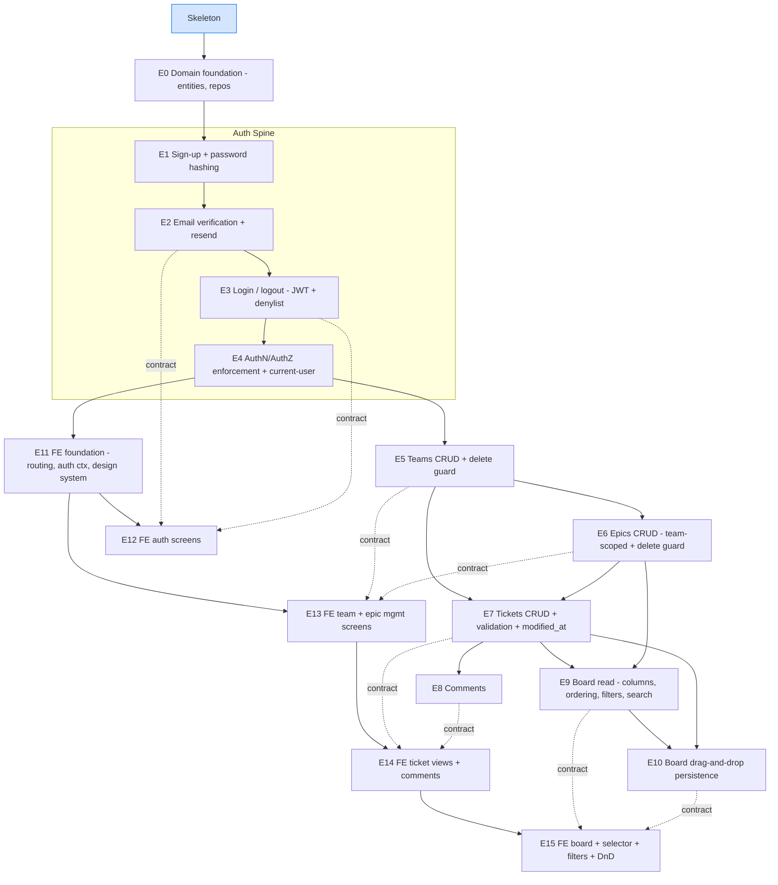

# yet-another-jira — Epics & Implementation Plan

This document turns the product requirements (`requirements/yet-another-jira.md`)
into an ordered, dependency-aware implementation plan. It identifies the feature
dependency graph, breaks the work into epics, and sequences those epics into
logical build batches.

The runnable **skeleton** is already done (spec `001-skeleton-bootstrap`): the
full three-tier topology boots with `docker compose up --build`, the complete
domain schema is migrated with zero seed data, cross-cutting concerns
(correlation-id, RFC 9457 errors, CORS, permit-all security seam, Valkey) are
wired, and a mock board proves the FE↔BE path. Every epic below layers real
behavior onto that scaffold and is expected to keep all quality gates green
(Spotless, Error Prone + NullAway, JaCoCo 90/90 line+branch, Cucumber BDD,
ESLint/Prettier, Vitest, Playwright).

---

## Epic Progress

Tracking checklist **in order** — tick each epic as it lands (`[ ]` → `[x]`). Details for each
are in the [Epic Catalog](#3-epic-catalog-major-one-by-one).
- [x] **E0** — Backend domain foundation
- [x] **E1** — Sign-up + password hashing
- [x] **E2** — Email verification + resend
- [x] **E3** — Login / logout (JWT + denylist)
- [x] **E4** — AuthN/AuthZ enforcement + current-user
- [x] **E5** — Teams CRUD + delete guard
- [x] **E11** — Frontend foundation (routing, auth context, design system)
- [x] **E12** — FE auth screens
- [x] **E6** — Epics CRUD (team-scoped) + delete guard
- [x] **E13** — FE team + epic management screens
- [x] **E7** — Tickets CRUD + validation + `modified_at`
- [ ] **E8** — Comments
- [ ] **E14** — FE ticket views + comments
- [ ] **E9** — Board read (columns, ordering, filters, search)
- [ ] **E15** — FE board + selector + filters + DnD
- [ ] **E10** — Board drag-and-drop persistence

---

## 1. Current State (the foundation we build on)

| Layer | Already present | Status |
|-------|-----------------|--------|
| DB | Full schema via Liquibase (`users`, `verification_tokens`, `teams`, `epics`, `tickets`, `comments`, `ticket_types`, `ticket_states`), zero seed data | Done |
| BE cross-cutting | Correlation-id filter, MDC cleanup, RFC 9457 `ProblemDetailFactory`/`GlobalExceptionHandler`, CORS from `CorsProperties`, Valkey wiring + startup ping, Actuator health | Done |
| BE security | `SecurityConfig` = `permitAll()` + stateless + CSRF off (the seam to replace) | Seam only |
| BE API | `GET /api/v1/mock/board` (hardcoded) | Mock — to remove |
| FE | Vite + React 19 + TS, `apiFetch` (10s timeout), TanStack Query, `@dnd-kit` (inert), **Tailwind v4** encoding the `DESIGN.md` Vercel tokens via `@theme` (stock palette + type scale reset out), board page rendering the mock | Scaffold |
| Tooling | docker-compose (incl. opt-in Mailpit), CI, semantic-release, Dependabot, pre-commit, Makefile | Done |

**Decisions already locked (design.md):** stateless **JWT bearer** auth; **Valkey**
for the JWT denylist (logout) + verification-resend rate limiting; **Argon2id**
password hashing; SMTP via **`relay1.dataart.com`** (configurable; Mailpit locally
behind the `mail` compose profile).

---

## 2. Feature Dependency Graph

### Dependency rules (why the edges exist)

| Feature | Depends on | Reason |
|---------|-----------|--------|
| E0 Domain foundation | Skeleton | Entities/repositories map the existing tables; everything else uses them. |
| E1 Sign-up | E0 | Persists `users`; needs the password encoder bean. |
| E2 Email verification | E1 | Issues/consumes `verification_tokens` for an existing user; needs SMTP. |
| E3 Login/logout | E1, E2 | Login must reject unverified accounts; logout denylists the JWT in Valkey. |
| E4 AuthN/AuthZ enforcement | E3 | Replaces `permitAll()`; resolves the authenticated user that `created_by`/`author` need. |
| E5 Teams | E4 | All business endpoints require auth. Teams are the root grouping. |
| E6 Epics | E5 | Each epic belongs to exactly one (existing) team; team fixed at creation. |
| E7 Tickets | E5, E6 | Ticket references a team (required) and optionally an epic of the **same** team. |
| E8 Comments | E7 | Comments belong to a ticket; author is the current user. |
| E9 Board (read) | E7, E6 | Renders tickets per team into 5 state columns; filters by type/epic + title search. |
| E10 Board DnD | E9, E7 | Drag persists a ticket **state** change (E7's update path) and reflects on the board. |
| E11 FE foundation | E4 | Needs the real auth contract (token, 401 handling) to build the app shell + guard. |
| E12 FE auth screens | E11, (E2/E3 contracts) | Sign-up/login/verify/resend UIs call the auth API. |
| E13 FE team+epic screens | E11, (E5/E6) | Management UIs; disabled delete when referenced. |
| E14 FE ticket views + comments | E13, (E7/E8) | Create/edit/details + comment thread. |
| E15 FE board + DnD | E14, (E9/E10) | Primary screen: selector, columns, filters, drag-and-drop. |

**Critical path:** `E0 → E1 → E2 → E3 → E4 → E5 → {E6, E7} → E9 → E10`, with the
frontend epics (E11–E15) trailing each backend contract. Teams (E5) is the first
true business feature and unblocks the widest fan-out.

---

## 3. Epic Catalog (major, one by one)

Each epic lists scope, backend tasks, frontend tasks (where applicable),
validation/error contract, and a definition of done. Requirement section numbers
(`§`) refer to `requirements/yet-another-jira.md`.

> Conventions every epic must honor:
> - **Layering:** controller (HTTP only) → service (business rules + `@Transactional`) → repository. No business logic in controllers; no persistence in controllers.
> - **Entities** live in a `*.model` package (JaCoCo-excluded). **Services/controllers carry logic and must be unit-tested.** MapStruct mappers in a `mapper` package.
> - **Errors:** use `ProblemDetailFactory` + typed exceptions mapped in `GlobalExceptionHandler`. `400` validation, `401` auth, `403` forbidden, `404` missing, `409` conflict (delete guards, uniqueness).
> - **Timestamps:** server-set, UTC, ISO-8601 in API. **IDs:** UUID.
> - **Validation is server-side and authoritative** (client validation is never sufficient — §6, §9).
> - **Tests are part of the epic**, not an afterthought: keep JaCoCo 90/90 green and add BDD coverage for the primary flow.

---

### E0 — Backend domain foundation
**Depends on:** Skeleton · **Requirement refs:** §9
**Scope:** JPA entities + Spring Data repositories for the existing tables, plus
shared building blocks (base auditing fields, exception types, the current-user
seam).

- JPA entities under `com.bovae.yaj.domain.model` mapping `users`, `teams`,
  `epics`, `tickets`, `comments`, `verification_tokens` to the **existing**
  columns (do not change the schema). `type`/`state` map to the `ticket_types`/
  `ticket_states` lookup codes (store the string code; expose a Java enum at the
  service layer).
- Repositories (`com.bovae.yaj.domain.repository` or per slice): `UserRepository`,
  `TeamRepository`, `EpicRepository`, `TicketRepository`, `CommentRepository`,
  `VerificationTokenRepository`. Include the existence/reference-count queries the
  delete guards need (e.g. `existsByTeamId`, `existsByEpicId`, `countByTicketId`).
- Shared: a small `domain` exception hierarchy (`NotFoundException`,
  `ConflictException`, `ValidationException`, `UnauthorizedException`) mapped
  centrally in `GlobalExceptionHandler`; a `ticket_type` / `ticket_state` enum with
  parse/validate helpers; `Instant`/UTC timestamp handling (`@PrePersist`/
  `@PreUpdate` only where a column isn't DB-defaulted — note `modified_at` is
  managed explicitly by the ticket service, see E7).
**DoD:** entities load against a Testcontainers Postgres; repositories resolve;
exception→Problem mapping unit-tested; build + 90/90 green.

---

### E1 — Sign-up + password hashing
**Depends on:** E0 · **Requirement refs:** §3 (sign-up, password rules), §11 (hashing, no secrets)
**Scope:** `POST /api/v1/auth/signup`.

- Email: trim, compare case-insensitively (DB `citext` already enforces), reject
  duplicates with `409`. Password: minimum 8 chars, hashed with **Argon2id**
  (`Argon2PasswordEncoder` — add BouncyCastle), never stored or logged in plain
  text. New users persist with `email_verified = false`.
- Add `spring-boot-starter-mail` and a JWT library to `pom.xml` in this/next epic
  (verify exact coordinates + API before use, per shared-library rules).
- Define a `PasswordEncoder` bean (Argon2id) in `config`.
**Contract:** `201 Created` on success; `409` duplicate email; `400` weak password
/ malformed email. Response never includes the hash.
**DoD:** unit tests for the service (hashing invoked, duplicate→conflict, weak
password→validation); BDD: sign up then verify the user row exists unverified.

---

### E2 — Email verification + resend
**Depends on:** E1 · **Requirement refs:** §3 (verification, expiry, resend, SMTP), §11 (no SMTP secrets in source)
**Scope:** token issue on signup, `GET/POST /api/v1/auth/verify`, `POST /api/v1/auth/verification/resend`.

- On signup, issue a single-use verification token: store **only its hash** in
  `verification_tokens` (`purpose = EMAIL_VERIFICATION`, `expires_at = now + 24h`).
  Send the raw token in a link via SMTP (configurable host/port; `relay1.dataart.com`
  target, Mailpit locally).
- Verify: token must be unexpired, unconsumed, and match a stored hash → set
  `users.email_verified = true`, stamp `consumed_at`. Verification leads to the
  login screen (no auto-login).
- Resend: issuing a new token **invalidates earlier unused tokens** for that user
  (consume/delete them). Rate-limit resend per user/email via Valkey.
- SMTP config externalized (`YAJ_SMTP_HOST`/`YAJ_SMTP_PORT`, 1–65535); no secrets
  in source.
**Contract:** expired/used/unknown token → clear error (`400`/`410`); resend for an
already-verified account is a no-op success or clear message.
**DoD:** unit tests (expiry boundary, single-use, resend invalidates prior, rate
limit); BDD: signup → capture token → verify → verified.

---

### E3 — Login / logout (JWT + denylist)
**Depends on:** E1, E2 · **Requirement refs:** §3, §9 (tokens not in URLs)
**Scope:** `POST /api/v1/auth/login`, `POST /api/v1/auth/logout`, `GET /api/v1/auth/me`.

- Login validates credentials against the Argon2id hash; **rejects unverified
  accounts** and rejects soft-deleted users (`deleted_at`). On success issue a
  signed JWT (bearer) carrying `sub` (user id), `jti`, `exp`. Signing secret is
  externalized config.
- Logout adds the token `jti` to a **Valkey denylist** with TTL = remaining token
  lifetime.
- `me` returns the current authenticated user (id, email, verified).
- Tokens are returned in the response body/`Authorization` flow — **never in a
  URL**.
**Contract:** `200` + token on success; `401` bad credentials; `403` (or `401`
with a clear reason) for unverified; logout `204`.
**DoD:** unit tests (good/bad password, unverified rejected, denylist add on
logout); BDD: signup→verify→login→authed call→logout→token rejected.

---

### E4 — AuthN/AuthZ enforcement + current-user
**Depends on:** E3 · **Requirement refs:** §3 (all endpoints require auth), §6, §9
**Scope:** replace the permit-all seam with a JWT auth filter.

- JWT authentication filter: parse `Authorization: Bearer`, validate signature/
  expiry, reject denylisted `jti`, populate the `SecurityContext`.
- `SecurityConfig`: **all** `/api/v1/**` require authentication **except**
  `/api/v1/auth/signup`, `/login`, `/verify`, `/verification/resend`; keep
  the public `/actuator/health`/readiness probes and static assets public. Remove the `SKELETON ONLY` warning.
- A `CurrentUser` accessor (resolves the authenticated user id for `created_by` /
  comment `author`).
- Unauthenticated/invalid-token requests → RFC 9457 `401` (not a redirect).
**DoD:** unit/slice tests for the filter (valid, expired, denylisted, missing);
BDD: protected endpoint is `401` without a token and `200` with one.

---

### E5 — Teams CRUD + delete guard
**Depends on:** E4 · **Requirement refs:** §4, §9
**Scope:** `GET/POST /api/v1/teams`, `GET/PUT/DELETE /api/v1/teams/{id}`.

- Create/rename: name trimmed, non-empty, unique case-insensitively (`409` on
  clash). List all teams (all verified users manage all teams — no membership).
- Delete guard: **reject (`409`)** if the team has any epics or tickets; never
  cascade. Returns a clear validation message.
- Set `created_at`/`modified_at` (server, UTC).
**DoD:** service unit tests (trim, empty→400, dup→409, delete-with-refs→409,
clean delete→204); BDD: create→rename→delete-guard.

---

### E6 — Epics CRUD (team-scoped) + delete guard
**Depends on:** E5 · **Requirement refs:** §5, §9
**Scope:** `GET/POST /api/v1/epics` (filter by `teamId`), `GET/PUT/DELETE /api/v1/epics/{id}`.

- Create: belongs to exactly one existing team; **team is fixed at creation** and
  cannot change on edit. Title trimmed non-empty; description optional.
- List epics for a team (drives the ticket epic drop-down).
- Delete guard: **reject (`409`)** if any ticket references the epic.
**DoD:** service unit tests (team-immutable on edit, empty title→400, delete-with-
tickets→409); BDD: create epic under team → cannot delete while referenced.

---

### E7 — Tickets CRUD + validation + `modified_at`
**Depends on:** E5, E6 · **Requirement refs:** §6, §9
**Scope:** `GET/POST /api/v1/tickets`, `GET/PUT/PATCH/DELETE /api/v1/tickets/{id}`.

- Create/edit fields: `team` (required, existing), `type` (`bug|feature|fix`),
  `state` (5 canonical values), optional `epic`, `title` (trimmed non-empty),
  `body` (non-empty). `created_by` set from the authenticated user; `created_at`
  server UTC.
- **Same-team epic rule:** `epic.team_id` must equal `ticket.team_id` (server-
  enforced) — reject otherwise (`400`/`409`). When the team changes, a referenced
  epic from the old team must be cleared/replaced.
- **`modified_at` semantics:** advanced only on an **actual** field/state change;
  saving unchanged values must **not** advance it (compare before persist).
- State change endpoint (used by drag-and-drop) persists immediately; any of the
  5 states reachable from any other (no sequential enforcement).
- Delete after explicit confirmation (confirmation is a FE concern); deleting a
  ticket deletes its comments (DB cascade already in place).
- Validate **all** enums/references server-side.
**DoD:** service unit tests — `@ParameterizedTest` for enum validation, same-team
rule, no-op save doesn't bump `modified_at`, state transition persists, delete
cascades; BDD: create → edit state → `modified_at` advances; add comment → does
not advance (cross-check in E8).

---

### E8 — Comments
**Depends on:** E7 · **Requirement refs:** §7
**Scope:** `GET/POST /api/v1/tickets/{ticketId}/comments`.

- Add: body non-empty; author = current user; `created_at` server UTC. Immutable
  after creation (edit/delete are stretch).
- List: chronological, oldest first.
- **Adding a comment does NOT update the ticket `modified_at`** (so it doesn't
  change board ordering).
**DoD:** unit tests (empty body→400, ordering, ticket `modified_at` untouched);
BDD: add two comments → returned oldest-first → ticket `modified_at` unchanged.

---

### E9 — Board read (columns, ordering, filters, search)
**Depends on:** E7, E6 · **Requirement refs:** §8
**Scope:** `GET /api/v1/teams/{teamId}/board` (replaces the mock).

- Returns exactly **5 columns** in workflow order, one per state, for the selected
  team. Each card shows at least title + type (epic recommended).
- Within a column, cards ordered **most-recently-modified first**.
- Filters: by ticket **type** and **epic**, plus **case-insensitive substring
  search** over title; combined with **AND**. May be server-side (preferred for
  100+ tickets) or split with the client.
- Must stay usable with **100+ tickets** on one board (indexes on `(team_id,
  state)` already exist; paginate/limit as needed).
**DoD:** unit/repository tests for ordering + each filter + combined AND; BDD:
seed N tickets via API → board has 5 ordered columns → filters narrow correctly.
**Cleanup:** remove `MockBoardController`, `BoardView`/`BoardColumn`/`BoardCard`
mock once the real endpoint + FE are wired.

---

### E10 — Board drag-and-drop persistence
**Depends on:** E9, E7 · **Requirement refs:** §6, §8
**Scope:** backend reuses E7's state-update endpoint; this epic is mostly the FE
contract + guarantees.

- Dropping a card on a column issues a state update that **persists immediately**;
  reordering within a column is not persisted (ordering is by `modified_at`).
- On failure the card returns to its previous column and an error shows (FE), so
  the update endpoint must be **idempotent** and return a clear status.
**DoD:** covered by E7 backend tests + E15 FE tests + a Playwright drag flow.

---

### E11 — Frontend foundation (routing, auth context, design system)
**Depends on:** E4 · **Requirement refs:** §10 (screens), §11 (states)
**Scope:** app shell, client-side routing, auth/session context, authed API
client, the Vercel design system from `DESIGN.md` (Tailwind v4, already in place),
and the shadcn/ui primitive layer (introduced here).

- Add a router; define routes for all minimum screens (§10). Guard business routes
  behind authentication; unauthenticated → login.
- Auth context: store the JWT (in memory + refresh-safe storage that is **not** the
  system of record), attach `Authorization` to `apiFetch`, handle `401` globally
  (clear session → login).
- **Styling — Tailwind v4 :** the `DESIGN.md`  tokens (colors/typography/spacing/radius)
  are encoded in `fe/src/index.css` via `@theme`, with the stock palette + type scale
  reset out, so build UI from token utilities only. No install needed — this entry
  only records that the styling layer exists. **Follow-up:** bundle the Geist/Inter
  webfonts (text currently falls back to `system-ui`; the `font-sans`/`font-mono`
  tokens already point at the right stacks).
- **Primitives — introduce shadcn/ui here:** run `shadcn init` as the source of
  accessible interactive primitives (Dialog, DropdownMenu, Select, Popover,
  Tooltip) consumed by E13–E15. **Bridge** shadcn's semantic tokens
  (`--background`, `--foreground`, `--primary`, `--border`, `--ring`, `--radius`)
  onto the `DESIGN.md` tokens — required because our `--color-*: initial` reset
  means un-bridged shadcn classes render nothing. First consumer: the header
  **collapsed user menu** (DropdownMenu) including **Log out**.
- Loading / empty / success / error states as a reusable pattern.
- **Compatibility (§11):** target a current desktop version of Chrome.
**DoD:** Vitest for the guard (redirects when unauthenticated) and the client
(adds bearer header, handles 401); shadcn is set up and re-themed to `DESIGN.md`
(the header user-menu dropdown opens and **Log out** fires).

---

### E12 — FE auth screens
**Depends on:** E11 · **Requirement refs:** §3, §10
**Scope:** sign-up, login, email-verification result, resend action.

- Sign-up form (email + password, client hints but server is authoritative);
  login; verification-result screen (success → link to login). A
  resend-verification action is reachable from **both** the login and
  verification-result screens (unverified or expired-token cases).
- Show loading/success/error states; surface backend validation messages.
**DoD:** Vitest for each form (submit, error rendering); a Playwright happy-path
(sign-up → verify via test inbox → login) in integration (E15/Batch 11).

---

### E13 — FE team + epic management screens
**Depends on:** E11 (+ E5, E6 contracts) · **Requirement refs:** §4, §5, §10
**Scope:** team management + epic management screens — create/edit in shadcn
**Dialog**s with confirm-delete **AlertDialog**s and reference-aware disabled delete.

- Teams: list, create, rename, delete. **Disable delete** when the team has epics/
  tickets (mirror the backend `409`), with a clear message.
- Epics: list (by team), create (team chosen at creation, **fixed** after),
  edit, delete. **Disable delete** when referenced by tickets.
**DoD:** Vitest for disabled-delete logic + create/rename flows.

---

### E14 — FE ticket views + comments
**Depends on:** E13 (+ E7, E8 contracts) · **Requirement refs:** §6, §7, §10
**Scope:** ticket create / edit / details view + comment thread — create/edit
**modal**, type/state/epic **Select**s, and a delete-confirm **AlertDialog**, all
on shadcn primitives.

- Create/edit: type, team, epic (drop-down scoped to the ticket's team), title,
  body, state. **Changing team clears/replaces the selected epic.** Show
  created-by, created-at, modified-at on details.
- Comments: list oldest-first, add comment; adding doesn't reorder the board.
- Delete ticket behind an explicit confirmation.
**DoD:** Vitest (team-change clears epic; comment add appends; required-field
validation surfaced).

---

### E15 — FE board + selector + filters + DnD
**Depends on:** E14 (+ E9, E10 contracts) · **Requirement refs:** §8, §10, §11
**Scope:** the primary Kanban screen — team **Select**, filter controls, and a
create-ticket **modal** built on shadcn primitives (`@dnd-kit` still drives drag).

- Team selector; 5 columns in workflow order; cards show title + type (+ epic);
  within a column ordered most-recently-modified first.
- Drag a card between columns (via `@dnd-kit`) → persist the state change; **on
  failure revert the card and show an error**.
- Filters: type + epic + case-insensitive title search, combined AND.
- Create-ticket and open-ticket entry points; usable with 100+ tickets.
**DoD:** Vitest (filters narrow; optimistic move + revert on rejected request);
Playwright drag-persist-refresh smoke.

---

## 4. Logical Implementation Batches

Batches are the build order. Each batch ends **green** (compiles, lints, unit +
BDD + FE tests pass, JaCoCo 90/90) before the next begins. Backend contracts land
before the matching FE screens so the UI integrates against real endpoints.

| Batch  | Epics          | Theme                                                                      | Exit criteria                                                                                                                                                            |
|--------|----------------|----------------------------------------------------------------------------|--------------------------------------------------------------------------------------------------------------------------------------------------------------------------|
| **0**  | E0             | Backend domain foundation                                                  | Entities + repositories load against Testcontainers Postgres; exception→Problem mapping tested.                                                                          |
| **1**  | E1, E2, E3, E4 | Authentication spine (signup → verify → login/logout → enforcement)        | Full auth flow works end-to-end; `permitAll()` replaced; protected routes `401` without a token.                                                                         |
| **2**  | E5             | Teams CRUD + delete guard                                                  | Team lifecycle + `409` guards via API/BDD.                                                                                                                               |
| **3**  | E11            | FE foundation (needs only E4 — pulled ahead of the remaining backend CRUD) | App shell, router + guard, auth context, shadcn bridge; mock board stays as the board placeholder.                                                                       |
| **4**  | E12            | FE auth screens                                                            | Sign-up/login/verify/resend UIs against the real auth API.                                                                                                               |
| **5**  | E6             | Epics CRUD (team-scoped) + delete guard                                    | Epic lifecycle; team immutable; `409` when referenced.                                                                                                                   |
| **6**  | E13            | FE team + epic management                                                  | Management screens with reference-aware disabled delete.                                                                                                                 |
| **7**  | E7             | Tickets CRUD + validation + `modified_at`                                  | Tickets create/edit/state/delete; same-team rule; `modified_at` semantics.                                                                                               |
| **8**  | E8             | Comments                                                                   | Add/list oldest-first; ticket `modified_at` untouched.                                                                                                                   |
| **9**  | E14            | FE ticket views + comments                                                 | Ticket create/edit/details + comment thread.                                                                                                                             |
| **10** | E9             | Board read (+ remove mock)                                                 | Real `GET /teams/{id}/board`: 5 ordered columns, filters, search.                                                                                                        |
| **11** | E15, E10       | FE board + DnD persistence                                                 | Primary board: selector, filters, drag-persist with revert-on-failure.                                                                                                   |
| **12** | —              | Integration, security cutover, e2e, docs                                   | Mock fully removed; Playwright happy-path (signup→verify→login→team→epic→ticket→board→drag); README/config updated; full gate green; Definition of Done (§13) satisfied. |

### Per-batch checklist
1. Implement controller → service → repository for the slice (server-side
   validation authoritative).
2. Map errors through `ProblemDetailFactory` (`400/401/403/404/409`).
3. Unit-test services/controllers (JUnit 5 + Mockito; `@ParameterizedTest` for
   same-shape cases) to hold JaCoCo 90/90.
4. Extend the Cucumber feature(s) for the slice's primary flow (Testcontainers).
5. FE: typed API module + screen + Vitest; wire loading/empty/success/error.
6. Run `make be-lint` / `make fe-lint` + tests; fix before moving on.

---

## 5. Cross-cutting requirements tracked across all batches

- **Security (§11):** every business endpoint authenticated after E4; passwords
  Argon2id; no secrets in source; tokens never in URLs.
- **Persistence (§9):** all writes through the API into Postgres; Valkey is never
  the system of record; referential integrity by DB constraints + server checks;
  meaningful status codes (`409` for delete-guard/uniqueness conflicts).
- **Reliability (§11):** refresh/restart never loses persisted data.
- **Usability (§11):** loading/empty/success/error states everywhere.
- **Fresh DB (§9, §13):** default startup loads **no** seed data; QA creates data
  via UI/API.
- **Testing (§11):** ≥1 backend business flow (BDD) and ≥1 FE/API flow
  (Vitest/Playwright) — exceeded by the per-epic tests above.
- **Maintainability (§11):** the README documents prerequisites, configuration
  (env vars + how secrets are supplied), and startup commands.
- **Concurrency (§9):** no concurrent-edit conflict detection — last successful
  write wins (intentionally out of scope).
- **Definition of Done (§13):** every item verified at Batch 11; each epic also
  carries its own DoD.

---

## 6. Non-goals — do not build (§12)

Kept as a short guardrail so the build doesn't drift into work the requirements
exclude; it mirrors §12/§14 of `yet-another-jira.md`.

**Do not build:** Scrum/sprints/backlogs/story points/burndown; SSO/OAuth/social
login; roles/admins/team membership/private teams/per-ticket access;
attachments/notifications/mentions/watchers/audit history/real-time updates;
custom workflows/types/subtasks/dependencies/time-tracking/reporting; production
deployment, high availability, production-grade mail infrastructure.

**Stretch (optional, §14) — not scheduled in the batches above:** password reset,
edit/delete own comments, ticket activity history, virtualized board rendering.
